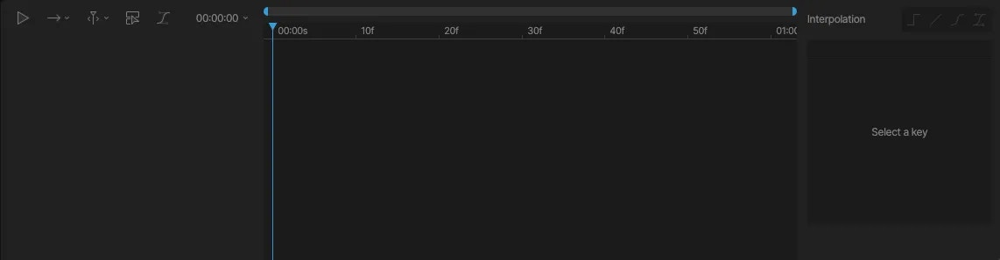
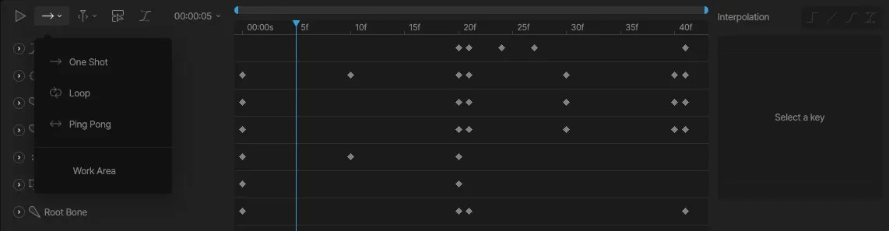
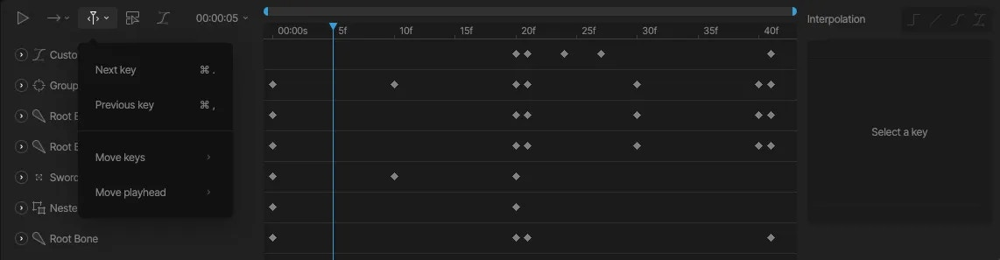
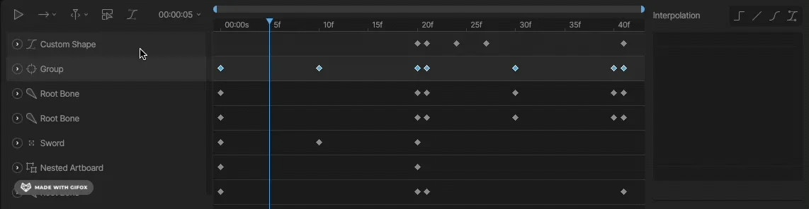
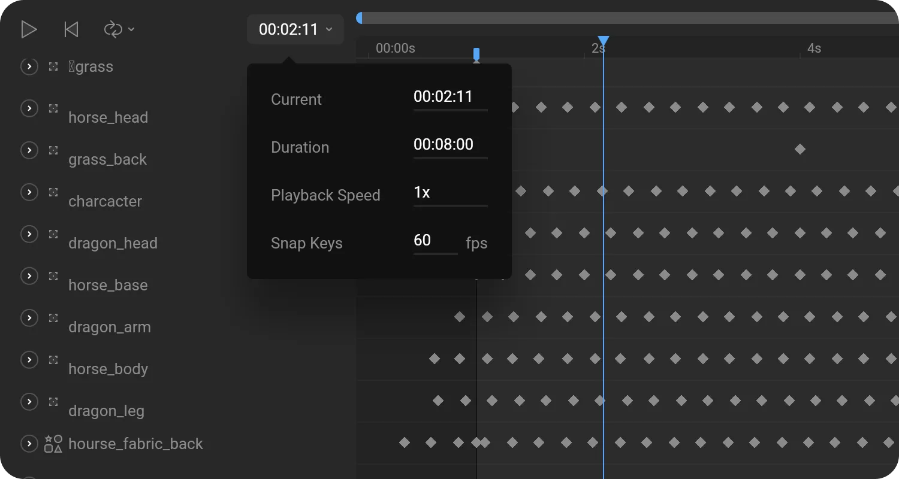

动画模式

# 时间轴 (Timeline)

Rive 界面显示了一个带有播放控制的时间轴，以及用于在动画模式下进行当前动画配置的选项。时间轴左侧显示了所有动画的列表。请记住，这些都是当前活动[画板 (Artboard)](/editor/fundamentals/artboards.md#active-artboard)的动画。

## [​](#animation-type) 动画类型 (Animation type)

**单次播放 (One-Shot)：** 播放头在动画结束时停止。
**乒乓播放 (Ping-Pong)：** 播放头持续从起点播放到终点，再从终点播放回起点。
**循环播放 (Loop)：** 播放头持续在起点和终点之间循环播放动画。
**工作区域 (Work Area)：** 工作区域定义了动画的播放范围。通过工作区域，可以轻松地专注于长动画中的一小部分。

## [​](#navigate-timeline) 导航时间轴 (Navigate Timeline)

导航时间轴菜单提供了一系列有用的快捷键，帮助你在时间轴中自由穿梭。

## [​](#show-only-selected) 仅显示选中项 (Show Only Selected)

在处理具有大量关键帧对象的动画时，“仅显示选中项”开关非常有用。开启此选项后，时间轴上只会显示你当前选中的对象。

## [​](#timeline-options) 时间轴选项 (Timeline Options)

时间轴选项位于播放选择器的右侧，显示了当前时间、持续时间、播放速度和关键帧吸附选项。

**当前 (Current)：** 播放头的当前位置。
**持续时间 (Duration)：** 时间轴的总长度。
**播放速度 (Playback Speed)：** 动画播放的速度。默认速度为 1x。负值会导致动画倒着播放。
**吸附关键帧 (Snap Keys)：** 可以在时间轴上放置关键帧的间隔。默认情况下，关键帧可以设置为每秒 60 帧的细分点。

## [​](#navigating-the-timeline) 在时间轴中导航

**滚动与缩放 (Scroll and Zoom)：** 使用时间轴顶部带有两个调节柄的水平滚动条来滚动和调整时间轴的缩放级别。
**平移 (Pan)：** 你也可以使用与舞台相同的平移快捷键来平移时间轴（右键点击并拖拽，或者按住空格键并拖拽）。

[概览 (Overview)](/editor/animate-mode/overview.md)[关键帧 (Keys)](/editor/animate-mode/keyframes.md)