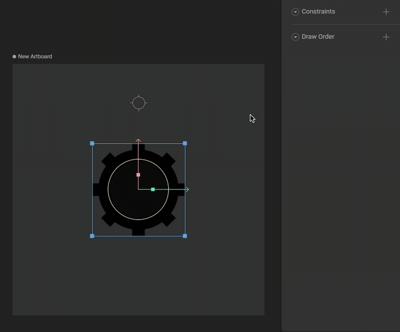
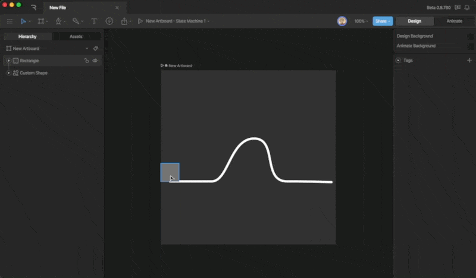
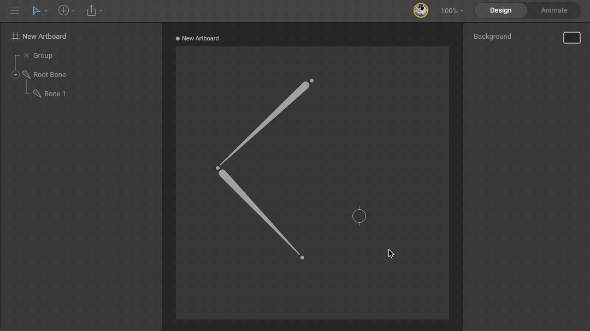

Constraints

# Follow Path Constraint

The Follow Path Constraint makes complex motion much easier to create by allowing us to constrain an object to a path. Watch the video, or read more below.

## [​](#setting-up-a-follow-path-constraint) Setting up a Follow Path Constraint

First we’ll need both an object to constrain and a path to constrain it to.
Next, add a new constraint and select the Follow Path Constraint.

Now, use the target button and select the path you want to constrain the object to.

## [​](#follow-path-properties) Follow Path Properties

Like other Constraints, the Follow Path Constraint has many different properties we can customize.

#### [​](#strength) Strength

The strength property dictates how strictly the constrained object will adhere to the constrained property.

#### [​](#target) Target

The Target tells the constraint which path to follow.

#### [​](#distance) Distance

The Distance property moves the object up and down the path. As the percent increases, the constrained object moves along the path. Note that this property can exceed 100%.

#### [​](#orient) Orient

The Orient toggle controls the constrained objects rotation.
When the Orient toggle is on, the object will adjust its rotation according to the path. Note that you can’t make manual rotation changes to the object in this state.

When the Orient toggle is set to off, the rotation of the constrained object does not change. This means you’ll be able to manually change the rotation of the object as you see fit.

#### [​](#offset) Offset

The Offset toggle allows the constrained object to move along the path, but from its current, offset position.

[Translation Constraint](/docs/editor/constraints/translation-constraint)[Scroll Constraints](/docs/editor/constraints/scroll-constraint)