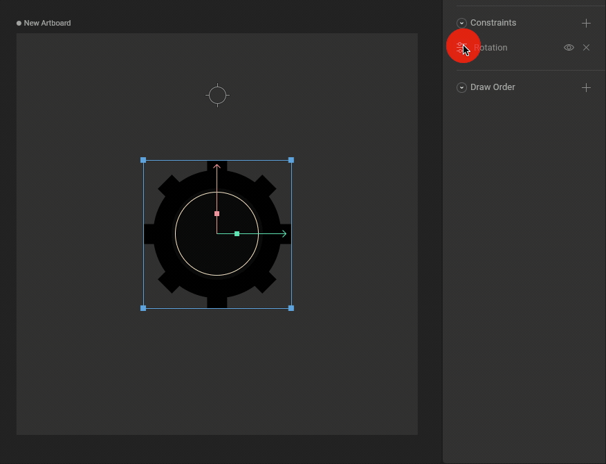
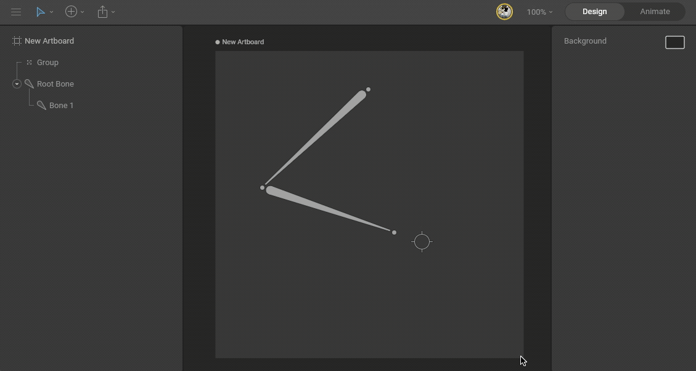
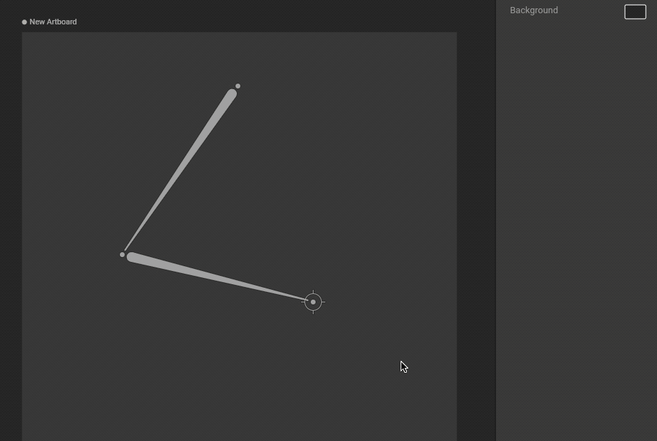
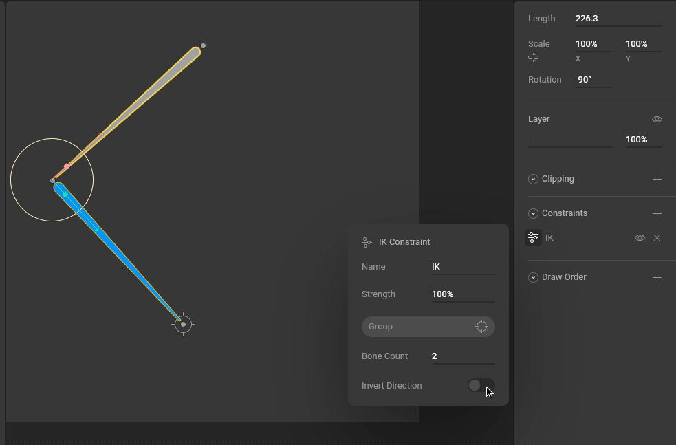
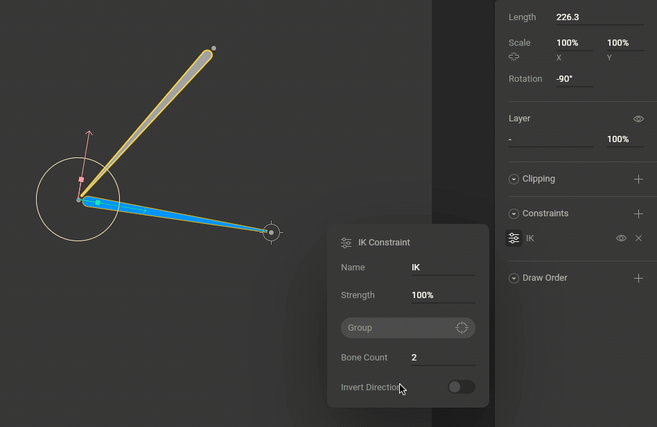
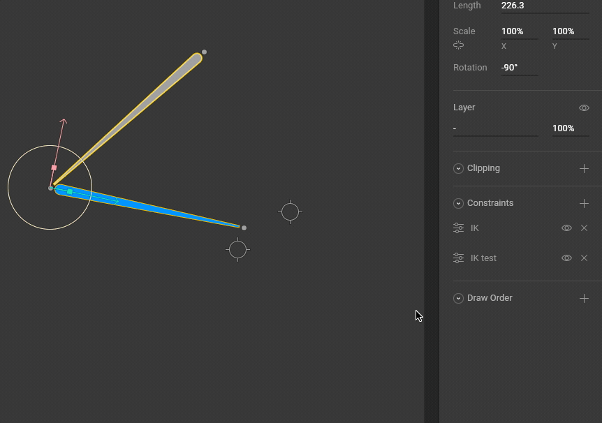
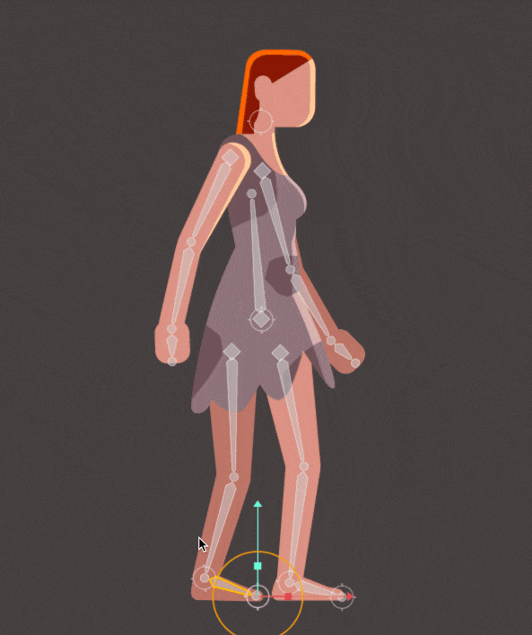

约束

# IK 约束 (IK Constraint)

了解如何在 Rive 中使用反向动力学 (Inverse Kinematics)。

## [​](#about-inverse-kinematics-ik) 关于反向动力学 (IK)

### [​](#forward-kinematics) 正向动力学 (Forward Kinematics)

Rive 中的大多数骨骼动画是通过旋转骨骼角度完成的。子骨骼的位置根据其父骨骼的旋转而改变。要定位链条末端的骨骼，需要旋转多个父骨骼（链条上方的骨骼）以达到所需的姿势。这种类型的骨骼摆动称为“正向动力学 (Forward Kinematics)”。

### [​](#inverse-kinematics) 反向动力学 (Inverse Kinematics)

反向动力学允许你在链条末端放置一个目标 (Target)，系统会自动反向计算出链条上方各父骨骼的有效朝向。

这种技术有很多应用，其中一些常见的例子包括让角色指向某个物品，或者让角色的脚固定在地面上。

## [​](#how-to-create-an-ik-constraint) 如何创建 IK 约束

要使用 IK，你需要一个骨骼链和一个目标。目标可以是任何对象，但在大多数情况下，你会希望使用一个 [样式设为“目标”的分组](/docs/editor/fundamentals/groups#group-style)。

1. **创建骨骼链和目标**
   使用快捷键 **B** 创建 [骨骼链](/docs/editor/manipulating-shapes/bones#how-to-create-bones)。然后使用快捷键 **G** 创建一个 [分组 (Group)](/docs/editor/fundamentals/groups)。在检查器中将分组的样式 (Style) 选项设置为“目标 (Target)”。
   
   使用 B 和 G 快捷键激活骨骼和分组工具。

2. **添加 IK 约束**
   选择你想要受影响的最后一个骨骼，并在检查器的“约束 (Constraints)”版块添加一个 IK 约束。
   

3. **选择目标**
   打开约束浮动菜单，使用目标按钮选择在第 1 步中创建的空分组。
   

4. **测试 IK 系统**
   移动目标分组以测试系统是否正常工作。
   

## [​](#bone-count) 骨骼数量 (Bone Count)

使用“骨骼数量 (Bone Count)”属性设置 IK 系统应向链条上方影响多远。请注意，当选中目标时，受 IK 系统影响的骨骼会高亮显示。

## [​](#invert-direction) 反转方向 (Invert Direction)

使用“反转方向 (Invert Direction)”开关来交换 IK 系统计算的角度。

## [​](#strength) 强度 (Strength)

使用“强度 (Strength)”属性来控制受影响的骨骼跟随目标的程度。强度为 0% 意味着目标完全不会影响受控骨骼。
请注意，与 Rive 中的大多数属性一样，强度是可以制作动画的。使用它来创建独特的效果，或者在两个或多个 IK 约束（每个都有自己的目标）之间进行混合。

## [​](#constraints-order) 约束顺序 (Constraints order)

约束的顺序非常重要。例如，如果一个骨骼有两个 IK 约束，且两者的强度均为 100%，则第二个约束（最下面的那个）将抵消第一个。如果它们的强度不是 100%，那么 IK 系统将在两者之间进行混合。可以通过点击并拖动来更改约束的顺序。

通过拖放操作更改约束顺序。

## [​](#multiple-ik-constraints-and-nested-targets) 多个 IK 约束和嵌套目标

你可以设置多个 IK 约束来实现更复杂的绑定。一种常见的设置是在角色的脚上设置一个 IK 约束（注意在下面示例中它仅影响 1 根骨骼），并为腿部骨骼（两根骨骼）设置另一个 IK 约束。腿部目标是脚目标的子级，这样移动脚部也会带动腿部移动。
