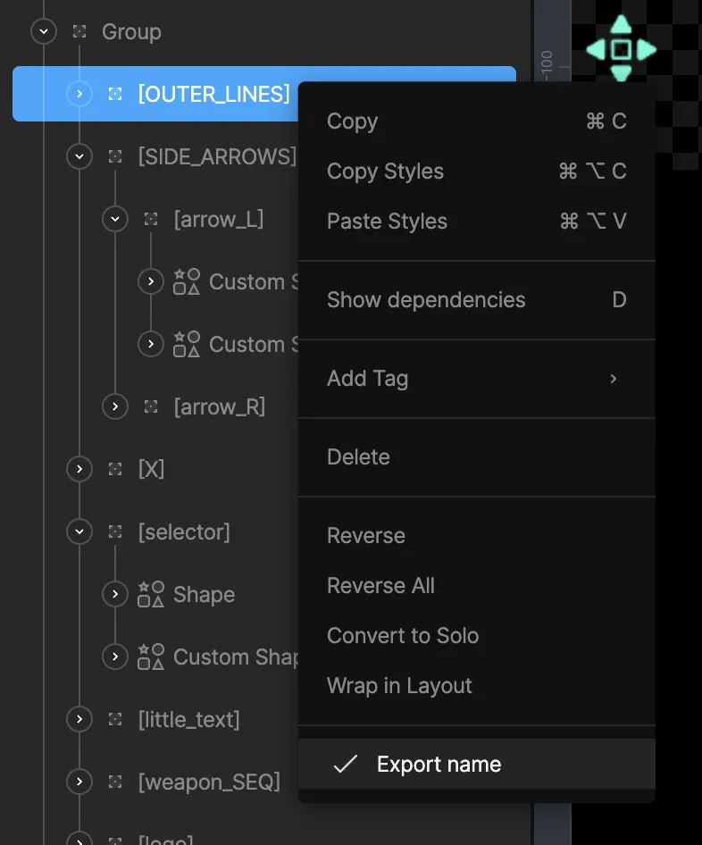

导出 (Exporting)

# 导出为运行时文件 (Exporting for Runtime)

导出为运行时文件功能仅在付费计划中提供。

要导出适用于运行时的文件，请选择工具栏右侧的蓝色导出图标，或通过左侧菜单导航至 `Export` > `For runtime`。你可以将导出的 `.riv` 文件加载到你的应用、游戏或网站中，通过我们的任何[开源运行时库](/runtimes/overview.md)进行调用。

## [​](#changes-to-exporting-object-names) 导出对象名称的变更

你可能需要在运行时访问某些对象，例如通过文本串替换字符串，或者通过组件访问其输入。为了让这些对象在运行时可被搜索到，你需要显式地将其名称设置为“导出”。

在以前，只要你在编辑器中重命名了对象（非默认名），它的名称就会被导出。但这种方式假设了所有重命名的对象都需要在运行时被访问，而实际上很多时候重命名只是为了整理文件。因此，我们更改了这一做法，以提供更精细的控制。

**如何导出名称**：
在层级面板或舞台上右键点击对象，勾选 **“Export name (导出名称)”** 选项。

被设置为导出名称的对象在层级面板中会被括号 `[]` 包裹。

*注意：动画、状态机、事件和输入名称不需要手动操作即可导出。*

## [​](#benefits-of-optimizing-your-names) 优化名称的好处

导出对象名称会增加 `.riv` 文件的一点点体积。对于大型复杂文件，累积的名称数据可能会影响性能。因此，建议仅导出需要在代码中引用的名称。

## [​](#files-created-before-the-introduction-of-explicit-export) 在引入显式导出前创建的文件策略

对于在此功能实施前创建的文件，我们默认假设所有重命名的对象都需要在运行时可发现。如果你想清理这些导出的名称以减小文件体积，可以：
1. 从工具栏菜单选择 `Export options` > `Remove name exports`。
2. 针对需要在运行时访问的对象，手动重新勾选 `Export name`。

[键盘快捷键 (Keyboard Shortcuts)](/editor/keyboard-shortcuts.md)[导出视频或静态图](/editor/exporting/exporting-for-video-and-static-design.md)