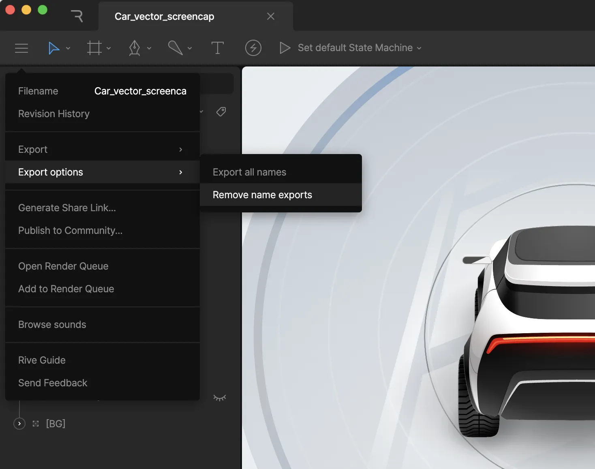

导出 (Exporting)

# 导出运行时使用 (Exporting for Runtime)

导出运行时使用的功能适用于付费方案。[了解更多关于我们的方案和定价的信息](https://rive.app/pricing)。

要导出运行时使用的文件，请选择工具栏右侧的蓝色导出动作，或通过左侧工具栏菜单导航至 `Export` > `For runtime`。你可以通过任何我们的 [开源运行时](/runtimes/overview.md) 将导出的 `.riv` 文件加载到你的应用、游戏或网站中。

## [​](#changes-to-exporting-object-names) 导出对象名称的变更

你可能需要在运行时访问某些对象，例如用于替换字符串的文本运行 (text run)，或用于访问其输入的组件。为了使这些对象在运行时可被发现，你需要显式设置导出其名称。

以前，如果在编辑器中修改了对象的默认名称，名称就会被导出。这种方法的问题在于，它假设任何重命名的对象都是需要在运行时查找的，而在许多情况下，你可能只是为了更好地组织文件而重命名对象 —— 并不一定需要将它们导出到你的 `.riv` 文件中。因此，我们更改了此方法，以便更精细地控制哪些对象名称被导出。

要导出名称，请在层级面板或舞台上右键单击对象，并勾选“导出名称 (Export name)”选项。

设置了导出名称的对象可以通过包裹其名称的括号来识别。

动画、状态机、事件和输入名称不需要手动导出。

### [​](#benefits-of-optimizing-your-names) 优化名称的好处

将对象名称导出到 `.riv` 中会增加少量数据。对于大型、复杂的文件，名称数据可能会累积。因此，最好只导出你在运行时需要引用的名称。

### [​](#files-created-before-the-introduction-of-explicit-export) 在引入显式导出之前创建的文件

对于在此开关实施之前创建的文件，我们假设任何重命名的对象都需要在运行时可被发现。这意味着打开现有文件时，你可能会注意到层级面板中的许多项目都显示在括号内。如果你希望不导出名称并减小导出文件的大小，可以采取以下步骤：

1.  从工具栏菜单中，选择 `Export options` > `Remove name exports`。
2.  通过在层级面板或舞台上右键单击并选择 `Export name`，为你需要在运行时访问的对象单独重新启用名称导出。

