# 画板 (Artboards)

画板是所有动画的容器。每个画板都有独立的时间轴及其相关联的状态机。

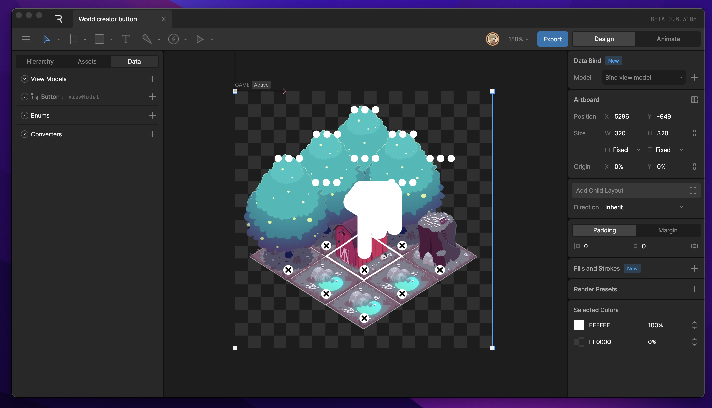

## 活动画板 (Active Artboard)

您可以通过点击画板名称或画板上的任何内容来选择它。

选中的画板会以蓝色高亮显示，这意味着：
*   编辑器左侧的 [层级面板 (Hierarchy)](editor/interface-overview/hierarchy.md) 将显示该画板的内容。
*   底部的时间轴、状态机和设计工具也将针对该画板。

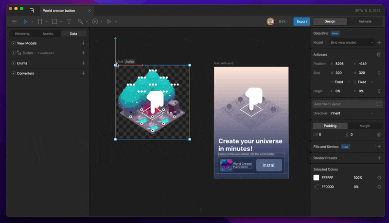

## 默认状态机 (Default State Machine)

在画板本身的属性面板中，您可以设置默认状态机。

这是在运行时文件加载时将播放的状态机。如果没有设置，运行时将不知道开始播放什么，除非您在运行时代码中手动指定。

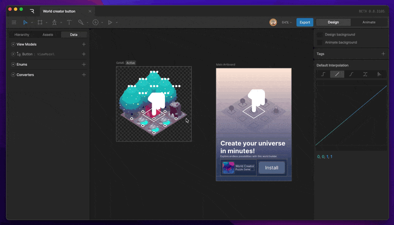

您可以通过点击编辑器左上角的播放按钮来预览此默认状态机。

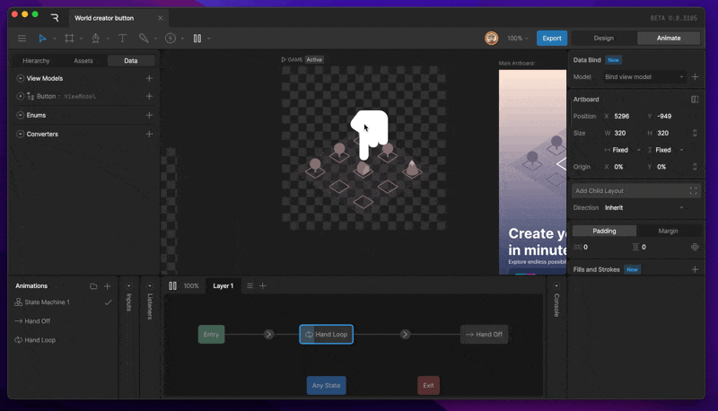

## 创建画板 (Creating an Artboard)

要创建画板，请激活画板工具：
*   从 [工具栏 (Toolbar)](editor/interface-overview/toolbar.md) 中选择 Artboard 工具。
*   或使用快捷键 **A**。

然后在舞台 (Stage) 上点击或拖拽以创建新画板。

在画板工具激活状态下，右侧的 [属性检查器 (Inspector)](editor/interface-overview/inspector.md) 将显示常见移动设备和桌面尺寸的预设列表。只需选择一个即可自动创建。

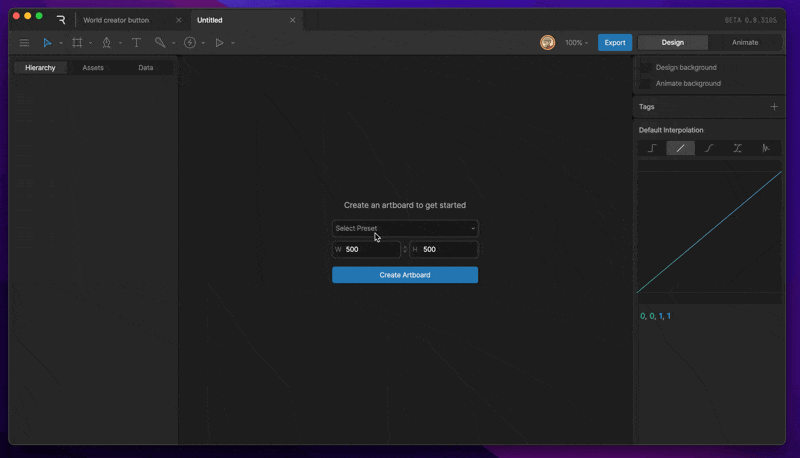

## 画板属性 (Artboard Properties)

当选中画板时，属性检查器提供了控制画板外观和行为的选项。

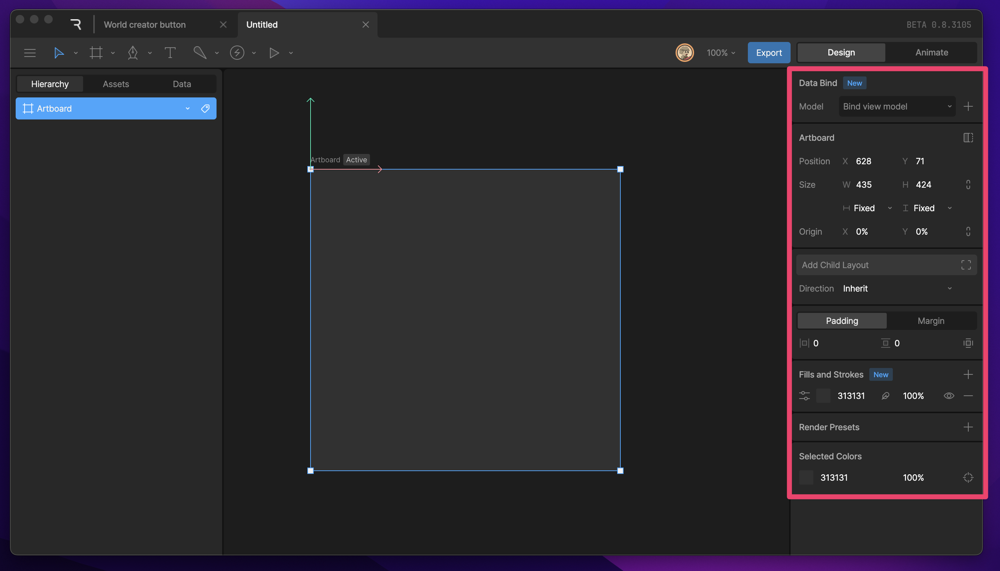

### 位置 (Position)

**X** 和 **Y** 值定义了画板在舞台上的位置。

### 尺寸 (Size)

**Width (宽度)** 和 **Height (高度)** 值定义了画板的尺寸。

点击两值之间的**链接图标**可以锁定宽高比，这样在调整一个值时，另一个值会按比例从变化。

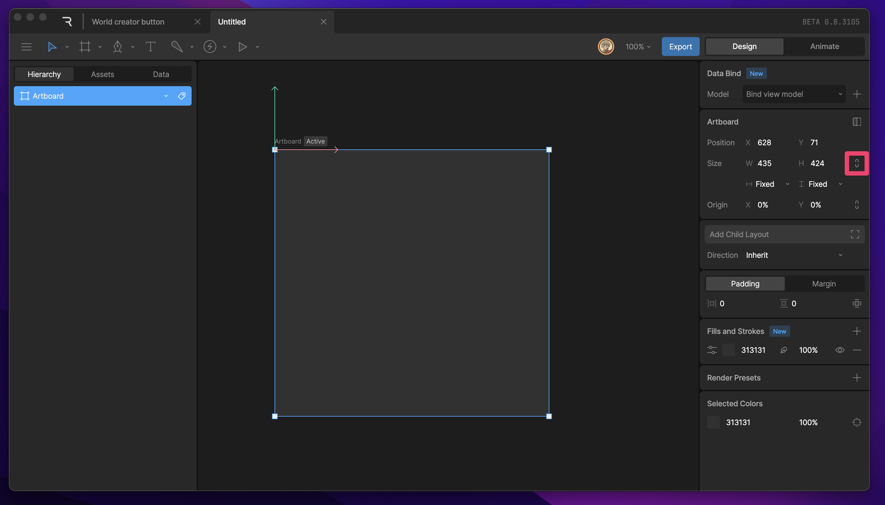

**尺寸类型 (Size Type)** 允许您设置以下选项：
*   **User (用户自定义)**: 默认选项，使用您设定的宽高。
*   **Width (宽度)**: 使用宽度的引用值。
*   **Height (高度)**: 使用高度的引用值。

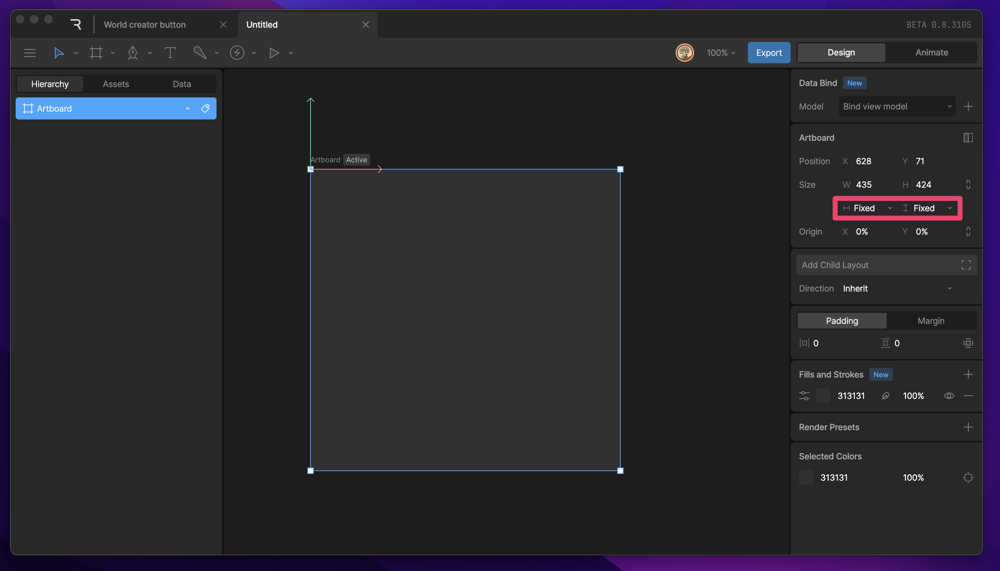

### 原点 (Origin)

Origin（原点）是画板的轴心点。这决定了画板在舞台上缩放或旋转时的中心位置。

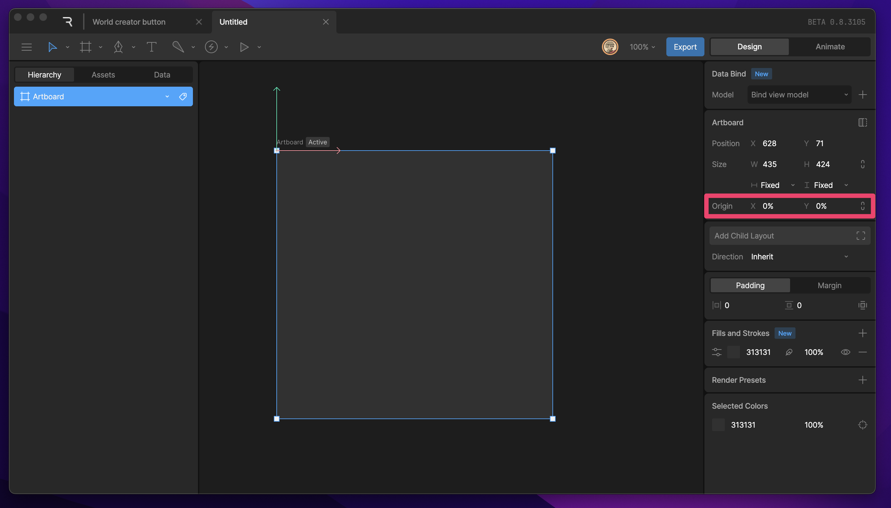

*   默认值为 `X: 0, Y: 0`（左上角）。
*   中心点为 `X: 0.5, Y: 0.5`。
*   右下角为 `X: 1, Y: 1`。

### 布局设置 (Layout Settings)

[布局 (Layout)](editor/fundamentals/layout.md) 将在后续章节详细介绍，但在此处，您可以控制运行时画板如何缩放和对齐。

*   **Clip (裁剪)**: 决定是否裁切掉超出画板边界的内容。默认开启。
*   **Fit (适配模式)**: Cover, Contain, Fill, etc.
*   **Alignment (对齐)**: Top Left, Center, Bottom Right, etc.

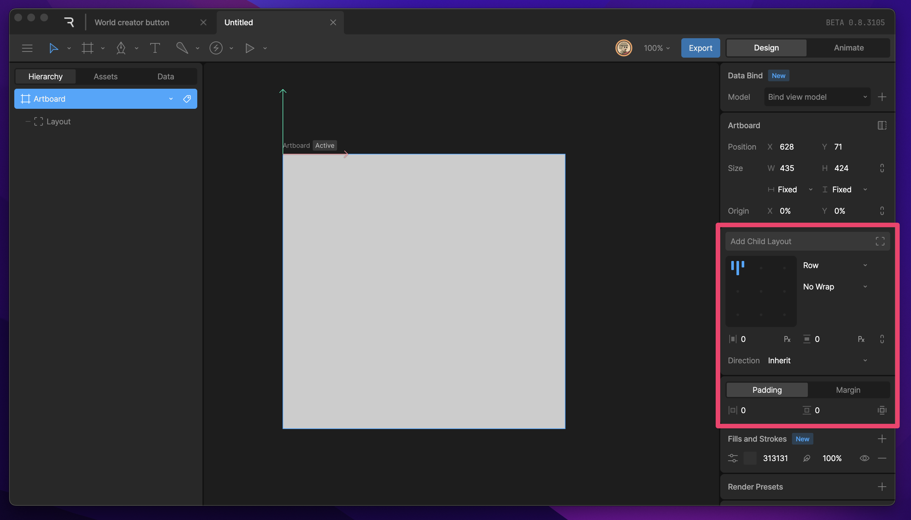

### 填充与描边 (Fill and Stroke)

画板本身也是一个图形，您可以像普通形状一样为它添加填充和描边。这通常用于设置背景颜色。

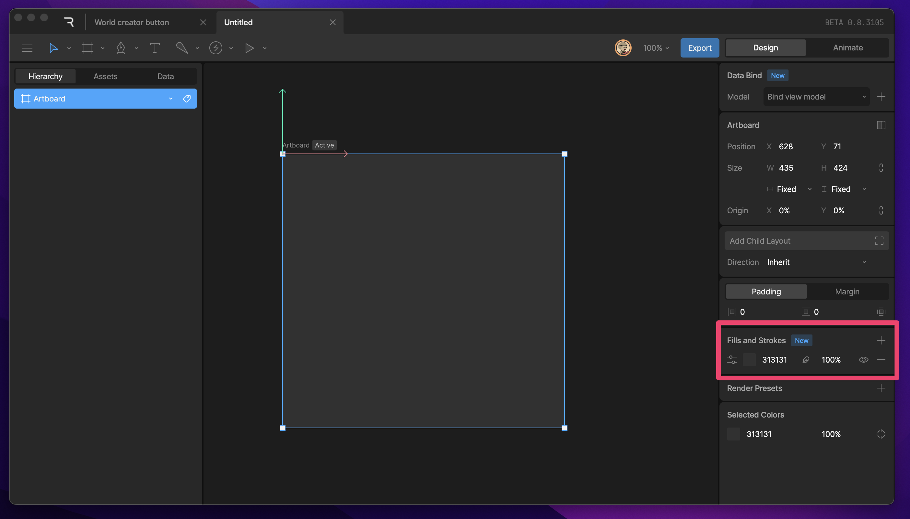

### 渲染预设 (Render Presets)

允许您更改画板的渲染方式。例如，您可以选择不透明（Opaque）以优化性能，或者更改绘图顺序。通常情况下，默认设置即可满足大多数需求。

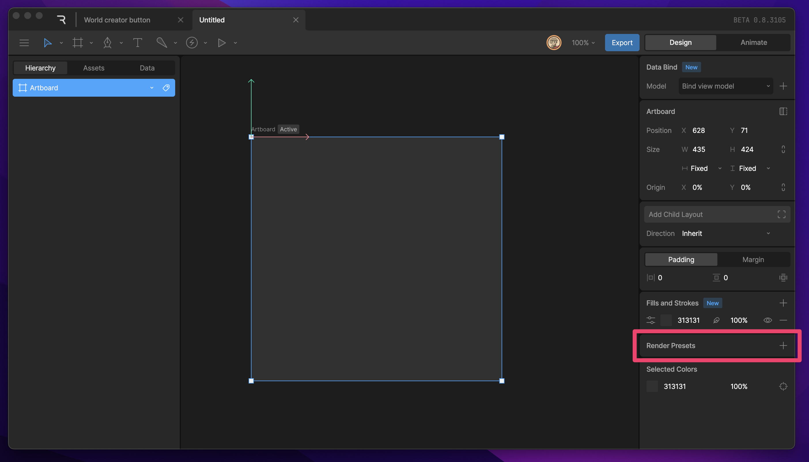

## 已选颜色 (Selected Colors)

如果选中了画板，属性检查器的底部会显示该画板中使用的所有颜色列表。这对于快速查找和替换颜色非常有用。

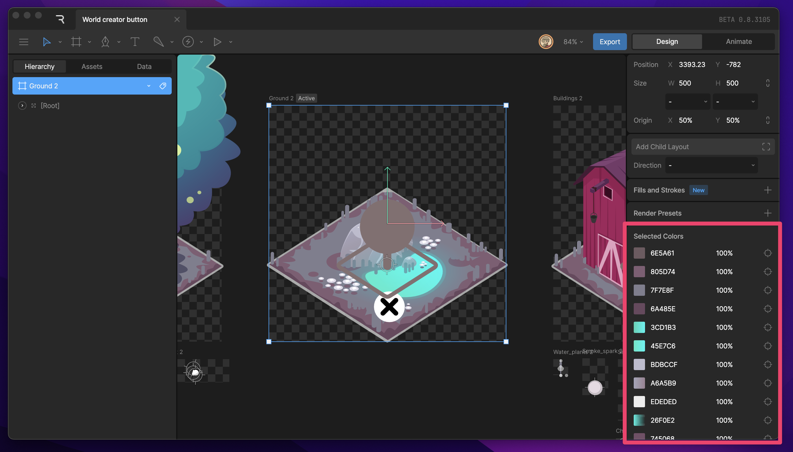
