基础知识

# 画板 (Artboards)

画板是文件的基石。

画板是你在设计模式 (Design Mode) 和动画模式 (Animate Mode) 下进行创作的基础。它们是每个层级结构的根节点，允许你定义场景的尺寸和背景颜色。你可以在 [舞台 (Stage)](../interface-overview/stage.md) 上创建无限个画板，但每个 Rive 文件都至少包含一个画板。
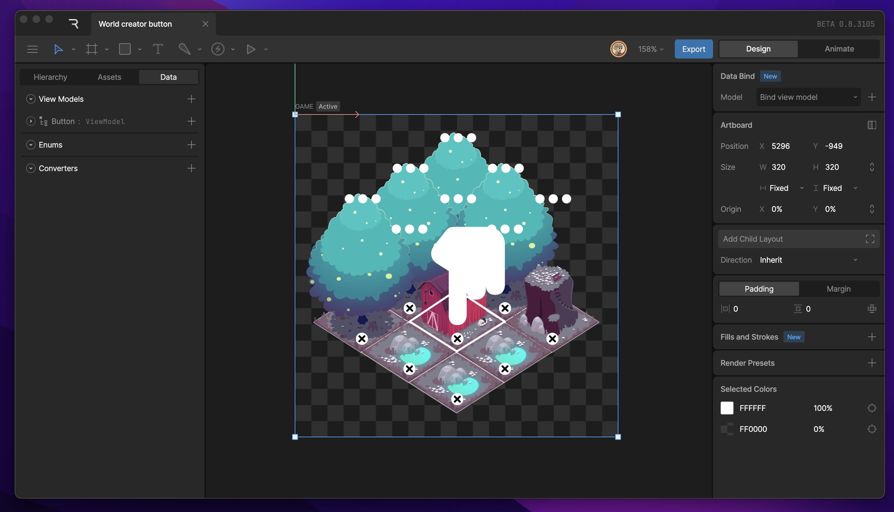

## [​](#​active-artboard) ​活动画板 (Active artboard)

活动画板在舞台上其名称旁有一个“活动 (Active)”标签（或是一个圆点）。你可以通过点击画板本身或舞台上它的任何子级来激活画板。请注意，编辑器各版块将仅显示与活动画板相关的内容。例如，树状结构中仅显示活动画板的层级；同样地，时间轴 (Timeline) 中也仅会显示引用自活动画板的动画。
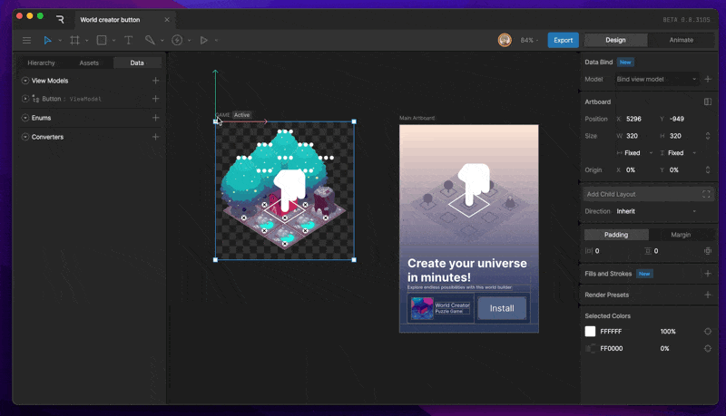

## [​](#default-state-machine) 默认状态机 (Default State Machine)

默认状态机是你在工具栏 (Toolbar) 中使用播放按钮时将播放的状态机。除了设置默认状态机外，这还设置了开发人员在 Rive 之外使用此文件时将看到的默认画板。
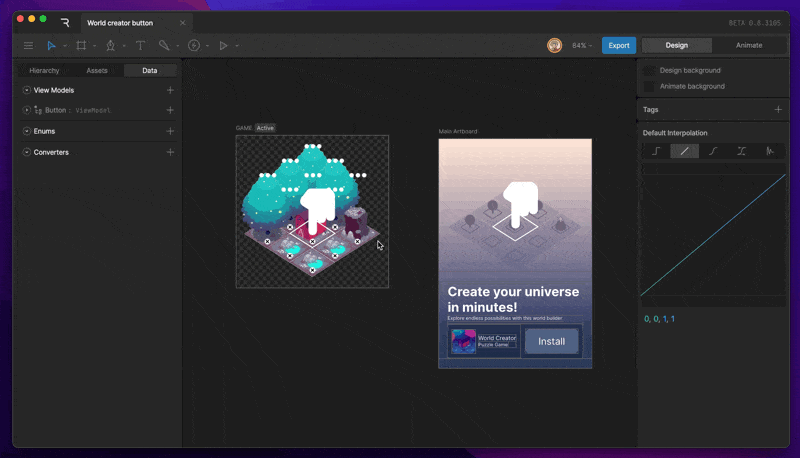
要更改默认状态机，请使用下拉菜单选择你想要使用的状态机。
你可以通过按住 Shift 键并点击空格键，在设计模式下快速播放所选状态机。
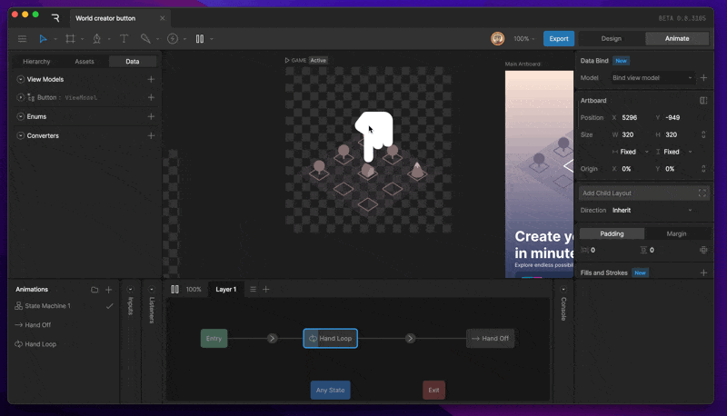

## [​](#​creating-an-artboard) ​创建画板

在创建任何图形之前，你首先需要创建一个画板。有两种方法可以创建画板：

1. 在一个新文件中，你会在舞台上看到用于定义画板尺寸或从几个预设中进行选择的选项。确定属性后，点击“创建画板 (Create Artboard)”按钮。
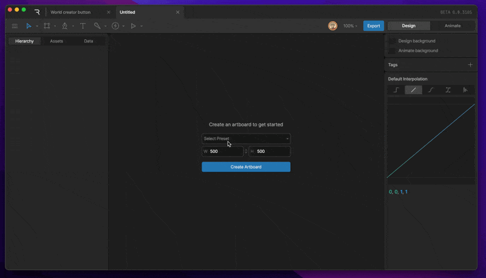
2. 或者，你可以使用位于画板菜单中的“画板工具”，或者使用快捷键 `A`。启用该工具后，通过点击并拖动来定义边界。你随时可以通过在 [层级面板 (Hierarchy)](../interface-overview/hierarchy.md) 中选中画板来在 [检查器 (Inspector)](../interface-overview/inspector.md) 中调整其大小和位置。

## [​](#artboard-properties) 画板属性 (Artboard properties)

每个画板都有各种属性可以在 [检查器 (Inspector)](../interface-overview/inspector.md) 中更改。可以更改的一些属性包括画板在 [舞台 (Stage)](../interface-overview/stage.md) 上的位置、大小、布局属性、填充颜色、原点 (Origin Point) 以及渲染预设。
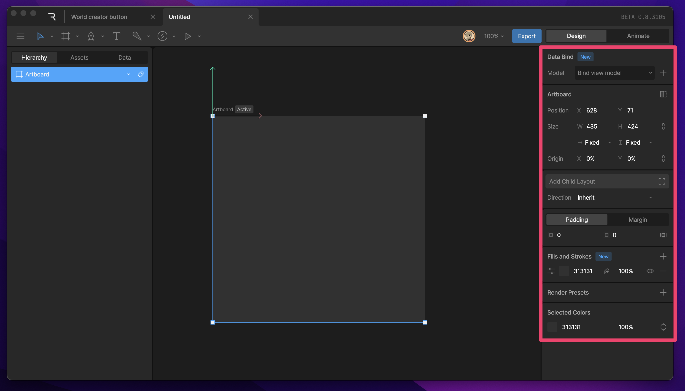

## [​](#position) **位置 (Position)**

画板在舞台上的位置由画板的位置属性控制。

## [​](#size-and-size-type) 大小与尺寸类型 (Size and Size Type)

默认情况下，画板被设置为固定大小，该大小由宽度 (Width) 和高度 (Height) 属性决定。
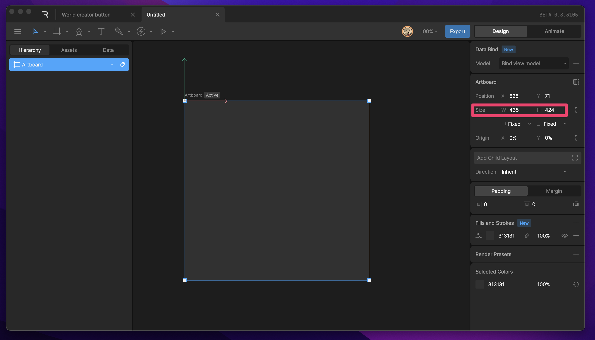
**链接图标 (Link Icon)**
与其他标有链接图标的属性一样，它可用于锁定当前尺寸属性的比例。
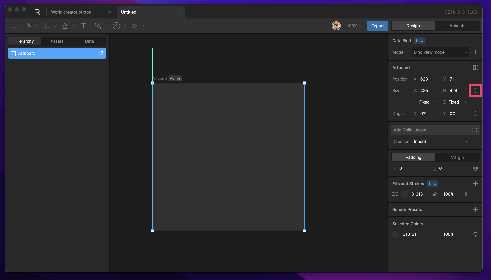

**尺寸类型 (Size Type)**
画板有两种尺寸模式：固定 (Fixed) 和包裹 (Hug)。可以通过宽度和高度属性下方的下拉菜单进行更改。

顾名思义，“固定 (Fixed)”类型允许你定义并为画板尺寸属性制作动画。
“包裹 (Hug)”类型会让画板自动调整其高度、宽度或两者以适应其子级。请注意，仅当画板至少包含一个子布局 (Layout) 对象时，此选项才可用。

## [​](#origin) 原点 (Origin)

画板的原点决定了与该画板关联的所有对象的测量起点。默认情况下，画板的原点是 X:0%, Y:0%。这些值将原点置于画板的左上角。
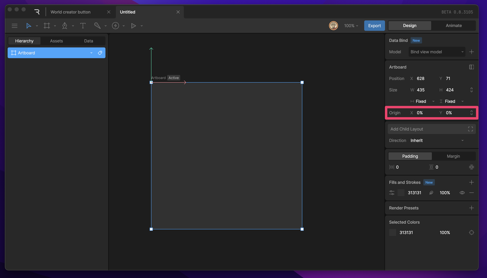
随着增加 X 或 Y 的值，原点会向右（在 X 轴上）和向下（在 Y 轴上）移动。
通常你不需要更改画板的原点，但如果你计划更改原点，最好在进行任何动画工作之前完成。在添加了动画关键帧之后更改原点可能会导致对象因为原点移动到新位置而显得错位。

**组件原点 (Component Origin)**
重要的是要记住，组件 (Component) 与其源画板共用原点。如果你计划执行诸如缩放或旋转组件的操作，更改原点将有助于简化该流程。
如果你在添加动画后才想起更改原点，你随时可以将组件添加到一个分组 (Group) 中，这会给你带来同级别的控制力。

## [​](#layout-settings) 布局设置 (Layout Settings)

由于画板是所有其他对象添加到的根对象，画板允许你添加和调整它们的布局属性。在此处了解更多关于布局的信息：[此处](/editor/layouts/overview.md)。
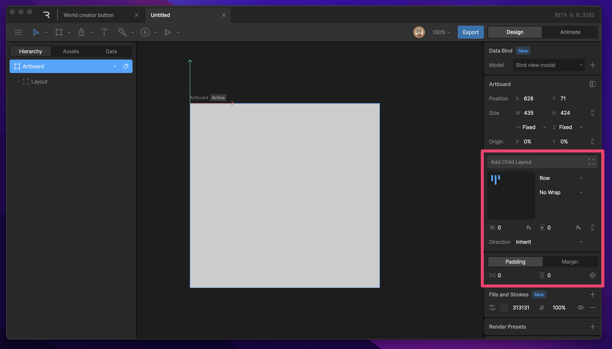
请注意，这些属性仅在画板中添加了一个或多个布局后才会生效。

## [​](#fill-and-stroke) 填充和描边 (Fill and Stroke)

与 Rive 中的其他对象一样，画板可以添加一个或多个填充 (Fills) 或描边 (Strokes)。添加和自定义填充及描边的过程对于画板和层级面板中的对象是相同的。
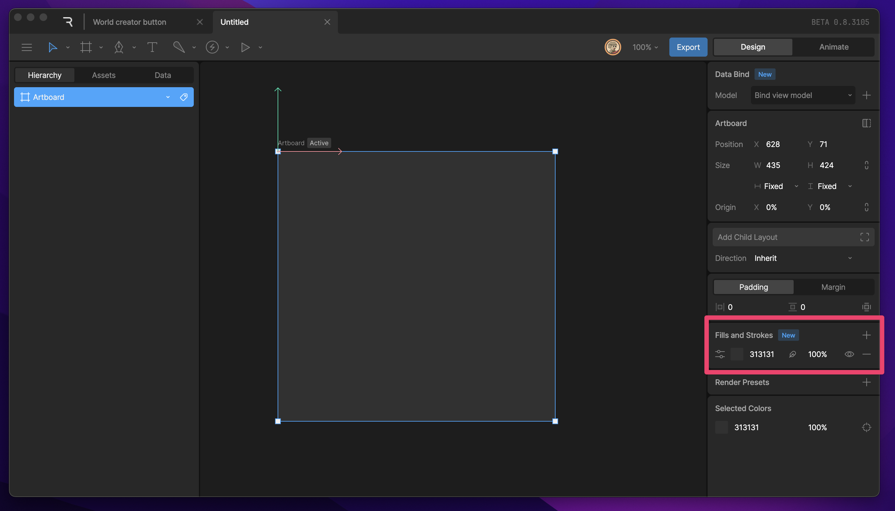
在此处阅读有关填充和描边的更多信息：[此处](/editor/fundamentals/fill-and-stroke.md)。

## [​](#render-presets) 渲染预设 (Render Presets)

选中画板后可以创建渲染预设，用于渲染出静态图形（如 PNG 和 SVG），以及视频和动态文件（如 PNG 序列和 MP4）。

在此处阅读有关创建渲染预设的更多信息：[此处](/editor/exporting/exporting-for-video-and-static-design)。

## [​](#selected-colors) 选中颜色 (Selected Colors)

选中画板时，你可以查看、定位并调整与画板上每个对象关联的所有颜色。
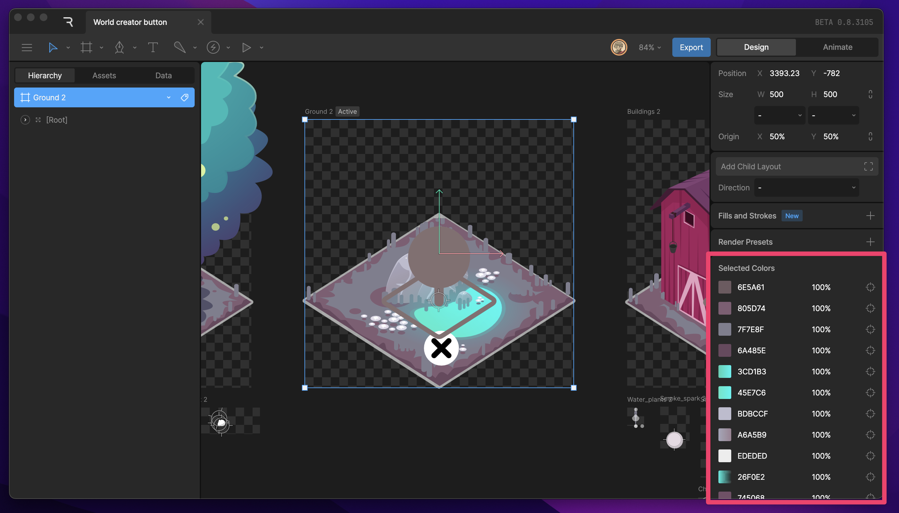