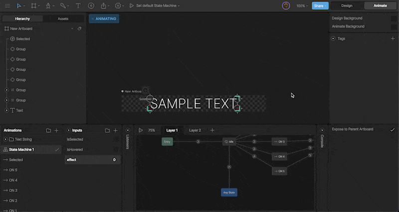
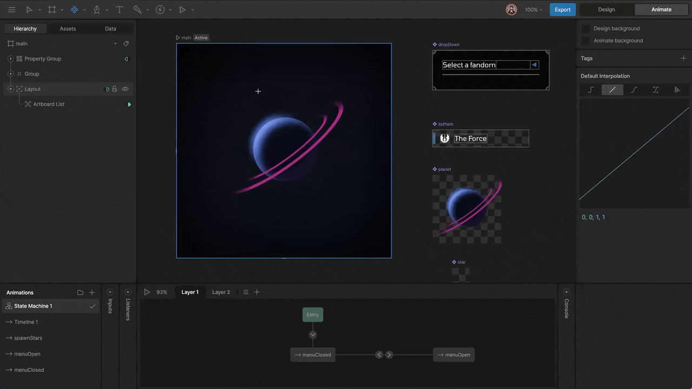
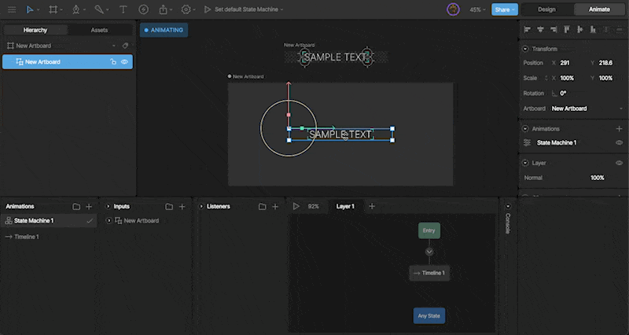
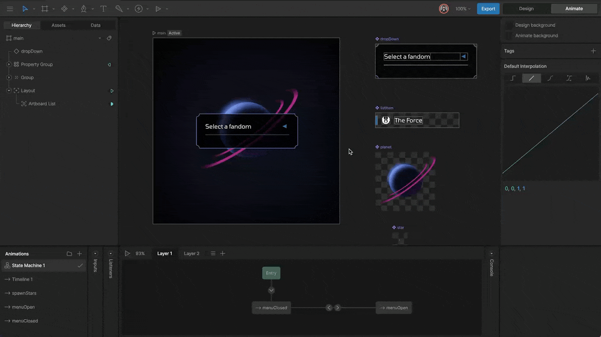
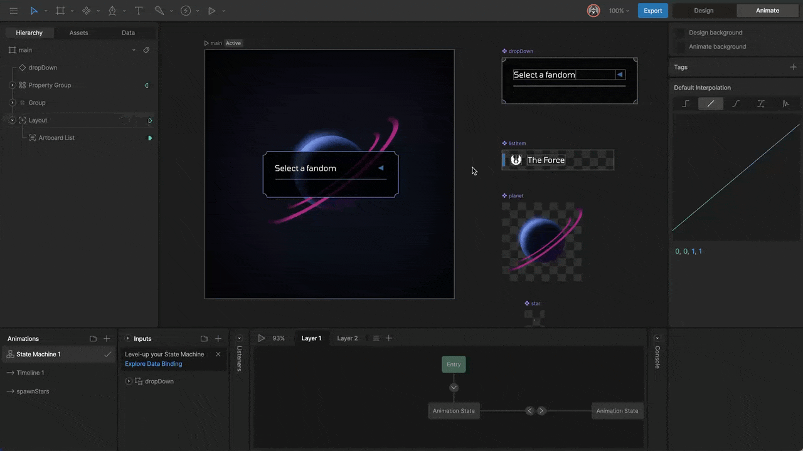
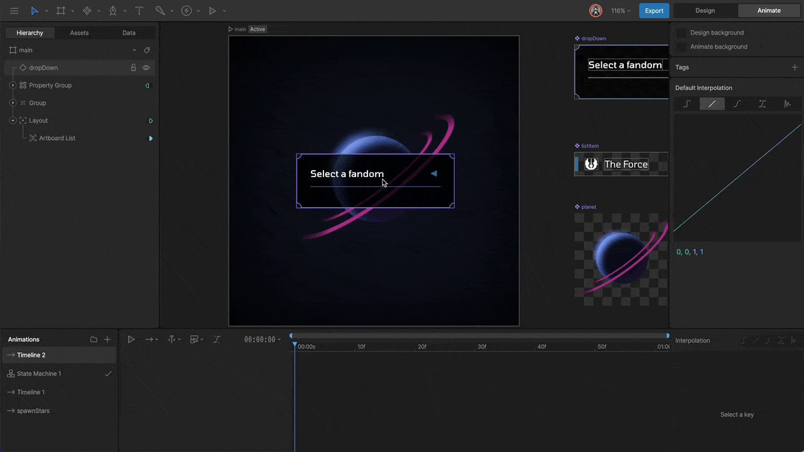
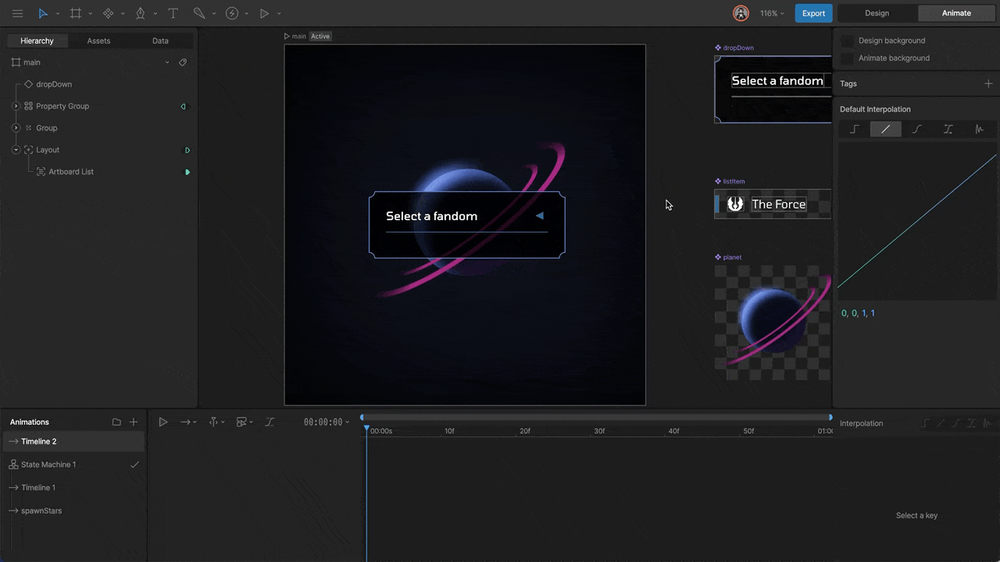
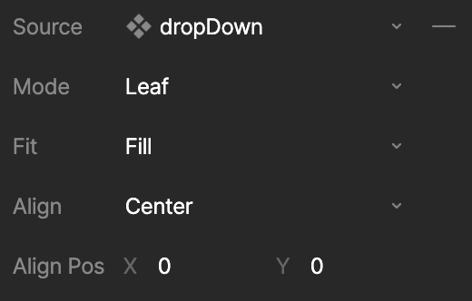
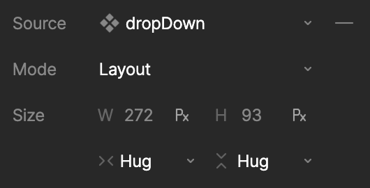
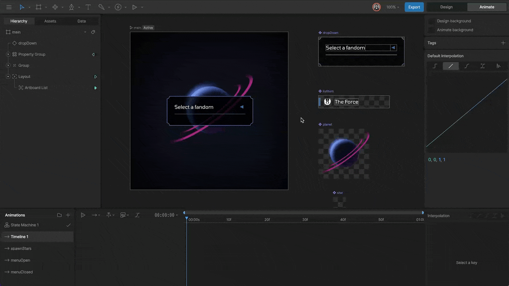

# 组件 (Components)

在 Rive 中，画板 (Artboards) 可以嵌套在其他画板内。当在一个画板中使用另一个画板时，我们将这个包含的画板称为**组件 (Component)**（以前称为嵌套画板）。

组件功能强大，因为它允许您创建可复用的图形元素、构建复杂的场景，甚至在角色身上附加道具。

## 创建组件 (Creating a Component)

要创建组件，只需使用画板工具 (A) 将一个画板嵌套到另一个画板中。只要画板包含任意内容，它就可以作为组件使用。

## 使用组件 (Using Components)

画板一旦创建，就会自动出现在**资产 (Assets)** 面板中。您可以将它们直接从资产面板拖拽到舞台上或其他画板中。

## 配置组件实例 (Configuring a Component Instance)

当您在画板中选中一个组件实例时，可以在右侧属性检查器中进行配置。

### 状态机 (State Machines)

组件实例最强大的功能之一是能够播放其内部的状态机。在属性面板的下拉菜单中，您可以选择要在此时运行的特定状态机。

### 添加动画 (Adding an Animation)

除了状态机，您还可以直接在组件实例上触发现性动画。点击组件属性旁边的 `+` 号可以添加动画槽。

Rive 提供两种播放动画的模式：

*   **Simple (简单)**: 就像在 Unity 或 Unreal 等游戏引擎中一样，动画会自动循环播放。
    

*   **Remap (重映射)**: 允许您使用从 0% 到 100% 的数值来手动控制动画的播放进度。这对于将动画进度绑定到滚动条或其他输入非常有用。
    

### 混合值 (Mix Value)

当应用多个动画或状态机时，您可以使用 **Mix (混合)** 值来控制它们之间的混合程度。这允许您在不同动作之间进行平滑过渡。

## 实例模式 (Instance Modes)

组件实例在父画板中有三种存在模式，决定了它的渲染和布局方式。

### 节点 (Node)

在 **Node** 模式下，组件仅作为一个空变换节点存在。它不可见，但保留了位置、旋转和缩放属性。这对于用作占位符或作为骨骼绑定的目标非常有用。

### 叶子 (Leaf)

在 **Leaf** 模式下，组件作为一个单一的渲染层存在。Rive 会将其展平为一个纹理，这在性能上有优势，但也意味着您无法单独控制其内部的每个形状。

您可以通过 **Leaf Fit** 和 **Leaf Alignment** 属性来控制组件内容在边界框内的显示方式（类似于 CSS 的 `object-fit`）。

### 布局 (Layout)

在 **Layout** 模式下，组件参与 Rive 的自动布局系统。它的尺寸和位置将根据父级容器的规则进行计算。

## 暴露输入和事件 (Exposing Inputs and Events)

组件不仅可以播放动画，还可以通过**输入 (Inputs)** 和**事件 (Events)** 与父级进行双向通信。

### 如何暴露输入 (How to Expose an Input)

在子画板的状态机中，勾选输入旁边的 **Expose to Parent (暴露给父级)** 选项。

现在，当该画板作为组件被嵌套时，您可以在父级的状态机中直接看到并控制这些输入。

### 在父画板上使用输入

一旦输入被暴露，您可以通过以下几种方式在父级画板中控制它们：

1.  **通过监听器 (Via a Listener)**: 在父级创建一个监听器，将目标设置为组件实例，并修改其输入。
2.  **使用事件 (Using Events)**: 子组件可以触发事件，父级监听这些事件并做出响应。
3.  **在状态机上设置关键帧 (Keying on the State Machine)**: 直接在父级的时间轴或状态中对子组件的输入值打关键帧。

这使得构建复杂的交互式 UI 组件（如按钮、滑块、开关）变得非常容易，因为逻辑封装在组件内部，而控制权在父级。
