基础知识

# 组件 (Components，原嵌套画板)

组件利用可复用的画板和动画来简化你的工作流程。对源组件所做的更改将反映在其所有实例中。

## [​](#creating-a-component) 创建组件 (Creating a Component)

任何画板都可以转换为组件。为此，请在舞台上选择一个画板，并使用检查器中的组件图标来切换其状态。
或者，在选中画板的情况下使用 `Shift` + `N` 快捷键。如果你习惯使用 Figma，那么 `Cmd/Ctrl` + `Alt/Option` + `K` 快捷键也同样适用。
再次在检查器中选择组件切换按钮，可将所选内容恢复为普通画板，或者使用 `Shift` + `Alt/Option` + `N` 快捷键。
目前，只有标记为组件的画板才会被导出到你的 `.riv` 文件中。如果你认为可能需要在运行时通过程序访问某个画板，应将其标记为组件。关于特定导出行为的更多选项即将推出。

## [​](#using-components) 使用组件 (Using Components)

使用组件工具（原名为嵌套画板工具）来选择并向舞台放置组件实例。从工具栏选择该工具或使用 `N` 快捷键启用它。
点击舞台上的任何位置即可将组件放置在所需位置。菜单将显示可实例化的可用组件。如果没有显示任何内容，可能是你的文件中没有任何画板被标记为组件。
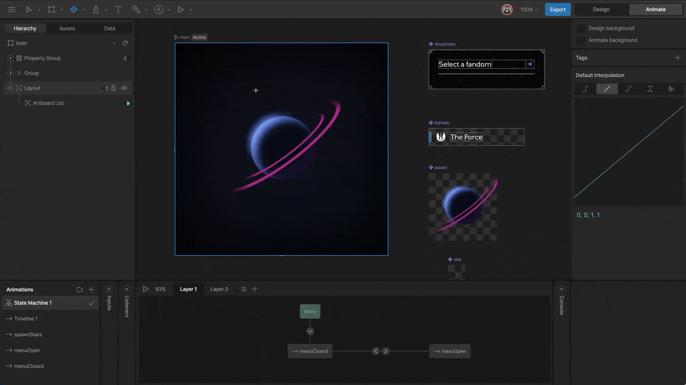
或者，选择工具栏图标右侧的下拉菜单以预先选择组件。该菜单由资产选项卡的排序模式决定 —— “自定义 (Custom)”模式将按资产面板中的组织方式展示组件，而“来源/类型 (Source/Type)”模式将按其来源展示组件。后者在我们的“库 (Libraries)”功能中会非常有用。

## [​](#configuring-a-component-instance) 配置组件实例 (Configuring a Component Instance)

添加组件实例后，选择一个时间轴或状态机进行回放。

### [​](#state-machines) 状态机 (State Machines)

分配实例后，默认状态机将显示在检查器中。
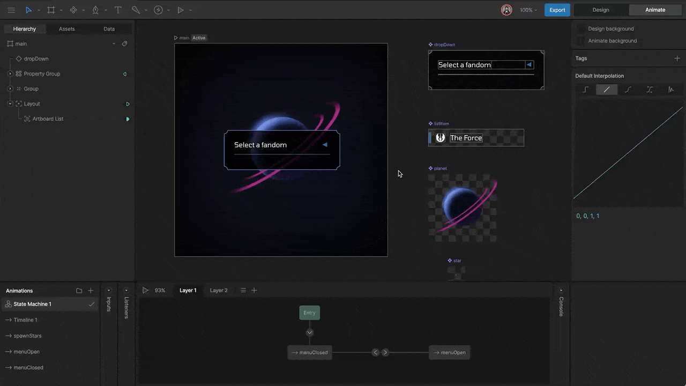
如果你公开了任何输入项 (Inputs)，可以在选中动画时通过选项菜单访问它们，或者在选中状态机时通过输入面板访问它们。
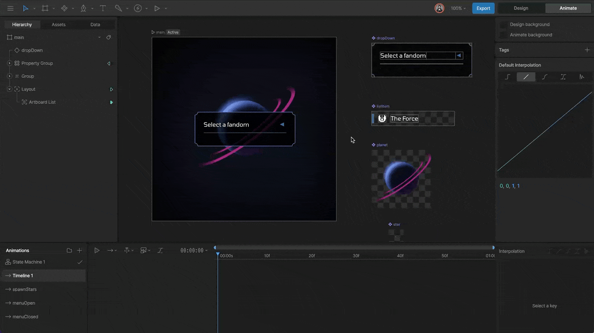

### [​](#adding-an-animation) 添加动画 (Adding an Animation)

你可以播放与组件关联的任何动画。你需要使用检查器中的加号按钮将所需的动画添加到实例中。
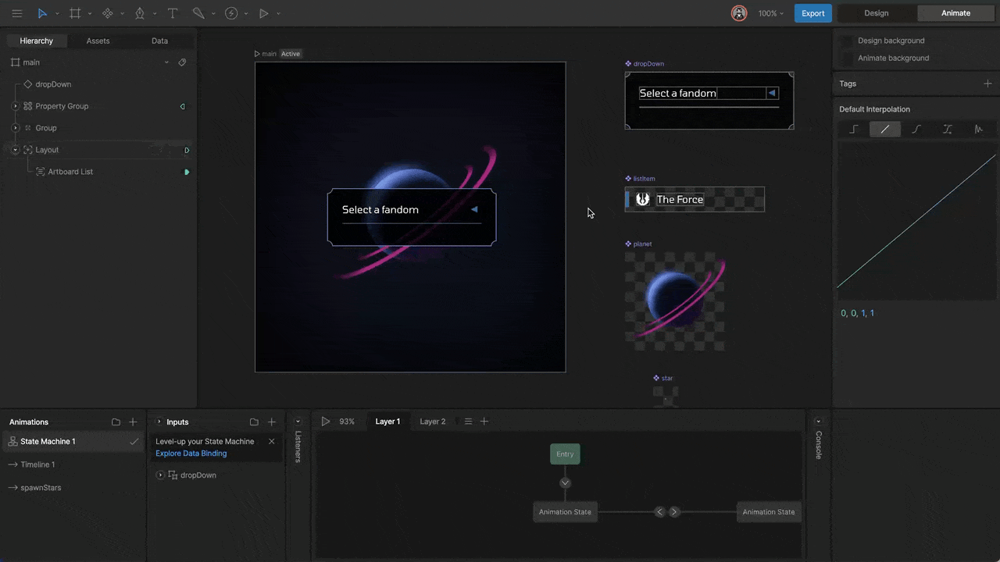
这些动画可以单独使用，与状态机混合使用，或者与其他动画分层使用。
请注意，在添加动画之前，你必须选择它是“简单 (Simple)”动画还是“重映射 (Remapped)”动画。

#### [​](#simple) 简单动画 (Simple)

简单动画是播放组件时间轴的一种便捷方式。
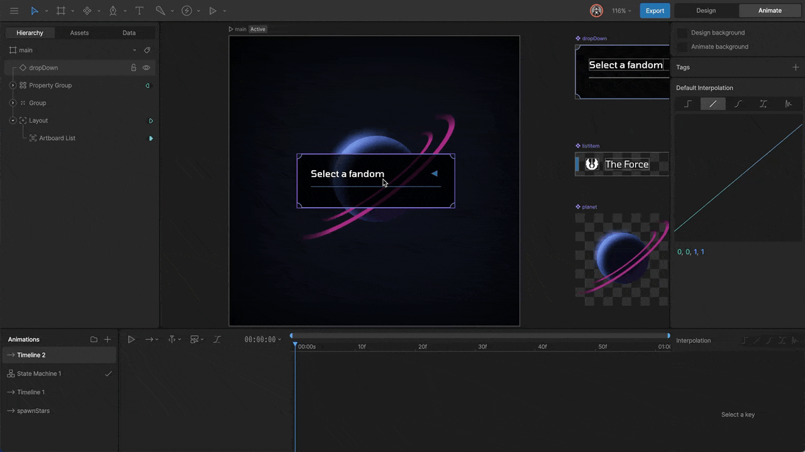
简单动画允许你在时间轴上设置其起点关键帧。你还可以选择更改动画的播放速度。

#### [​](#remap) 重映射动画 (Remap)

重映射动画允许你在时间轴上为动画的时间值设置关键帧。这让你可以拉伸、收缩，甚至反向播放动画。
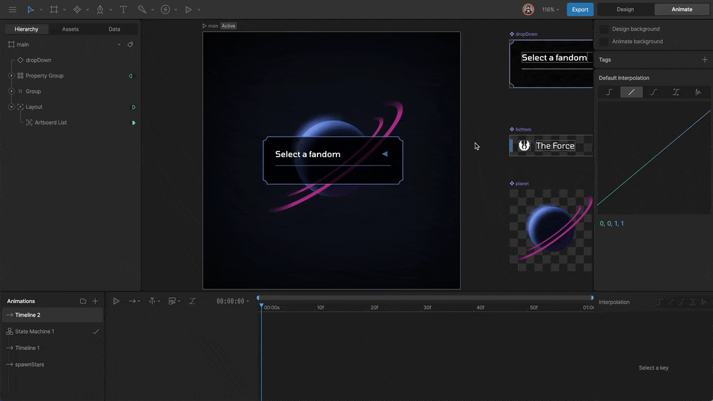
请注意，时间值以百分比表示，0% 代表时间轴的起点，100% 代表终点。

### [​](#mix-value) 混合值 (Mix Value)

当你向组件添加更多动画时，动画开始混合在一起。这种混合非常重要，特别是当多个动画共用已设置关键帧的属性时。如果不调整此值，你的组件可能无法按你期望的方式播放动画。
默认情况下，添加到组件的任何动画起始混合值均为 100%。你可以在设计模式下调整此值，或通过设置关键帧在特定动画中调整。**请注意，混合值不为零的动画将始终与其他动画混合，无论是否设置了播放关键帧。**
为确保播放正确的动画，请确保将目标动画的混合值设为 100%，并将所有其他动画的混合值设为 0%。

## [​](#instance-modes) 实例模式 (Instance Modes)

组件实例可以设置为使用 3 种模式之一，这些模式会根据其内容和使用上下文而表现不同。“叶节点 (Leaf)”和“布局 (Layout)”模式通常在父画板需要响应式布局其内容时使用。

### [​](#node) 节点模式 (Node)

这是默认模式，用于非响应式场景。其内容将始终以缩放形式显示（通过 Scale 属性）。

### [​](#leaf) 叶节点模式 (Leaf)

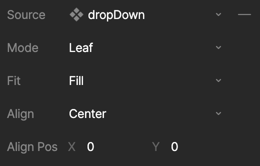
叶节点模式会使组件始终相对于其所在的布局或画板进行定位和调整大小。如果组件包含需要随容器调整大小但不包含布局本身的元素，这将非常有用。

#### [​](#leaf-fit) 叶节点适配模式 (Leaf Fit)

适配类型决定了组件叶节点在其分配区域内如何缩放。

- **填充 (Fill) (默认)**: 内容将填满可用视图。如果宽高比不同，Rive 内容将被拉伸。
- **包含 (Contain)**: 内容将包含在视图内，并保持宽高比。如果比例不同，视图的一部分将留空。
- **覆盖 (Cover)**: Rive 将覆盖整个视图，并保持宽高比。如果内容比例与视图不同，内容将被裁剪。
- **填满宽度 (Fit Width)**: 内容将填满视图的宽度。这可能导致裁剪或留空。
- **填满高度 (Fit Height)**: 内容将填满视图的高度。这可能导致裁剪或留空。
- **无 (None)**: 内容将按其画板原始大小渲染，这可能导致裁剪或留空。
- **缩小适应 (Scale Down)**: 内容将缩小到视图的大小并保持宽高比。当内容大于画布时，这相当于“包含”。如果画布更大，则不会放大。

#### [​](#leaf-alignment) 叶节点对齐 (Leaf Alignment)

对齐类型决定内容在分配区域内的对齐方式。对齐采用 3x3 网格方式：**居中 (Center) (默认)**、**左下**、**底部居中**、**右下**、**左侧居中**、**右侧居中**、**左上**、**顶部居中**、**右上**。

#### [​](#leaf-alignment-position-x/y) 叶节点对齐位置 X/Y

叶节点对齐位置是对齐方式的数值表示，可用于 9 种预设对齐选项不理想的情况。数值表示如下：X = -1 (左)、0 (中)、1 (右)；Y = -1 (上)、0 (中)、1 (下)。也可以使用非整数值来进行各种对齐，例如 X = 0.5 将使内容定位于中心和右侧之间的中间位置。

### [​](#layout) 布局模式 (Layout)

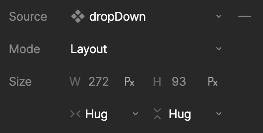
当你的组件包含需要在父级大小更改时保持响应式的布局 (Layouts) 时，请使用布局模式。这是唯一一种组件内容不被缩放，而是画板大小发生变化以重新排列组件内容的模式。

#### [​](#layout-scale-type) 布局缩放类型 (Layout Scale Type)

- **固定 (Fixed)** - 布局的固定宽度或高度。定义的值可以是点 (point) 或百分比。使用字段内的单位切换按钮在值类型之间切换。
- **包裹 (Hug)** - 布局的宽度和/或高度收缩以适应其子级。如果你的组件包含文本或其他需要决定其大小的对象，这将非常有用。
- **填充 (Fill)** - 布局的宽度和/或高度扩展，以填满父布局或画板内的可用空间。

#### [​](#layout-size) 布局大小 (Layout Size)

当设置为固定时，组件的宽度和高度可以设置为像素或百分比值。这与缩放 (Scale) 属性不同，缩放属性会改变组件的比例。通常在选择布局模式时不应使用缩放。

## [​](#exposing-inputs-and-events) 公开输入项和事件 (Exposing Inputs and Events)

公开组件的输入项 (Inputs) 和/或事件 (Events)，以便从父级/宿主画板控制它们。这允许你通过状态机使用一个组件来控制另一个组件。

### [​](#how-to-expose-an-input) 如何公开输入项

公开输入项允许父画板访问并操纵它。为此，请选择所需的输入项，然后在检查器中勾选“公开给主画板 (expose to main artboard)”选项。
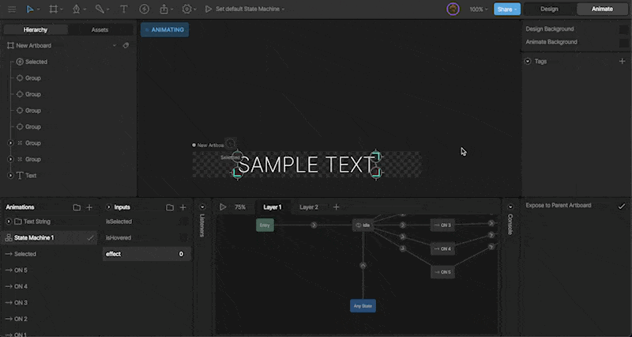
创建组件后，你可以在检查器的选项面板和输入面板中看到任何公开的输入项。

### [​](#using-inputs-on-a-parent-artboard) 在父画板上使用输入项

公开的输入项可以在输入面板或检查器中找到。你可以通过监听器 (Listeners)、事件 (Event) 或在时间轴上设置关键帧来使用它们。
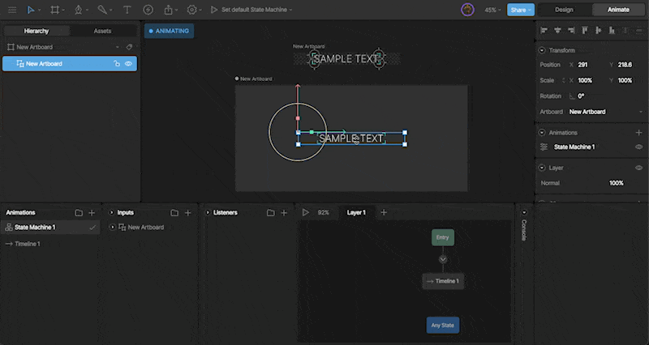

#### [​](#via-a-listener) 通过监听器 (Via a Listener)

当你创建监听器时，你会发现所有公开的输入项都作为监听器的“设置输入属性 (set input property)”出现。此选项允许你例如同时更改多个画板的布尔输入。
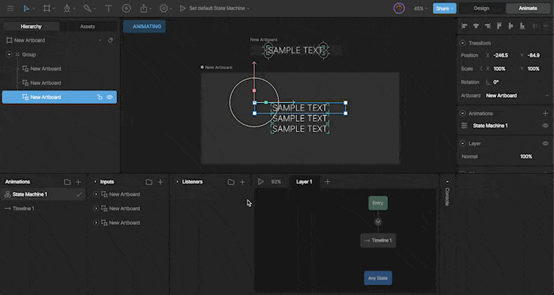

#### [​](#using-events) 使用事件 (Using Events)

此外，我们可以使用监听器来监听来自组件的事件触发，并相应地更改输入。
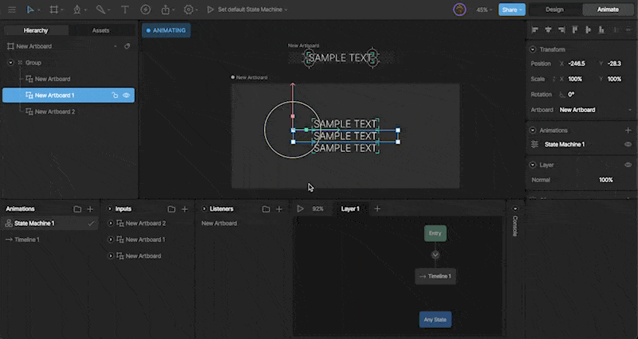
要查看与画板关联的事件，你需要将该画板设置为监听器的目标。该事件现在将作为监听器动作列出。

#### [​](#keying-on-the-state-machine) 在状态机上设置关键帧

你可以通过检查器中的选项面板在父画板上为公开的输入项设置关键帧。
这是一个很方便的技巧，例如当你想要设置实例内的文本值时。