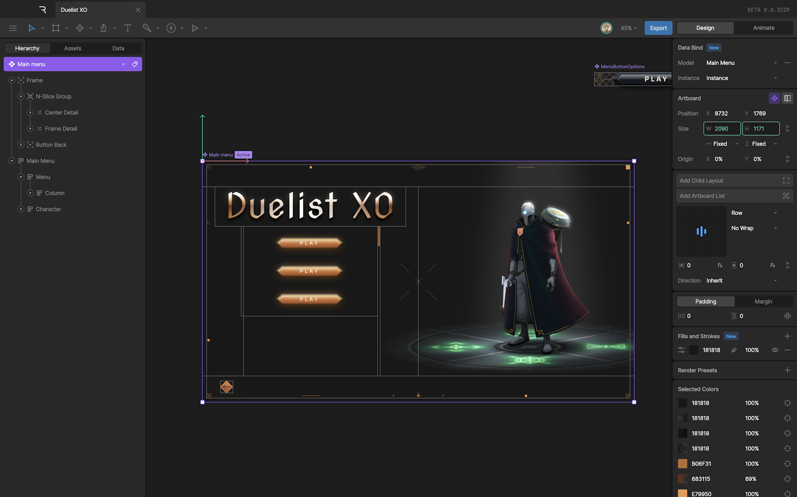
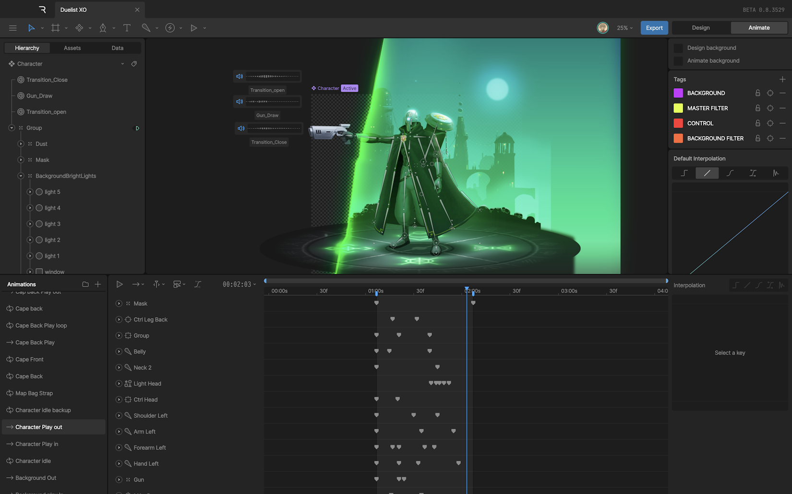
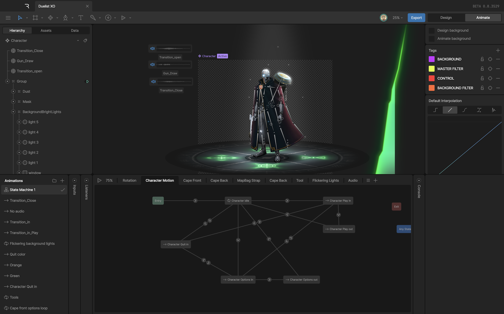

# 设计与动画模式 (Design vs Animate Mode)

Rive 编辑器有两种主要模式：**设计模式 (Design Mode)** 和 **动画模式 (Animate Mode)**。

您可以通过点击编辑器左上角的 [切换按钮](editor/interface-overview/toolbar)，或者使用 **Tab** 键来在这两种模式之间切换。

## 设计模式 (Design Mode)

设计模式是您的默认起始位置。Rive 将设计与动画分离，因此您无需在设计模式下担心时间轴或关键帧。

在这个模式下，您可以：
*   **设置场景**：绘制图形、导入资源（SVG, PSD 等）。
*   **创建层次结构**：通过分组（Groups）和约束（Constraints）组织对象。
*   **构建骨骼 (Rigging)**：添加骨骼（Bones）并绑定图形网格。

您在设计模式下所做的一切都是为了给动画做准备。这就像是定格动画中的“制作木偶”阶段。

## 动画模式 (Animate Mode)

准备好让您的设计动起来了吗？切换到动画模式。

在动画模式下，您所做的任何更改（例如移动形状位置、改变颜色或不透明度）都会被记录为**关键帧 (Keyframes)**。

这个模式解锁了两个新面板：
1.  **时间轴 (Timeline)**：用于创建传统的线性动画。
2.  **状态机 (State Machine)**：用于创建交互式动画逻辑。

注意，当您处于动画模式时，所选的时间轴或状态机会以蓝色高亮显示，以提醒您当前的更改将被记录。

### 在动画模式下创建资源

虽然大多数资源创建是在设计模式下完成的，但您也可以在动画模式下添加某些对象，例如**事件 (Events)** 和 **监听器 (Listeners)**。这些通常直接属于状态机逻辑的一部分。

## 快捷键切换

只有当舞台（Stage）获得焦点时，即您最近一次是在舞台上点击或操作时，使用 **Tab** 键切换模式才会生效。

*   **Tab**: 在设计模式和上次使用的动画/状态机之间切换。
