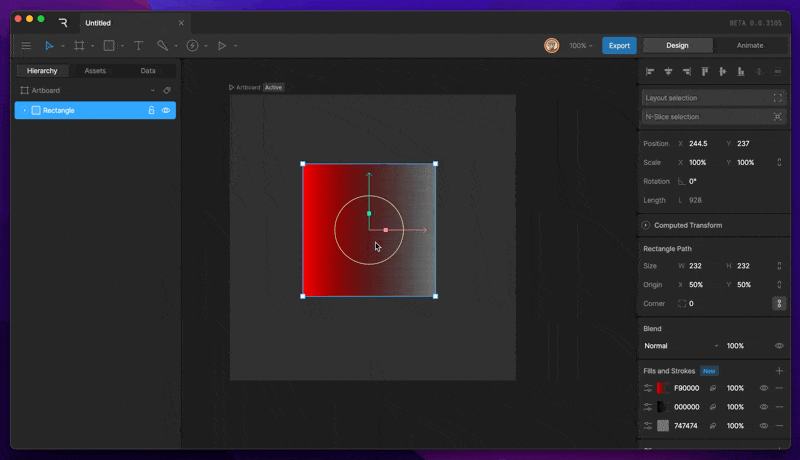
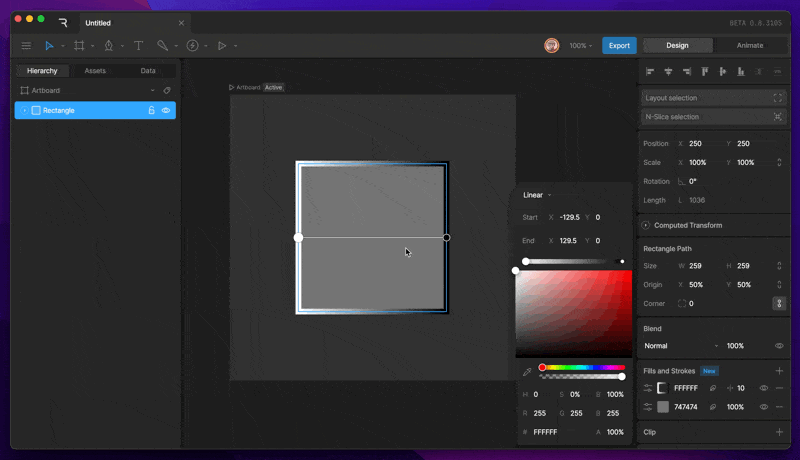
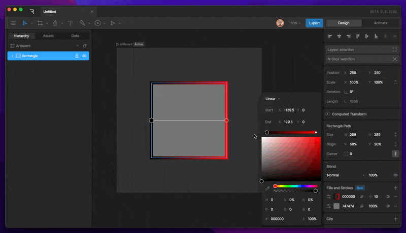
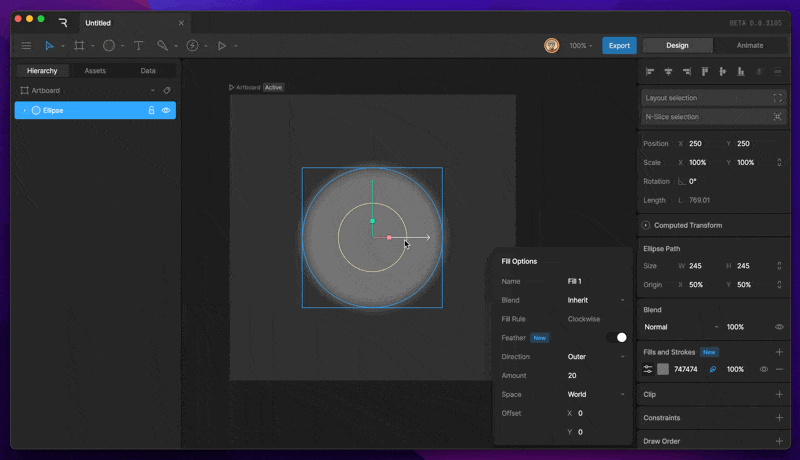
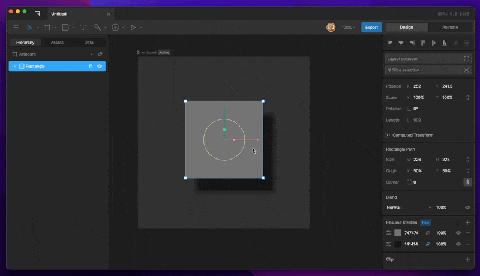

基础知识

# 填充和描边 (Fill and Stroke)

检查器的填充 (Fill) 和描边 (Stroke) 部分允许你添加和修改当前选中对象的填充和描边属性。你可以根据需要创建任意数量的填充或描边。

# [​](#fill) 填充 (Fill)

### [​](#create-a-new-fill) **创建新填充**

要创建填充，请选择一个形状，然后点击检查器中“填充和描边”部分下的加号按钮。务必从出现的菜单中选择“填充 (Fill)”。通过查看左侧的颜色方块，你可以辨别出一个图层是否为填充。

### [​](#changing-fill-color) **更改填充颜色**

要更改填充颜色，请点击填充图层左侧的颜色方块。这将打开颜色选择器 (Color Picker)。从那里，你可以使用各种滑块选择你想要的填充颜色。

### [​](#changing-fill-type) **更改填充类型**

创建新形状时，默认情况下形状将具有纯色填充。添加新填充时，默认情况下填充类型设置为线性渐变 (linear)。我们经常需要在不同类型之间切换填充类型。这可以通过点击颜色方块来完成。

打开填充设置后，你会在选项框顶部找到填充选择下拉菜单。
可以选择的不同填充类型包括：

- **纯色 (Solid)**
- **线性渐变 (Linear Gradient)**
- **径向渐变 (Radial Gradient)**

### [​](#changing-fill-color-gradient) **更改填充颜色（渐变）**

要更改填充颜色，请点击填充图层左侧的颜色方块。这将打开颜色选择器。

选中渐变时，你会注意到颜色选择器上方出现一个新条。这代表渐变在不同点的颜色。
默认情况下，渐变有两个控制点 (stoppers)。

### [​](#changing-the-color-of-a-stopper) **更改控制点颜色**

要更改特定颜色控制点的颜色，请先选择你想要更改的控制点。
接下来，使用各种滑块选择该控制点应有的颜色。

### [​](#adding-and-removing-stoppers) **添加和删除控制点**

要添加新的颜色控制点，请点击色条上当前没有其他控制点的任何位置。这将生成一个额外的颜色控制点。

要删除颜色控制点，请选择要删除的控制点，然后按下 Delete 或 Backspace 键。

### [​](#change-fill-order) **更改填充顺序**

填充在列表中的组织顺序决定了它们的渲染顺序，顶部的填充渲染在前面，底部的填充渲染在后面。

通过在图层内的空白区域点击并拖动，可以随时更改此顺序。

### [​](#fill-properties) **填充属性**

每个填充都有自己的属性，可以在时间轴上进行编辑和设置关键帧。其中一些属性可以通过填充选项按钮找到。

**填充名称 (Fill Name) -** 你可以使用此属性编辑填充的名称。
**混合模式 (Blend) -** 此选项可用于更改单个填充的混合模式。默认情况下，此模式将设置为“继承 (inherit)”，即继承形状图层的混合模式。
**填充规则 (Fill Rule) -** 此选项可用于更改填充的填充规则。如果你希望填充羽化，则必须将其设置为“顺时针 (clock-wise)”。
**羽化 (Feather) -** 可以启用此选项来羽化选中的填充。在下文阅读有关羽化的更多信息。

### [​](#deleting-and-hiding-a-fill) **删除和隐藏填充**

很多时候我们需要删除或隐藏特定的填充。这可以通过选择形状，然后使用眼睛图标隐藏填充，或使用减号图标删除填充来完成。

### [​](#fill-rule) 填充规则 (Fill Rule)

填充规则决定了形状中重叠路径的填充方式：

- **非零 (Non-Zero)** 为顺时针路径分配 +1 值，为逆时针路径分配 -1 值。合计值不等于 0 的区域将被填充。
- **奇偶 (Even-Odd)** 为顺时针路径分配 +1 值，为逆时针路径分配 -1 值。合计值为偶数的区域将被填充，而奇数值则不会。
- **顺时针 (Clockwise)** 是 Rive 特有的填充规则。此填充规则支持手动减去路径，该功能可在编辑顶点模式下找到。该填充规则也是启用矢量羽化 (vector feathering) 的形状所必需的。

# [​](#stroke) 描边 (Stroke)

### [​](#create-a-new-stroke) 创建新描边

要创建描边，请选择一个形状，然后点击检查器中“填充和描边”部分下的加号按钮。务必从出现的菜单中选择“描边 (Stroke)”。通过查看左侧的颜色方块，你可以辨别出一个图层是否为描边。描边由带轮廓的方框表示。

### [​](#changing-stroke-color-solid) **更改描边颜色（纯色）**

要更改描边的颜色，请点击描边图层左侧的颜色方块。这将打开颜色选择器。从那里，你可以使用各种滑块选择你想要的描边颜色。

### [​](#changing-stroke-type) **更改描边类型**

默认情况下，描边被设置为纯色，但可以从颜色选择器菜单中选择各种描边类型。

可以选择的不同描边类型包括：

- **纯色 (Solid)**
- **线性渐变 (Linear Gradient)**
- **径向渐变 (Radial Gradient)**

### [​](#changing-stroke-color-gradient) **更改描边颜色（渐变）**

要更改描边的颜色，请点击描边图层左侧的颜色方块。这将打开颜色选择器。
选中渐变时，你会注意到颜色选择器上方出现一个新条。这代表渐变在不同点的颜色。
默认情况下，渐变有两个控制点。

### [​](#changing-the-color-of-a-stopper-2) **更改控制点颜色**

要更改特定颜色控制点的颜色，请先选择你想要更改的控制点。

接下来，使用各种滑块选择该控制点应有的颜色。

### [​](#adding-and-removing-stoppers-2) **添加和删除控制点**

要添加新的颜色控制点，请点击色条上当前没有其他控制点的任何位置。这将生成一个额外的颜色控制点。

要删除颜色控制点，请选择要删除的控制点，然后按下 Delete 或 Backspace 键。

### [​](#deleting-and-hiding-a-stroke) **删除和隐藏描边**

很多时候我们需要删除或隐藏特定的描边。这可以通过选择形状，然后使用眼睛图标隐藏描边，或使用减号图标删除描边来完成。

# [​](#stroke-properties) 描边属性 (Stroke Properties)

每个描边都有自己的属性，可以在时间轴上进行编辑和设置关键帧。其中一些属性可以通过描边选项按钮找到。
**描边名称 (Stroke Name) -** 你可以使用此属性编辑描边的名称。
**混合模式 (Blend) -** 此选项可用于更改单个描边的混合模式。默认情况下，此模式将设置为“继承 (inherit)”，即继承形状图层的混合模式。
**线帽 (Cap) -** 此选项更改描边的末端样式。在下文阅读有关不同线帽的信息。

- **平头 (Butt)** 描边末端是直线，且不超出末端顶点。在零长度路径上，描边根本不会被渲染。
- **圆头 (Round)** 描边末端是圆形的。在零长度路径上，描边是一个完整的圆。
- **方头 (Square)** 描边末端是方形的，且延伸到末端顶点之外。在零长度路径上，描边是一个正方形。

**连接 (Join) -** 此选项更改描边转角的渲染方式。在下文阅读有关不同连接选项的信息。

- **圆角 (Round)** 创建圆滑的转角。
- **斜切 (Bevel)** 创建切平的转角。
- **尖角 (Miter)** 创建尖锐的转角。

**应用变换 (Apply Transformations) -** “应用变换”开关决定了形状图层的缩放是否会影响描边的粗细。当此开关关闭时，无论缩放如何，描边的粗细都将保持不变。
**羽化 (Feather) -** 可以启用此选项来羽化选中的描边。在下文阅读有关羽化的更多内容。
**描边类型 (Stroke Type)** - 在描边选项面板底部，你可以找到将描边在纯色、修剪、虚线描边之间切换的选项。

- **实线 (Solid) -** 将描边渲染为实线。这是每个新创建描边的默认描边类型。
- **修剪 (Trim) -** 允许你为线段的起点、终点和偏移值制作动画。在此处阅读更多：[此处](/editor/manipulating-shapes/trim-path.md)。
- **虚线 (Dashed) -** 允许你创建具有诸如虚线线段长度和偏移量等可动画属性的虚线描边。在此处阅读更多：[此处。](/editor/manipulating-shapes/trim-path.md)

# [​](#vector-feathering) 矢量羽化 (Vector Feathering)

矢量羽化是一种为填充和描边设置羽化的新方式。矢量羽化是我们在 Rive 发明的一种技术，它可以柔化矢量路径的边缘，而不会产生传统模糊效果那样的性能影响。

### [​](#enabling-vector-feathering) **启用矢量羽化**

有两种主要方法可以在任何描边或填充上启用矢量羽化。

- **羽化图标 (Feather Icon) -** 羽化图标可用于任何填充或描边图层，以启用矢量羽化。
- **羽化开关 (Feather Toggle) -** 羽化开关可以在填充/描边选项面板中找到。

### [​](#feathering-options) 羽化选项 (Feathering Options)

羽化可以以多种方式进行自定义。一旦在填充或描边上启用了羽化，就可以在选项面板中找到羽化选项。
**方向 (Direction)** - 此选项允许你选择随着增加羽化量，路径将向哪个方向羽化。

- 外部 (Outer) - 此选项创建从路径向外羽化的效果。
- 内部 (Inner) - 此选项创建从路径向内羽化的效果。

**数量 (Amount)** - 此选项允许你增加或减少应用的羽化量。

**空间 (Space) -** 决定了如果羽化存在任何位移，羽化填充或描边将如何应用来自父级的变换。

- 世界 (World) - 变换将从世界变换中应用。羽化现在的行为类似于投影 (drop shadow)。
- 局部 (Local) - 变换将从局部变换中应用。此模式将使羽化的变换符合你的预期。

**偏移 (Offset)** - 偏移属性允许你通过增加或减少 X 和 Y 数值来使羽化远离路径。
