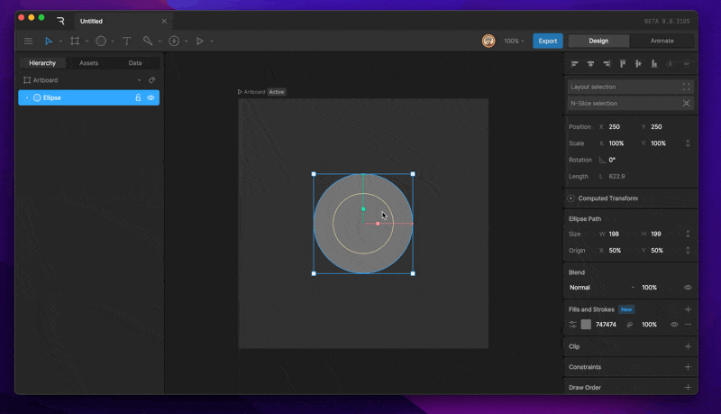
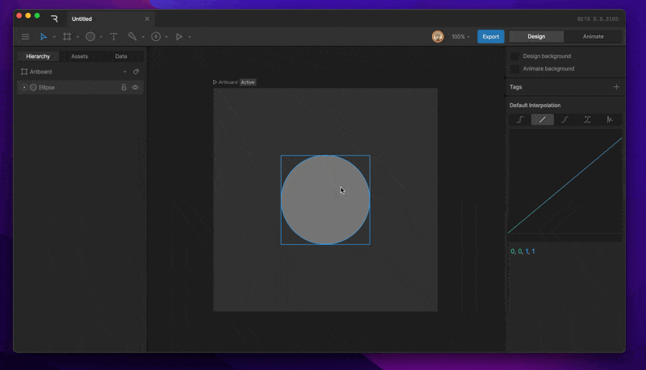
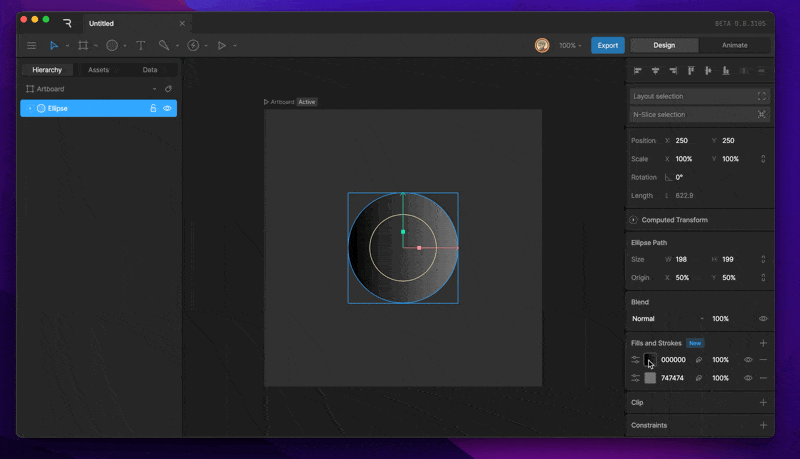
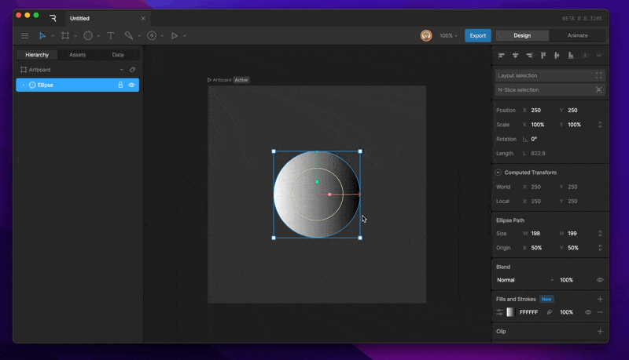
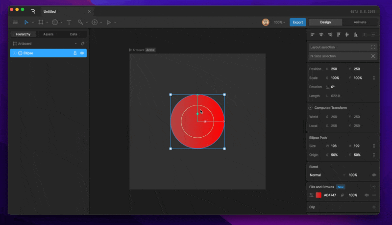
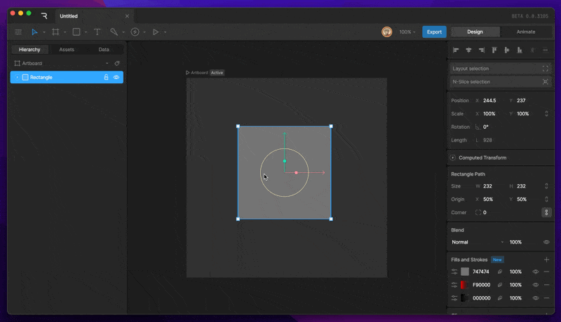
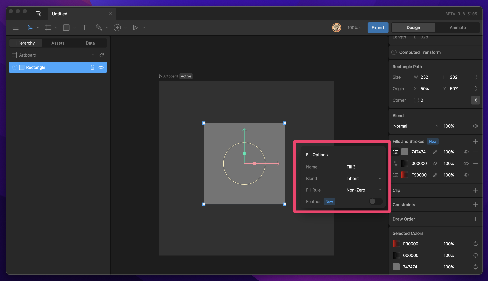
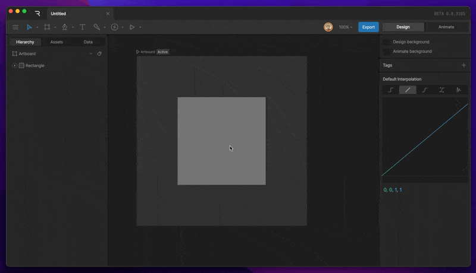
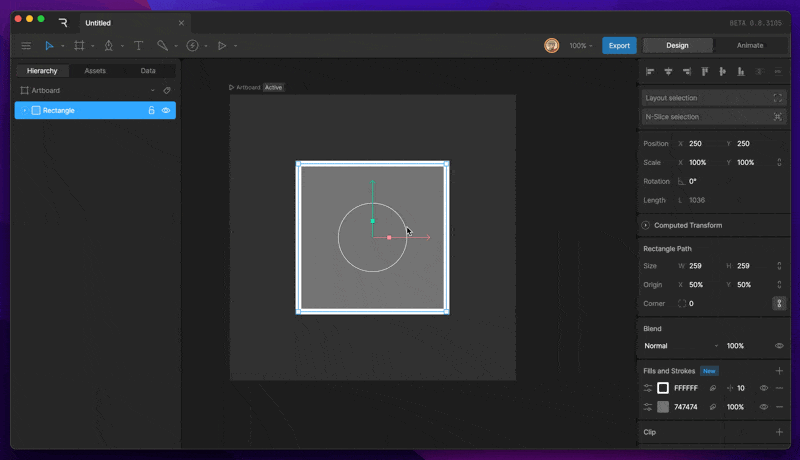
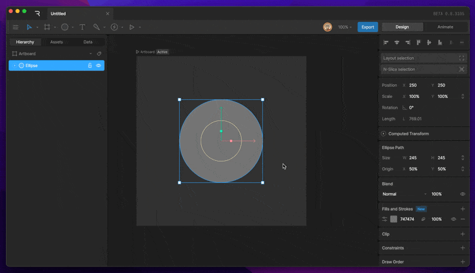

基础概念 (Fundamentals)

# 填充与描边 (Fill and Stroke)

检查器中的“填充与描边 (Fill and Stroke)”部分允许你添加和修改当前选中对象的填充和描边属性。你可以根据需要创建任意数量的填充或描边。

# [​](#fill) 填充 (Fill)

### [​](#create-a-new-fill) **创建新填充**

要创建填充，请先选择一个形状，然后使用检查器“填充与描边”部分下的加号按钮。在弹出菜单中选择“Fill”。你可以通过左侧的颜色方块识别出该层是一个填充层。

### [​](#changing-fill-color) **更改填充颜色**

点击填充层左侧的颜色方块即可打开“拾色器 (Color Picker)”。你可以通过各种滑块选择你想要的填充颜色。

### [​](#changing-fill-type) **更改填充类型**

创建新形状时，默认使用纯色填充。添加新填充时，默认类型为线性渐变。你可以通过点击颜色方块来切换填充类型。

在打开的填充窗口顶部，你会发现填充类型下拉菜单。可供选择的填充类型包括：
- **Solid (纯色)**
- **Linear Gradient (线性渐变)**
- **Radial Gradient (径向渐变)**

### [​](#changing-fill-color-gradient) **更改填充颜色 (渐变)**

当选择渐变类型时，拾色器上方会出现一个长条。它代表了渐变在不同位置的颜色。

### [​](#adding-and-removing-stoppers) **添加和删除控制点**

点击渐变条上任何没有控制点的位置即可生成新的控制点。

要删除控制点，先选中它，然后按 `Delete` 或 `Backspace` 键。

### [​](#change-fill-order) **更改填充顺序**

填充在列表中的顺序决定了它们的渲染顺序：顶部的填充渲染在最前面，底部的渲染在最后面。

你可以直接在图层区域点击并拖动来更改顺序。

### [​](#fill-properties) **填充属性**

每个填充都有自己的属性，可以在时间轴上进行编辑和设置关键帧。点击填充选项按钮可查看更多：

- **名称 (Name)**：重命名填充。
- **混合 (Blend)**：更改单个填充层的混合模式。默认继承自形状层。
- **填充规则 (Fill Rule)**：选择填充算法（Non-Zero, Even-Odd, Clockwise）。
- **羽化 (Feather)**：启用后可对填充进行羽化效果处理。

---

# [​](#stroke) 描边 (Stroke)

### [​](#create-a-new-stroke) 创建新描边

选择形状，点击加号按钮并选择“Stroke”。描边层在左侧通过一个带轮廓的方块来表示。

### [​](#changing-stroke-type) **更改描边类型**

与填充类似，描边也可以设置为纯色、线性渐变或径向渐变。

# [​](#stroke-properties) 描边属性 (Stroke Properties)

每个描边都有独特的属性，点击描边选项按钮可进行设置：
- **名称 (Name)**
- **端点 (Cap)**：更改描边末端的形状。
  - **Butt (平头)**：在端点处平齐，不延伸。
  - **Round (圆头)**：半圆形端点。在零长度路径上表现为一个圆。
  - **Square (方头)**：方形端点，延伸出端点一段距离。
- **连接 (Join)**：更改路径转角处的渲染方式。
  - **Round (圆角)**
  - **Bevel (斜角)**
  - **Miter (直角/尖角)**
- **应用变换 (Apply Transformations)**：确定形状的“缩放”是否会改变描边的粗细。关闭后，粗细将保持恒定（非缩放）。
- **羽化 (Feather)**：开启矢量羽化。
- **描边类型 (Stroke Type)**：
  - **Solid (实线)**：默认类型。
  - **Trim (路径裁剪)**：允许动画化起始点、终点和偏移。详见[路径裁剪](/editor/manipulating-shapes/trim-path.md)。
  - **Dashed (虚线)**：允许设置虚线长度和间隙。

---

# [​](#vector-feathering) 矢量羽化 (Vector Feathering)

矢量羽化是 Rive 发明的一项新技术，可以柔化矢量路径的边缘，而不会像传统的模糊效果那样产生沉重的性能负担。

### [​](#enabling-vector-feathering) **启用矢量羽化**

你可以通过填充或描边层上的羽化图标，或者在选项面板中的开关来开启。

### [​](#feathering-options) 羽化选项

- **方向 (Direction)**：选择向内 (Inner) 或向外 (Outer) 产生羽化。

- **数值 (Amount)**：控制羽化的强度。
- **空间 (Space)**：
  - **World (世界空间)**：羽化表现更接近投影效果。
  - **Local (局部空间)**：羽化随变换对象一起运作。
- **偏移 (Offset)**：控制羽化效果在 X 和 Y 轴上的偏移量。

[分组技巧 (Group Tips)](/editor/fundamentals/group-tips)[编辑顶点 (Edit Vertices)](/editor/fundamentals/edit-vertices)