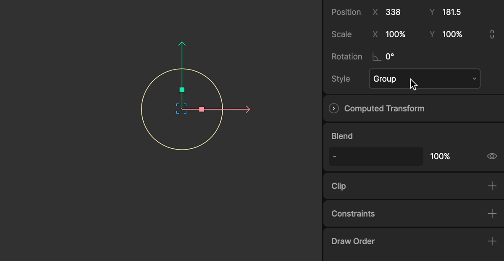

# 分组 (Groups)

  <iframe width="100%" height="400" src="https://www.youtube.com/embed/FnnZV57Dp3c" title="Rive 101 - Hierarchy and Groups" frameborder="0" allow="accelerometer; autoplay; clipboard-write; encrypted-media; gyroscope; picture-in-picture" allowfullscreen></iframe>

组 (Groups) 是在层级面板 (Hierarchy) 中用来包含其他图形或子层级的一种对象。它们本身没有可视化的属性（如填充、描边或形状），但它们拥有变换属性（位置、旋转、缩放）。

使用组的主要目的是：
1.  **组织管理**: 保持层级面板整洁有序。
2.  **辅助变换**: 为子对象提供额外的父级变换空间，这在制作复杂动画（如骨骼绑定）时非常有用。

## 创建分组 (Creating Groups)

您可以通过以下快捷键将选中的对象快速分组：
*   **macOS**: `Cmd + G`
*   **Windows**: `Ctrl + G`

要取消分组，请使用 `Cmd + Shift + G` (Mac) 或 `Ctrl + Shift + G` (Windows)。

此外，您也可以在层级面板中通过拖拽图层，将它们手动嵌套到现有的组中，改变它们的绘制顺序和父子关系。

## 分组样式 (Group Style)

在属性检查器中，您可以更改组的样式 (Style) 选项。

### Group (默认)

这是标准的组行为。它作为一个不可见的容器，仅影响子对象的变换。在编辑器视口中，除非选中它，否则您看不到它的外观。

### Target (目标)

当样式设置为 **Target** 时，该组在编辑器中将显示为一个十字准星图标。

Target 并没有渲染上的区别（导出后同样不可见），但它在编辑器中有特殊的用途：
1.  **始终可见**: 十字准星图标即便未被选中也能在视口中看到（如果启用了骨骼/Target显示）。
2.  **约束目标**: 它们通常被用作 **Constraints (约束)** 系统中的目标点。例如，您可以使用一个 Target 组来控制反向动力学 (IK) 约束的末端效应器。

因为 Target 具有可视化的图标，所以在复杂的绑定系统中，它们比普通的组更容易被选中和操作。

## 约束 (Constraints)

组（特别是设置为 Target 样式的组）是构建 Rive 高级绑定系统的基石。通过将约束应用于组，或者让组作为约束的目标，您可以创建复杂的机械运动、跟随效果和角色骨骼系统。

有关更多详细信息，请参阅[约束 (Constraints)](/editor/constraints/overview) 章节（稍后推出）。
