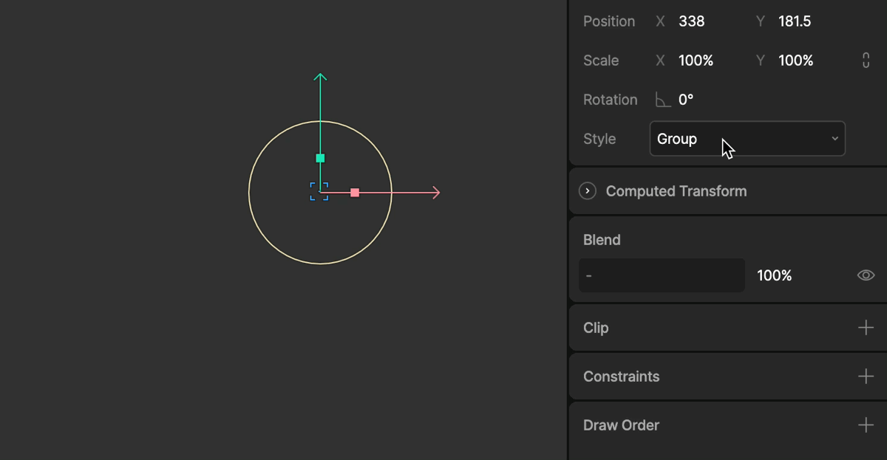

基础知识

# 分组 (Groups)

使用分组来组织你的图形或添加额外的变换空间。

通过快捷键 `G` 激活分组合工具。在画板中的任何位置点击以添加一个新分组。现在可以在层级面板 (Hierarchy) 中将对象拖放到该分组中。
你也可以在 macOS 中使用 `⌘`+`G` 或在 Windows 中使用 `Ctrl`+`G` 将选中的形状包装到一个分组中。
在 macOS 中使用 `⌘`+`Shift`+`G` 或在 Windows 中使用 `Ctrl`+`Shift`+`G` 来解构分组。

## [​](#group-style) 分组样式 (Group Style)

分组的样式 (Style) 属性可以设置为“普通 (Group)”或“目标 (Target)”。

### [​](#group) 普通分组 (Group)

“普通 (Group)”是默认行为，其表现如 [选择和浏览分组](/docs/editor/fundamentals/selecting-and-navigating-groups) 中所述。

### [​](#target) 目标 (Target)

“目标 (Target)”选项在舞台上绘制一个不同的图标，该图标始终可见，无论该分组是否有子级（通常分组只有在为空时才显示图标）。当一个分组显示为“目标”时，它也会禁用 [选择和浏览分组](/docs/editor/fundamentals/selecting-and-navigating-groups) 章节中描述的功能。这意味着你可以直接点击进入该分组的任何子级（无需双击、Enter/Esc 或深层选择）。

“目标”选项在处理约束 (Constraints) 时特别有用。

[## 约束 (Constraints)

约束是通过另一个目标对象来控制一个对象属性的一种方式。某些约束可以对这些属性（及其层级关系）设置限制，而另一些约束则可以将属性从一个对象复制到另一个对象。](/docs/editor/constraints)