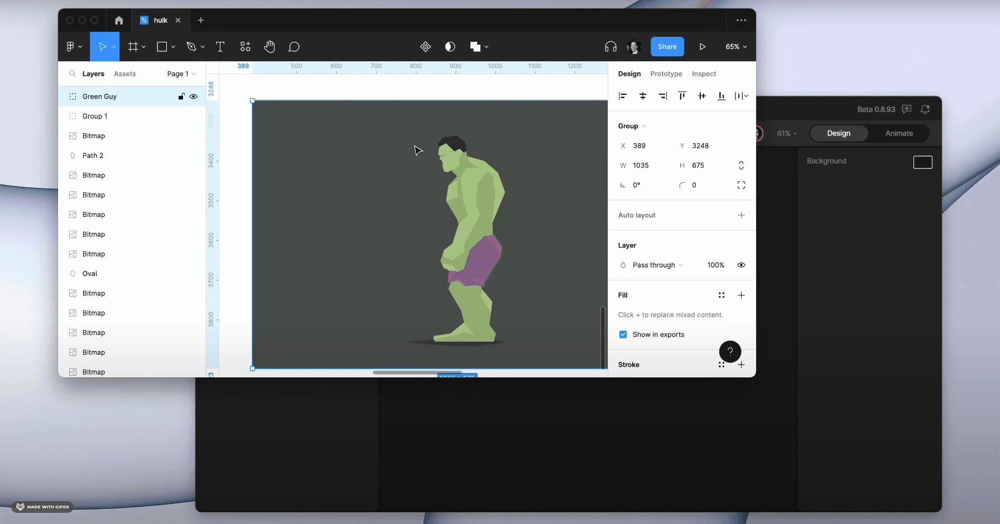
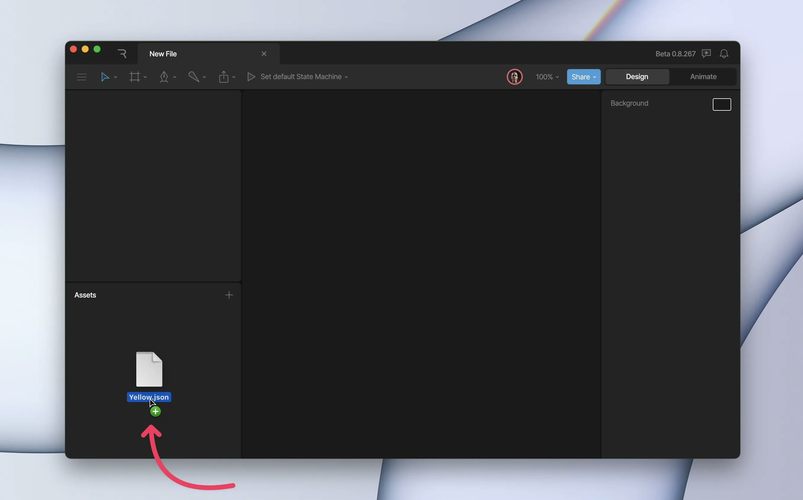
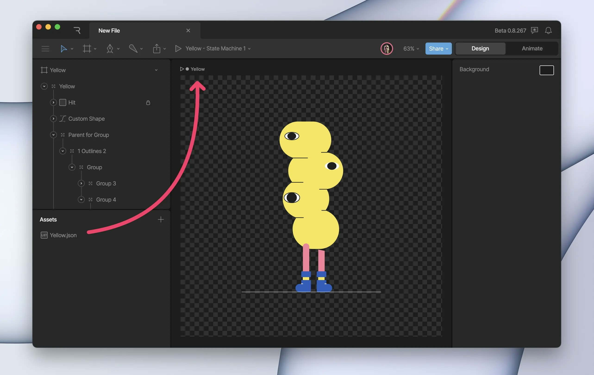
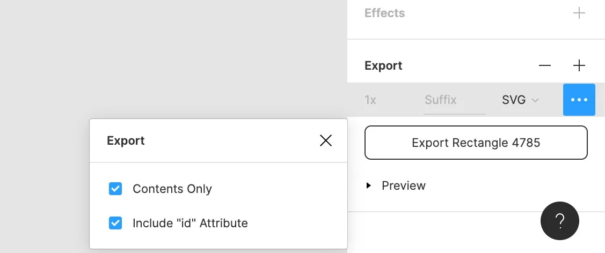

基础知识

# 导入资产 (Importing Assets)

通过将资产拖放到 Rive 编辑器中来导入它们。你可以导入 SVG、JSON、PNG、PSD 和 JPG 格式。

## [​](#assets-panel) 资产面板 (Assets Panel)

拖入图形后，它们会出现在编辑器 UI 左侧的资产面板中。将它们拖放到画板上即可开始使用。

## [​](#importing-custom-font) 导入自定义字体 (Importing Custom Font)

对于 Pro 客户，你可以添加自定义字体用于文本工具。将 `.OTF` 或 `.TTF` 文件拖放到编辑器中，或使用字体部分旁边的加号按钮。

## [​](#updating-image-assets) 更新图像资产 (Updating image assets)

资产导入后，你仍可以对其进行更新。
在资产面板中选中图像；该资产的属性将显示在检查器中，位图资产（PNG、JPG、PSD）将提供“替换 (Replace)”按钮。
点击替换按钮，并根据提示选择更新后的图像。你会注意到，这会更新文件中使用的该图形的所有实例。

## [​](#supported-formats) 支持的格式 (Supported formats)

Rive 支持导入 SVG（见下文限制）、JSON、PNG、PSD 和 JPG 格式。

#### [​](#copy-and-paste-directly-from-figma) 直接从 Figma 复制并粘贴

你可以使用“复制为 SVG (Copy as SVG)”并直接将其粘贴到 Rive 编辑器中。

#### [​](#import-lottie-file) 导入 Lottie 文件

导入 Lottie 文件功能适用于 Enterprise（企业）方案。[了解更多关于我们的方案和定价的信息](https://rive.app/pricing)。
此工作流可能会因客户设置的不同而引入风险，在没有我们指导的情况下实施可能会导致性能、安全性或可靠性方面的问题。帮助客户评估和降低这些风险需要花费大量的时间和精力，这就是为什么这种级别的支持仅在 Enterprise 方案中提供。

你可以将 Lottie 动画导入 Rive。首先，将 Lottie JSON 文件拖放到 Rive 编辑器中。这会将其添加到你的资产面板。

从那里，你可以将其拖入现有的画板，或拖入空白区域以创建一个新画板。

如果你在运行时遇到问题，可能需要将任何 `Plus`、`Add` 或 `Hard Mix` 图层混合模式转换为 Rive 运行时支持的混合模式。

## [​](#svg-tips) SVG 技巧

SVG 是一种非常灵活且功能丰富的格式。我们的目标是尽可能好地支持 SVG；然而，现阶段我们仍有一些功能不支持。
将文件导出为带有行内样式 (inline style) 而非 CSS 的 SVG，对我们的导入器效果最好。
从其他设计工具导出时，请寻找在导出时保留形状 ID 和名称的选项。这将确保你导入的文件保留相同的结构和图层名称。大多数工具都有此选项，如底下的 Figma 示例所示。

### [​](#photoshop) Photoshop

从 Photoshop 导出时，请确保你只使用矢量图层。不要将任何内容转换或平整化为位图。

### [​](#illustrator) Illustrator

使用“另存为”从 Illustrator 导出 SVG 时，将 SVG 选项中的 CSS 属性设置为“演示属性 (Presentation Attributes)”而非默认设置。同样，使用“导出为”从 Illustrator 导出 SVG 时，在 SVG 选项中将样式设置为“演示属性”。请注意，Illustrator 在直接复制时会使用“导出为”的 SVG 选项，因此如果你要从 Illustrator 复制粘贴到 Rive 编辑器，请务必在 SVG 选项中将样式设置为“演示属性”。
此外，请禁用“保留 Illustrator 编辑能力”选项，因为这会使你的文件变大很多，并添加我们的导入器无法识别的数据。

### [​](#known-issues) 已知问题

- 嵌入的图像会被忽略。我们计划实现这一功能。
- 渐变变换会被忽略。
  - 我们目前无法在所有运行时中提供同等支持，因此此功能不受支持。
  - 不过，我们支持线性渐变和径向渐变，这可以覆盖某些使用场景。
- Rive 没有点 (pt) 或毫米 (mm) 大小的概念。使用 pt 或 mm 提供尺寸的 SVG 将会将其值转换为像素 (px)。点将转换为 1.33 px，毫米将转换为 3.78 px。
- SVG 提供了 `inherit` 以允许描边和填充使用其祖先的颜色。Rive 不支持此功能，任何继承的颜色默认为白色。
- 其他不支持的 SVG 功能：
  - `stroke-dasharray` - 你可能会看到实线描边
  - `mask` - 我们将其视为剪裁 (clipping)
  - `filter`
  - `skew`