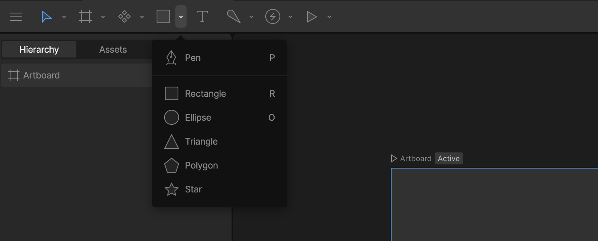
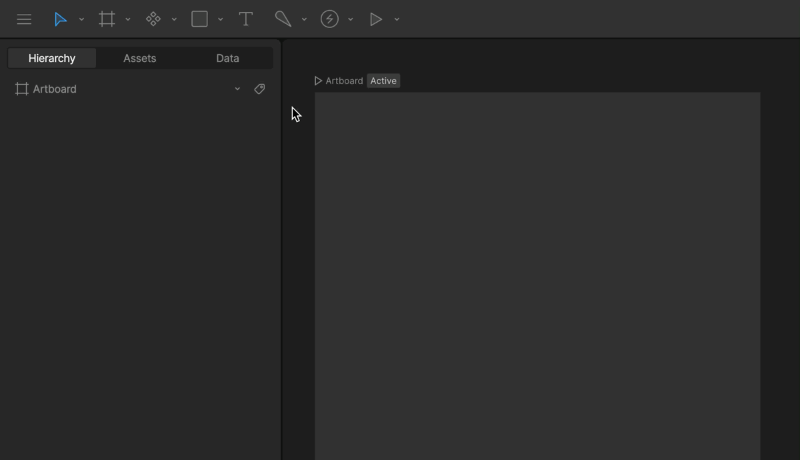
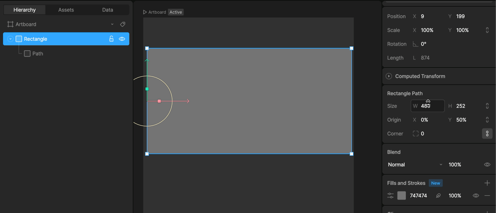
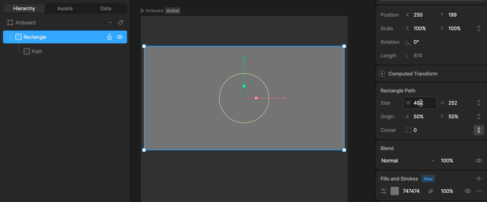
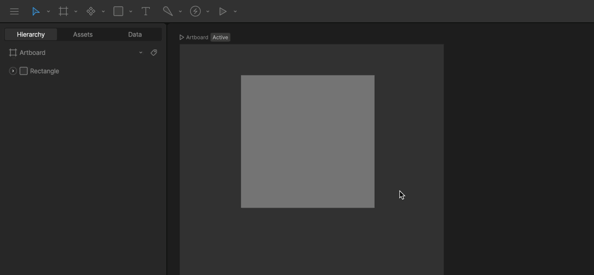

# 程序化形状 (Procedural Shapes)

  <iframe width="100%" height="400" src="https://www.youtube.com/embed/vU5SrgymGD8" title="Rive 101 - Procedural Shapes" frameborder="0" allow="accelerometer; autoplay; clipboard-write; encrypted-media; gyroscope; picture-in-picture" allowfullscreen></iframe>

程序化形状是 Rive 中预定义的几何图形，您可以通过属性检查器轻松配置其参数。与手动绘制的路径不同，程序化形状提供了特定的属性（如矩形的圆角、星形的角数等），使得修改和动画化变得非常方便。

## 创建程序化形状 (Creating a procedural shape)

要创建程序化形状，请在工具栏中找到形状工具（通常是矩形图标）。点击并按住该工具可以展开菜单，查看所有可用的形状选项。

可用的形状包括：

*   **Rectangle (矩形)**: `R` 键
*   **Ellipse (椭圆)**: `O` 键
*   **Triangle (三角形)**
*   **Polygon (多边形)**
*   **Star (星形)**
*   **Spiral (螺旋线)**

选择所需的形状后，在舞台上点击并拖动即可创建。按住 `Shift` 键可以限制比例（例如创建正方形或正圆形）。

## 调整原点 (Origin)

每个程序化形状都有一个**原点 (Origin)**，它决定了形状在调整尺寸时的锚点位置。

在属性检查器中，您可以通过 Origin 控件来设置原点。例如，如果将原点设置在左上角，可以修改宽度和高度，形状将向右下方扩展。

同样，原点也决定了形状缩放时的中心点。

## 转换为自定义路径 (Convert to custom path)

虽然程序化形状非常方便，但有时您需要对顶点进行更精细的控制（例如调整单个顶点的位置）。为此，您需要将程序化形状转换为自定义路径。

选中程序化形状，然后按 **Enter** 键。形状将变为路径图层，您可以看到并编辑其所有的顶点。

> [!NOTE]
> 转换后，该形状就变成了一个普通的路径，您将失去之前的程序化属性（如星形的角数、矩形的圆角半径等）。这是一个不可逆的操作（除非撤销）。

