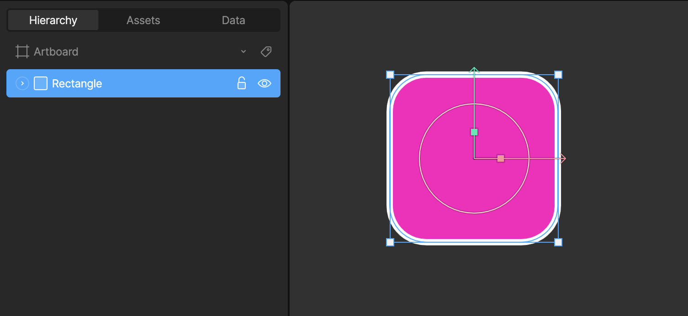
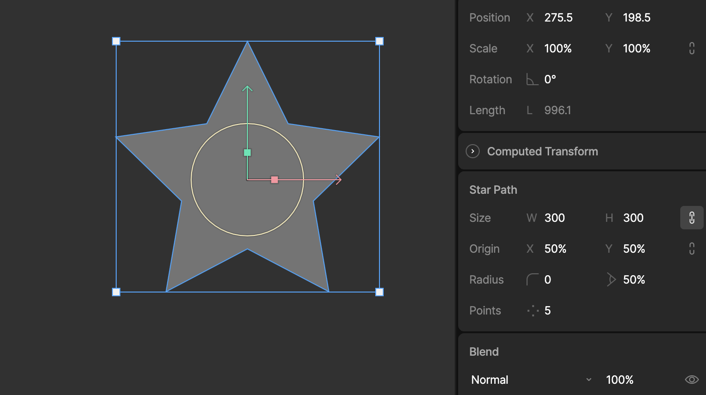
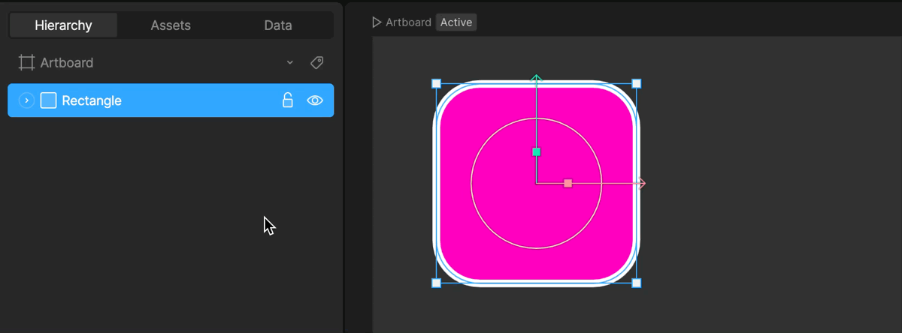
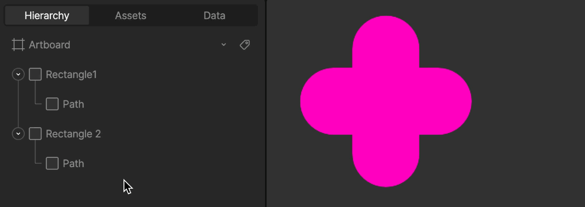

# 形状与路径概览 (Shapes and Paths Overview)

  <iframe width="100%" height="400" src="https://www.youtube.com/embed/KunkCnbkTsg" title="Rive 101 - Shapes and Paths" frameborder="0" allow="accelerometer; autoplay; clipboard-write; encrypted-media; gyroscope; picture-in-picture" allowfullscreen></iframe>

在 Rive 中，形状 (Shapes) 和路径 (Paths) 由两种不同的图层类型组成：**形状图层 (Shape Layers)** 和 **路径图层 (Path Layers)**。

## 形状图层 (Shape Layer)

形状图层由**蓝色**图标表示，它是路径图层的**容器**。

形状图层本身并不直接包含各种属性或顶点。相反，它作为容纳路径、填充 (Fills) 和描边 (Strokes) 的容器。您可以将多个路径图层放置在一个形状图层中，它们将共享同一套填充和描边样式。

## 路径图层 (Path Layer)

路径图层由**灰色**图标表示。

这是构成矢量图形的核心部分。路径图层包含定义形状的所有顶点数据。路径图层必须始终嵌套在形状图层内部才能被渲染。

### 路径图层属性 (Path Layer Properties)

当您选中一个路径图层时，可以在属性检查器中看到一个 **Closed (闭合)** 选项。

*   **勾选 Closed**: 路径将自动连接起点和终点，形成一个封闭的图形。
*   **取消 Closed**: 路径将保持开放。

## Enter 和 Esc 快捷键

为了加快工作流程，Rive 提供了方便的快捷键来在层级之间导航。

*   **Enter**: 当选中一个形状图层时，按下 `Enter` 键可以选择其内部的第一个路径图层（进入编辑模式）。这允许您快速开始编辑顶点。
*   **Esc**: 当选中一个路径图层或正在编辑顶点时，按下 `Esc` 键将使选择向上移动一级，选回父级的形状图层。

