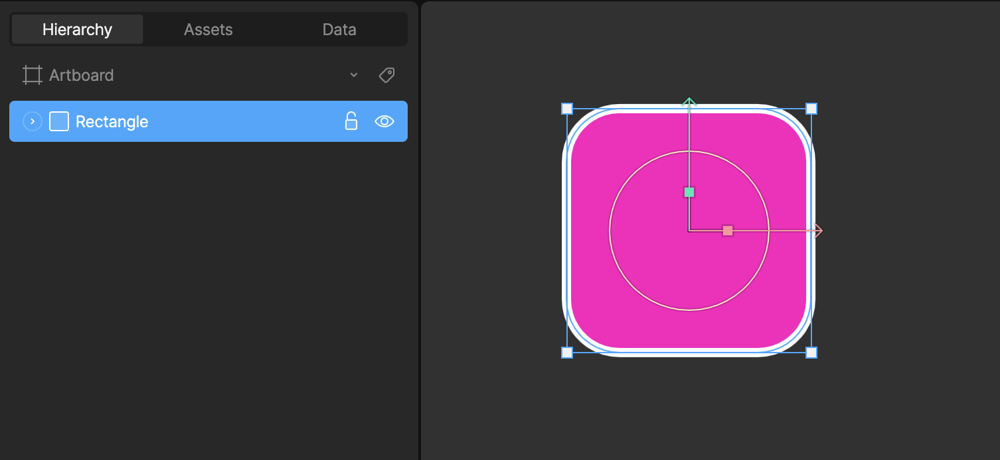
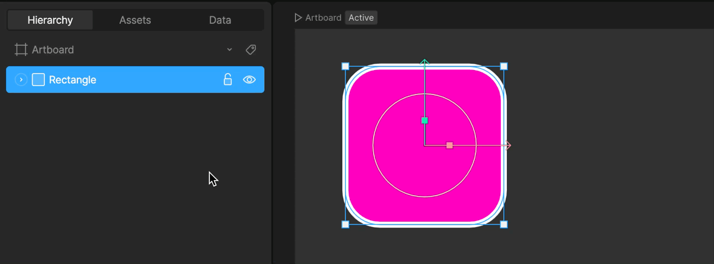
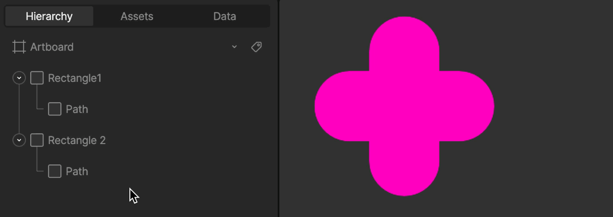
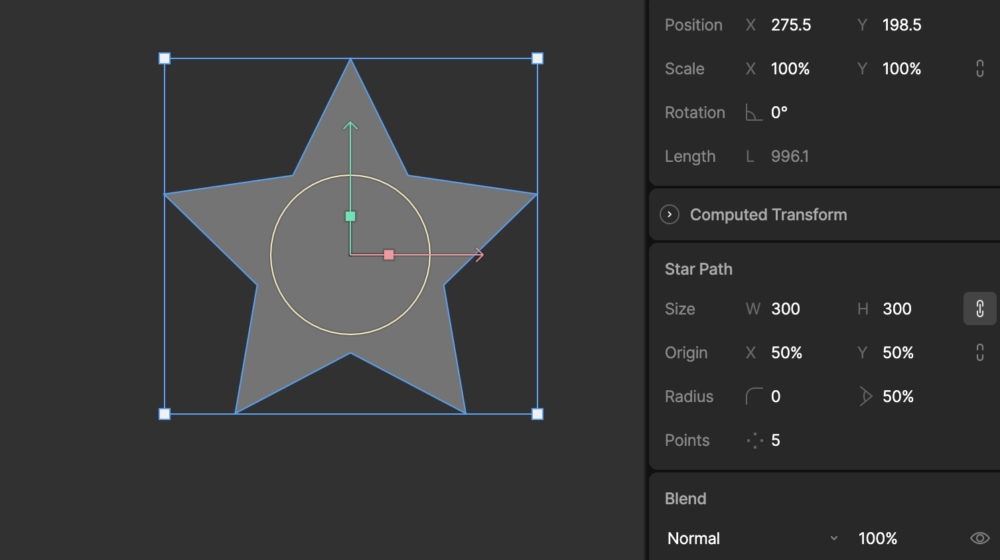

基础概念 (Fundamentals)

# 形状与路径概览 (Shapes and Paths Overview)

Rive 允许你使用程序化形状 (Procedural Shapes) 或自定义形状来创建、编辑和制作矢量图形动画。这些图形结合了“形状层 (Shape layer)”和“路径层 (Path layer)”来定义，Rive 开放了这些层级，以便在设计和动画制作中为你提供更大的灵活性和控制力。

要了解有关形状层和路径层的更多信息，请观看我们的视频或阅读下文。

## [​](#shape-layer) 形状层 (Shape layer)

Rive 中的矢量图形是在形状层上渲染的。形状层通过允许你自定义“填充 (Fill)”和“描边 (Stroke)”来定义形状的样式。

## [​](#path-layer) 路径层 (Path layer)

矢量图形的实际轮廓是由一个或多个路径定义的。在 Rive 的层级面板中展开一个形状层，即可查看到它正在使用的路径。

你可以通过将现有路径拖放到目标形状层级中，来向任何形状添加新路径。

### [​](#path-layer-properties) 路径层属性 (Path layer properties)

路径层会显示与该路径类型相关的属性。详细了解 [程序化形状 (Procedural Shapes)](/editor/fundamentals/procedural-shapes.md)。

## [​](#enter-and-esc-shortcuts) Enter 和 Esc 快捷键

使用 `Enter` 键可以快速向下导航层级面板。如果你选中了一个形状，这允许你快速进入并选中子级路径层。
使用 `Esc` 键可以快速向上导航层级面板。如果你选中了一个路径，这允许你快速返回并选中父级形状层。

[钢笔工具概览 (Pen Tool Overview)](/editor/fundamentals/pen-tool-overview.md)[程序化形状 (Procedural Shapes)](/editor/fundamentals/procedural-shapes.md)