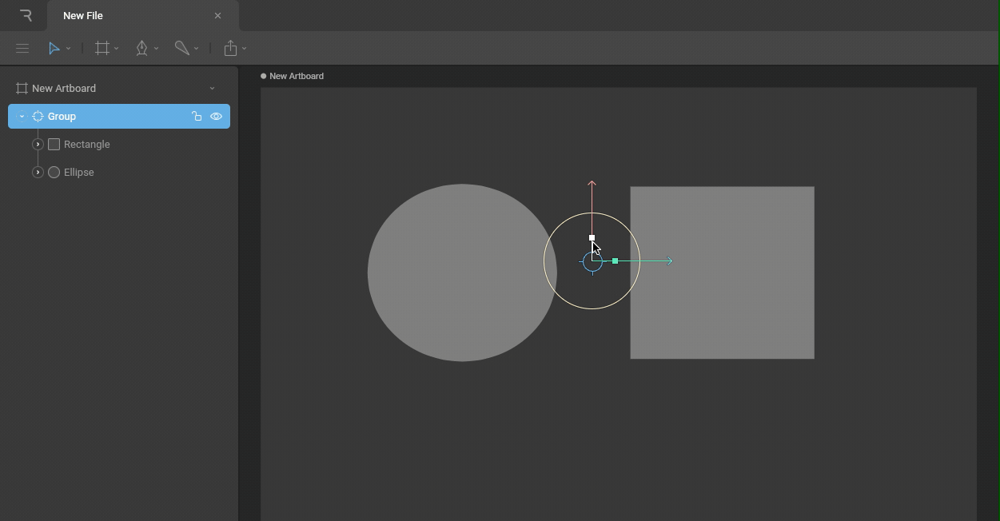
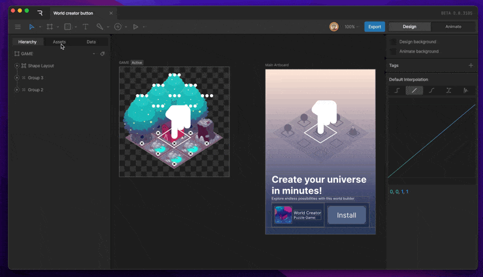
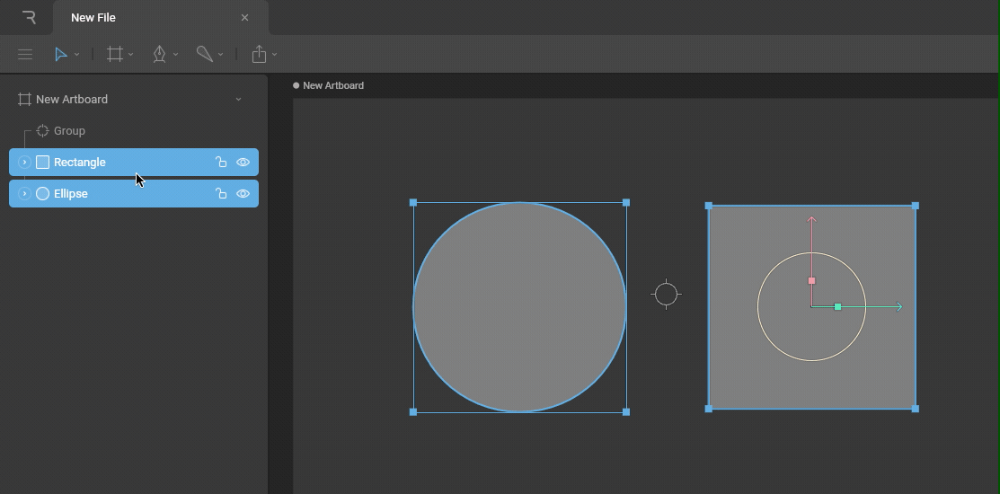
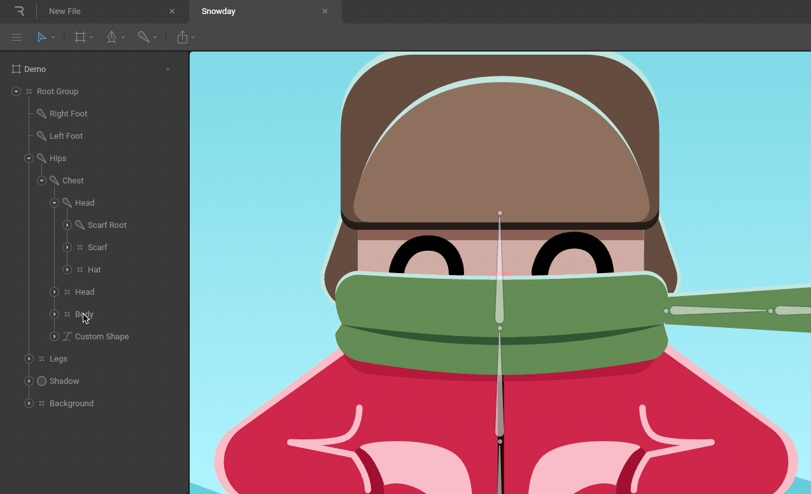
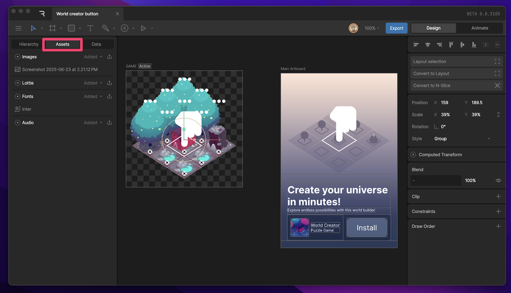
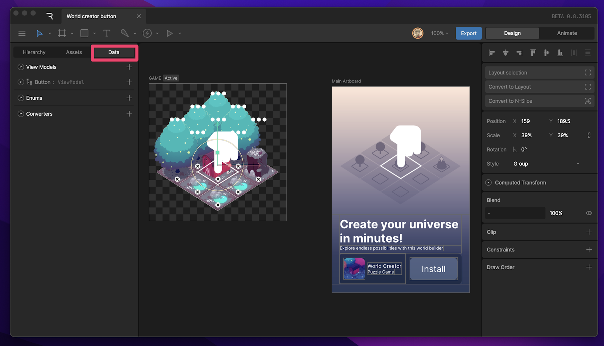

# 层级面板 (Hierarchy)

层级面板位于 Rive 编辑器的左侧区域。

<iframe width="100%" height="400" src="https://www.youtube.com/embed/FnnZV57Dp3c" frameborder="0" allow="accelerometer; autoplay; clipboard-write; encrypted-media; gyroscope; picture-in-picture" allowfullscreen></iframe>

## 概览 (Overview)

层级面板是一个树形视图，它反映了当前选中的画板 (Artboard) 或组件 (Component) 的结构和顺序。当你选择不同的画板或对象时，层级面板会相应更新。

## 切换视图 (Switching Views)

通过点击层级面板左上角的图标，你可以在以下三个视图之间切换：
*   **层级 (Hierarchy)**：显示舞台上的对象结构
*   **资源 (Assets)**：显示项目中的图片、字体等资源
*   **数据 (Data)**：显示状态机使用的数据、枚举等

## 父子关系 (Parent-child relationships)

Rive 中的对象可以通过父子关系（Parenting）相互连接。这种关系不仅组织了文件结构，还决定了变换属性（位置、旋转、缩放）如何继承。

子对象会继承其父对象的变换。这意味着：
*   当移动父对象时，子对象会随之移动。
*   所有的变换都是相对于父对象的原点进行的。

你可以创建无限层级的嵌套结构。组 (Groups)、骨骼 (Bones) 和图形都可以作为父对象。

### 修改父子关系 (Change parent-child relationships)

你可以通过在层级面板中拖拽对象来改变它们的父子关系：
1.  **选中**一个或多个对象。
2.  **拖拽**并将它们**放置**到目标父对象上。

## 绘制顺序 (Draw Order)

层级面板列表不仅显示父子关系，还决定了对象的绘制顺序（渲染顺序）。

*   列表**上方**的对象会绘制在**下方**的对象之上（即图层更靠前）。
*   在同一父级下的兄弟节点中，位于列表更下方的节点会覆盖上面的节点（*注：Rive 的默认渲染顺序是从上到下，但在某些上下文中，可以通过调整顺序改变覆盖关系*）。

注意：绘制顺序是一个重要的概念，特别是在处理复杂的角色绑定和 UI 布局时。

### 修改绘制顺序 (Change Draw Order)

与修改父子关系类似，你可以通过在层级面板中**拖拽**对象来改变它们在列表中的位置，从而改变绘制顺序。

## 右键菜单 (Right Click Menu)

在层级面板中右键点击对象，可以打开上下文菜单，提供该对象的常用操作选项：

*   **复制/粘贴 (Copy/Paste)**
*   **删除 (Delete)**
*   **重命名 (Rename)**
*   **编组 (Group selection)**
*   **单独显示 (Solo)**
*   **显示/隐藏 (Show/Hide)**
*   **锁定/解锁 (Lock/Unlock)**

## 资源面板 (Assets Panel)

点击层级面板顶部的 **Assets** 图标切换到资源视图。在这里你可以管理所有导入到项目中的外部文件：

*   图片 (Images)
*   字体 (Fonts)
*   音频 (Audio)
*   Lottie 动画文件

你可以直接将文件拖入 Rive 编辑器以添加到资源面板。

## 数据面板 (Data Panel)

点击层级面板顶部的 **Data** 图标切换到数据视图。这个面板用于管理与状态机和运行时逻辑相关的数据：

*   **ViewModel**：定义应用程序的数据模型
*   **Enums**：定义枚举类型

数据面板是 Rive 强大的数据绑定功能的核心入口。

