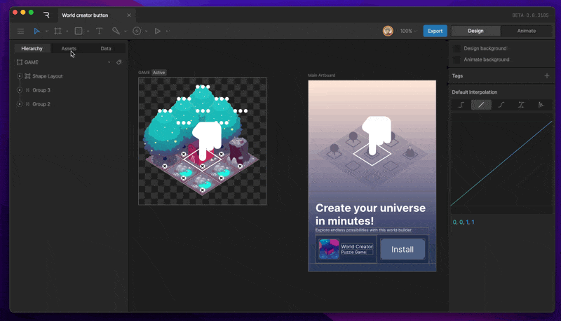
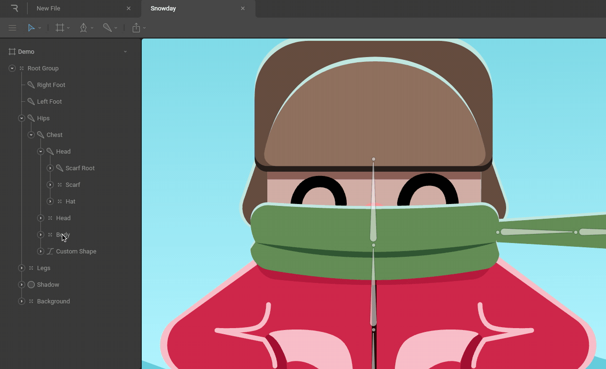
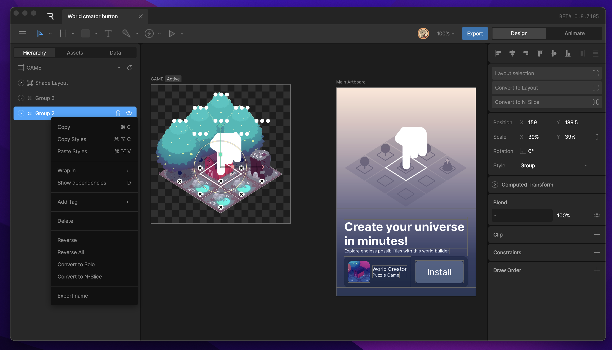
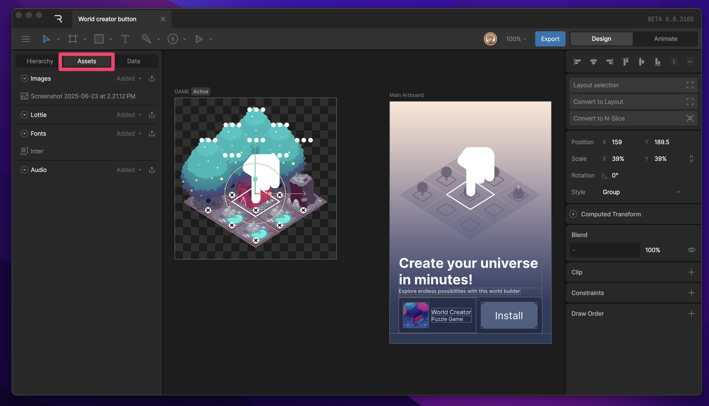
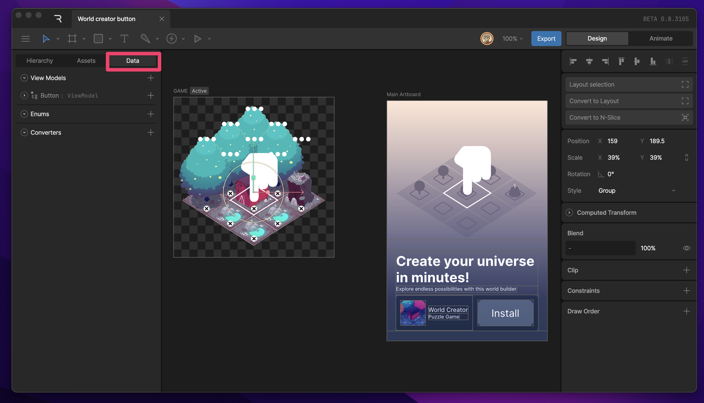

界面概览

# 层级面板 (Hierarchy)

层级面板显示了文件中的所有对象、资产和视图模型。此视图会根据你选择的画板 (Artboard)、组件 (Component) 或选项卡而变化。

# [​](#switching-views) 切换视图 (Switching Views)

要切换不同的面板，请点击所需的面板。

# [​](#hierarchy) 层级面板 (Hierarchy)

层级面板是一个树状视图，它既显示了舞台上对象之间的父子关系，也显示了它们的渲染顺序。通过观看视频或阅读下文来了解层级面板。
父子关系是 Rive 的核心概念，它允许你以极小的代价创建复杂的层级式动画。[分组 (Groups)](/editor/fundamentals/groups.md) 和 [骨骼 (Bones)](/editor/manipulating-shapes/bones.md) 在 Rive 中都可以拥有子级。

层级面板中的每一行代表舞台上的一个项目。在拥有嵌套子级的项目旁边会出现一个带箭头的圆型按钮。此按钮允许你展开和折叠子级列表。

## [​](#parent-child-relationships) **父子关系 (Parent-child relationships)**

任何类型的对象都可以是另一种类型对象的父级或子级。当一个对象是另一个对象的子级时，它会继承其父级的所有变换。例如，更改父级对象的缩放将影响子级对象。这些变换是相对于父级原点而非局部原点发生的。

这些父子关系的深度是无限的，因此你可以不断堆叠（或嵌套）项目，创建孙级、曾孙级等等。

### [​](#change-parent-child-relationships) **更改父子关系**

要更改对象之间的关系，请将对象拖放进或拖离另一个对象。

## [​](#draw-order) **绘制顺序 (Draw Order)**

除了显示对象之间的关系外，层级面板还显示了文件的绘制顺序（渲染顺序），顶部的对象显示在前面，底部的对象显示在后面。

### [​](#change-draw-order) **更改绘制顺序**

要更改舞台上对象的绘制顺序，请在列表中将形状或分组向上或向下拖到另一个之上或之下。请注意，绘制顺序也会影响对象在布局 (Layout) 中的放置和处理方式。在此处了解更多信息：[此处](/editor/layouts/overview.md)。
绘制顺序可以制作动画，但过程稍微深入一点。请在 [绘制顺序动画](/editor/animate-mode/animating-draw-order) 页面阅读相关内容。

## [​](#right-click-menu) **右键菜单 (Right Click Menu)**

在层级面板中右键点击任何对象都会弹出一个针对不同对象的选项菜单。在菜单中，你可以找到复制/粘贴对象和样式、删除对象、将对象包裹在 [布局 (Layouts)](/editor/layouts/overview.md) 和 [Solo (Solos)](/editor/manipulating-shapes/solos.md) 中、显示依赖图、添加 [标签 (Tags)](/editor/tagging)、翻转绘制顺序以及 [导出名称](/editor/exporting/exporting-for-runtime.md) 的功能。

其中许多选项都有快捷键，可以在选项旁边找到，也可以在快捷键菜单中查看。

# [​](#​assets-panel) ​资产面板 (Assets Panel)

资产面板是你的图像、Lottie 文件、音频和自定义字体的列表视图。此面板允许你添加、移除、替换和修改文件中添加的所有资产。在下文阅读有关导入和修改资产的更多信息。

[## 导入资产 (Importing Assets)](/editor/fundamentals/importing-assets.md)[## 音频事件 (Audio Events)](/editor/events/audio-events)

# [​](#data-panel) 数据面板 (Data Panel)

数据面板是创建、组织和查看文件所有视图模型 (View Models)、枚举 (Enums) 和转换器 (Converters) 的地方。该面板分为三个独立空间：视图模型、枚举和转换器。在此处了解更多关于数据绑定 (Data Binding) 的信息：[此处](/editor/data-binding/overview)。

每个部分右侧的加号按钮允许你添加新的视图模型、枚举或转换器。
如果任何部分有相关的元素，可以使用左侧的箭头图标展开或折叠列表。