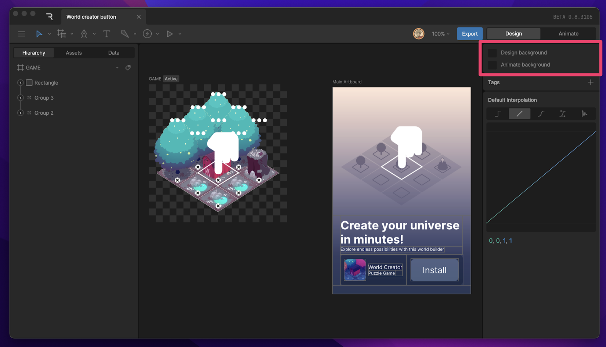
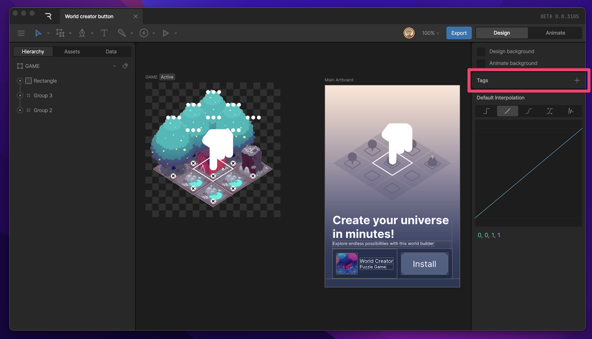
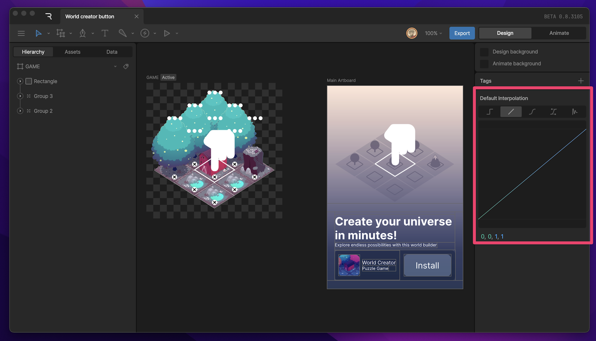
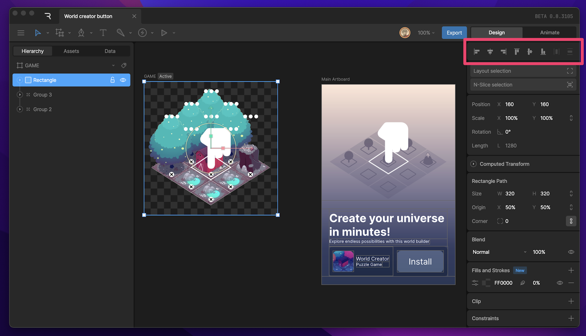
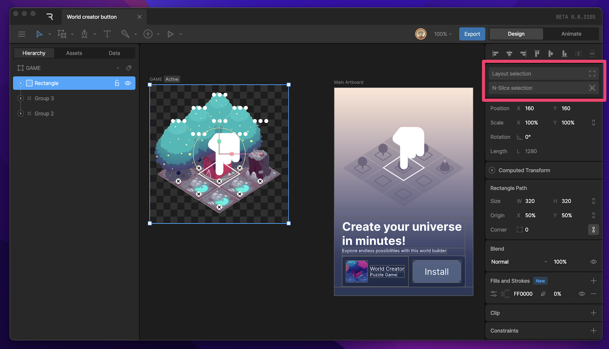
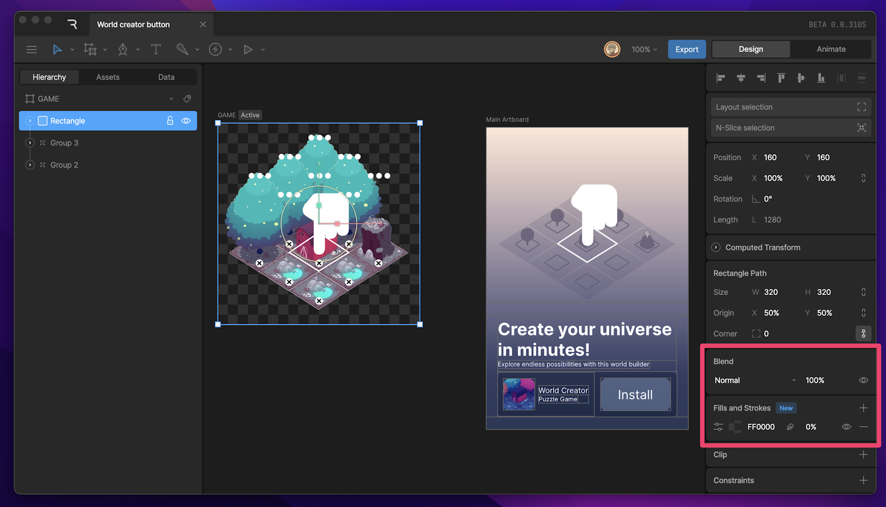
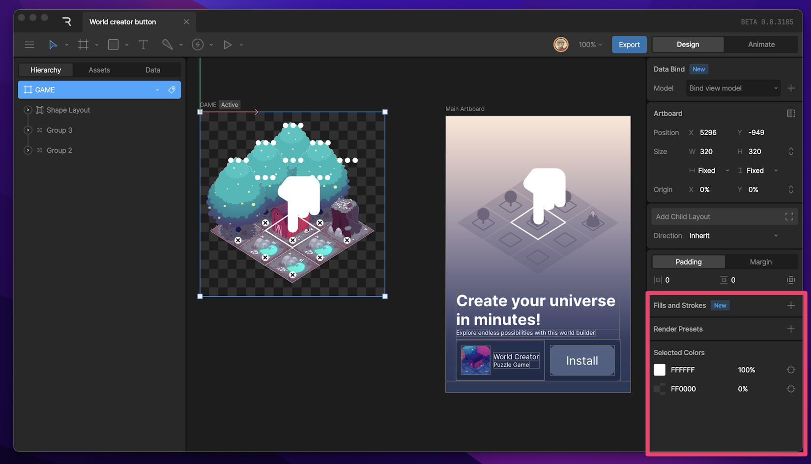
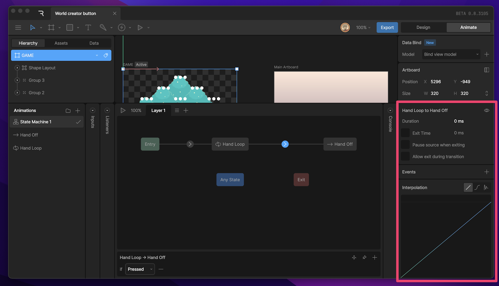

# 检查器 (Inspector)

检查器（Inspector）位于编辑器的右侧。

## 概览 (Overview)

检查器是基于上下文感知的（context-aware）。这意味着当你更改选择的内容时，比如从画板切换到特定形状，或者从设计模式切换到动画模式，检查器中的选项都会随之变化，以显示该选择的可用属性。

## 背景颜色 (Background Color)

在检查器顶部，你可以更改画板和组后面的区域（称为舞台 Stage）的背景颜色（Background Color）。

Rive 允许你分别为**设计模式**和**动画模式**设置不同的背景颜色，这是一个非常有用的视觉提示，让你一眼就能知道当前处于哪种模式。

## 标签 (Tags)

在文件名旁边是一个表情符号图标，点击它可以为文件设置、编辑或查看标签（Tags）。

## 默认插值 (Default Interpolation)

当你未选中任何对象时，检查器会显示**默认插值（Default Interpolation）**选项。你可以使用它来更改该动画时间轴中设置的所有新关键帧的默认插值类型：线性（Linear）或保持（Hold）。

## 对齐与分布工具 (Align and Distribute tools)

当你选中舞台上的一个或多个对象时，可以在**变换（Transform）**部分上方找到这些工具。使用这些工具来对齐选中的对象。

## 布局与 N-Slicing (Layout and N-Slicing)

当你选中某个对象时，你可以更改其布局属性。

*   **布局 (Layout)**：你可以将任何形状或组放置在具有特定布局规则的容器中。这对于创建响应式 UI 非常有用。
*   **N-Slicing (九宫格切片)**：允许你定义图像和形状如何随其尺寸变化而伸缩，非常适合创建可缩放的 UI 元素（如按钮背景），保持边角不失真。

## 变换属性 (Transform properties)

当你选中一个对象时，检查器将显示其位置（X 和 Y）、旋转和缩放属性。对于形状（Shapes）和画板（Artboards），你还会看到宽度和高度属性。

## 图层属性 (Layer properties)

使用图层（Layer）部分来更改对象的**不透明度（Opacity）**。你还可以更改**混合模式（Blend Mode）**，这决定了像素如何与下方图像混合。

在图层部分下方，你会找到用于更改形状、画板和文本的**填充（Fills）**和**描边（Strokes）**的控件。

## 附加属性 (Additional properties)

根据选中的对象，你可能还会看到一个显示额外属性的部分。这些属性包括：

*   **剪裁 (Clipping)**：使用选中的形状剪裁（遮罩）其他内容。
*   **约束 (Constraints)**：为对象添加运动约束（如跟随路径、IK 等）。
*   **绘制顺序 (Draw Order)**：自定义特定组件的渲染层级。

你还可以使用取色器（Color Picker）在此处更改选中对象的颜色。

## 动作与状态属性 (Motion and State Properties)

当你在**动画模式**下工作时，你会注意到检查器的某些部分会发生变化。虽然你仍然可以更改许多在设计模式下可用的属性，但你也会看到特定于你正在处理的动画或状态机的属性。

