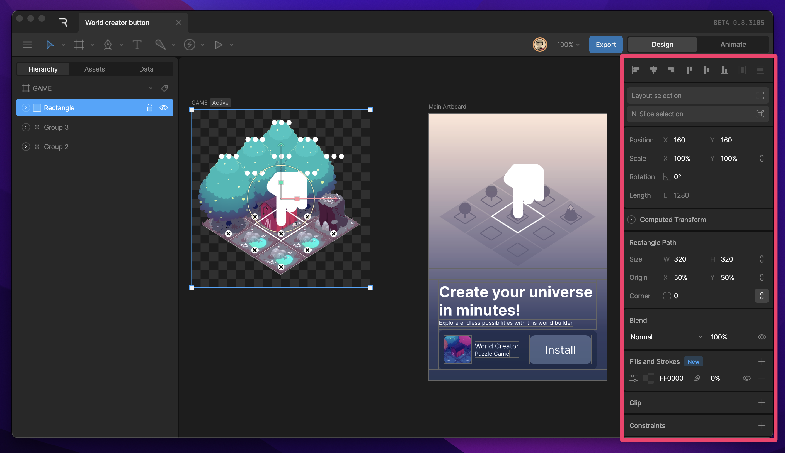
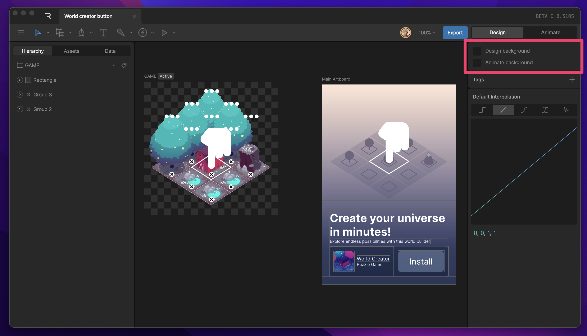
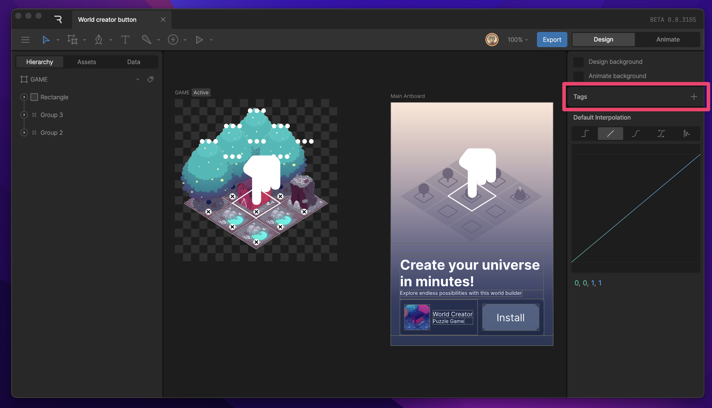
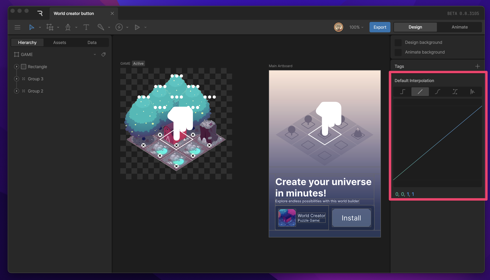
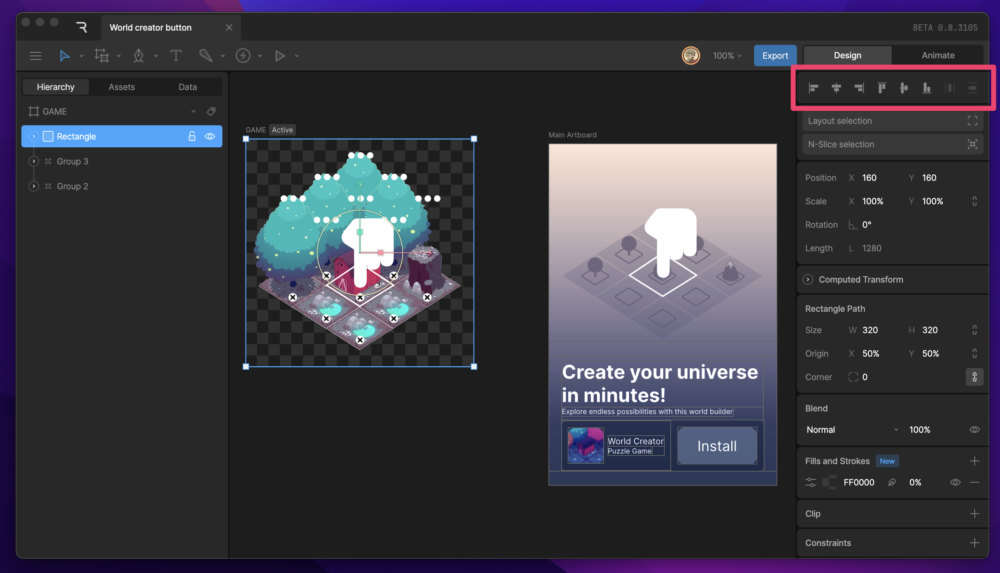
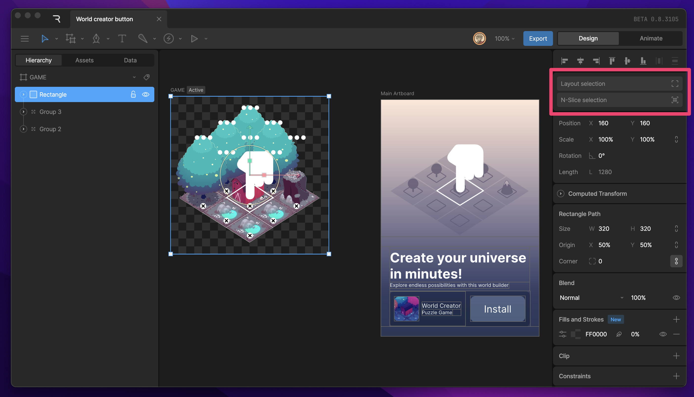
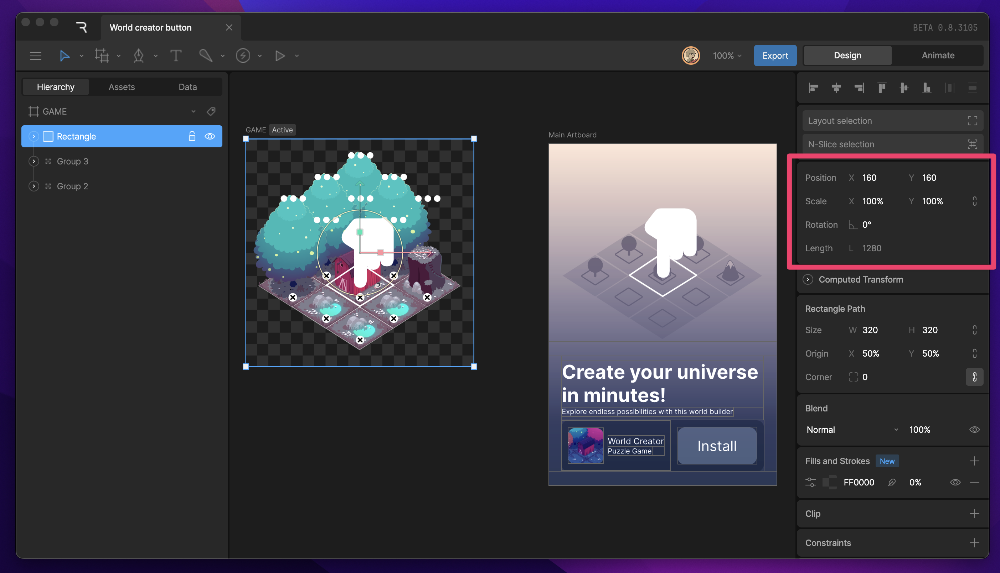
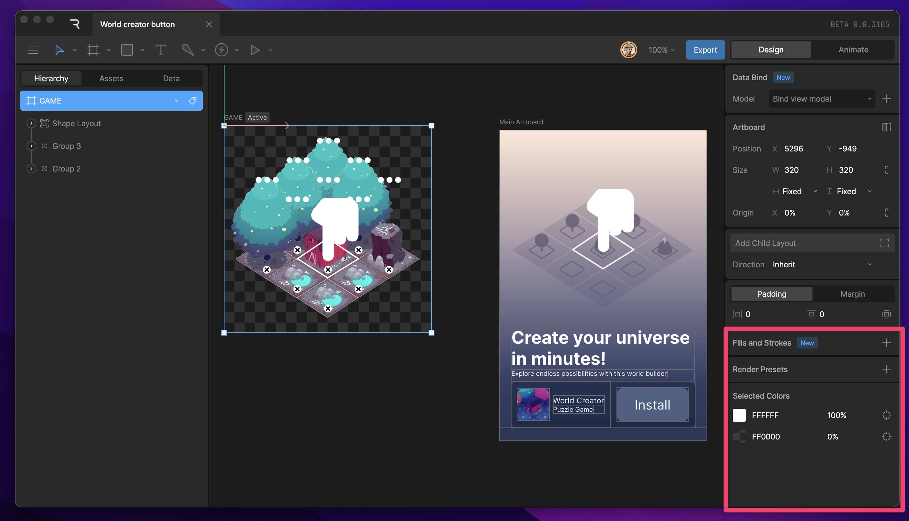
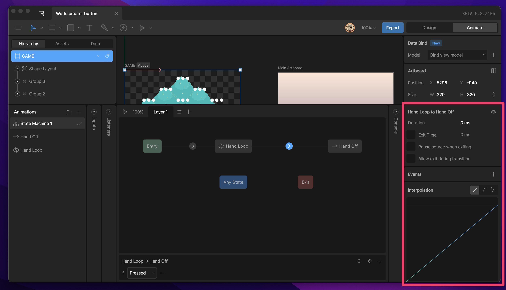

界面概览

# 检查器 (Inspector)

检查器位于编辑器的右侧。它显示了 Rive 编辑器中所有对象的所有可编辑属性。

# [​](#inspector) 检查器 (Inspector)

对象的待编辑属性可以在检查器中找到。检查器会根据你选择的对象以及你在编辑器中所处的位置动态变化。

## [​](#background-color,-tags,-default-interpolation) 背景颜色、标签、默认插值

当没有选中任何内容时，检查器包含三个部分：背景、标签和默认插值 (Default Interpolation)。

**背景颜色 (Background color)**
该部分位于检查器顶部，允许你更改动画 (Animate) 和设计 (Design) 模式下编辑器的背景颜色。这是一个提醒你当前处于哪种模式的有用方法。

**标签 (Tags)**
在背景颜色下方，你可以查看、编辑和向文件添加新标签。在此处了解更多关于标签的信息：[此处](/editor/tagging)。

**默认插值 (Default Interpolation)**
标签下方是文件的默认插值设置。

当你在时间轴上设置一个关键帧时，它将使用文件的默认插值，直到在时间轴上再次更改。通过更改默认插值，你可以控制应用于新关键帧的插值曲线。

## [​](#align-and-distribute-tools) 对齐和分布工具 (Align and Distribute tools)

当选中一个或多个对象（如形状或分组）时，对齐工具会出现在检查器顶部。使用它们来对齐或分布所选对象。在“对齐工具”页面了解更多。

## [​](#layout-and-n-slicing) 布局和 N-切片 (Layout and N-Slicing)

当选中一个或多个对象（如形状或分组）时，检查器提供对当前选择进行布局 (Layout) 或 N-切片 (N-Slice) 的选项。

[## 布局 (Layouts)

布局让你能够构建响应式设计。](/editor/layouts/overview.md)[## N-切片 (N-Slicing)

N-切片让你能够拉伸或重复位图和矢量设计的某些部分。](/editor/layouts/n-slicing.md)

## [​](#transform-properties) 变换属性 (Transform properties)

对象的变换属性出现在对齐工具下方。通常，这些属性包括位置 (Position)、缩放 (Scale) 和旋转 (Rotation)，但如果你选中了路径层，它们还可能包括宽度 (Width) 和高度 (Height)。

## [​](#layer-properties) 图层属性 (Layer properties)

变换属性下方有几个属性，允许你自定义舞台上某些对象的外观。这些属性包括混合模式 (Blend mode)、不透明度 (Opacity)、填充 (Fill) 和描边 (Stroke)。

## [​](#additional-properties) 其他属性 (Additional properties)

在图层属性下方，你会发现许多可以添加的其他属性，例如剪裁 (Clipping)、约束 (Constraints)、自定义绘制顺序 (Custom Draw Order) 和选择颜色 (Selection Colors)。

[## 操纵形状 (Manipulating Shapes)

Rive 编辑器提供了多种方式来操纵图形，以创建所需的动画。](../manipulating-shapes/manipulating-shapes)[## 约束 (Constraints)

约束是通过另一个目标对象来控制一个对象属性的一种方式。](../constraints/)[## 动画模式 (Animate Mode)

Rive 有两种不同的模式：设计 (Design) 和动画 (Animate)。](../animate-mode/)

### [​](#motion-and-state-properties) 运动和状态属性 (Motion and State Properties)

当选中关键帧、过渡 (Transitions) 或状态 (States) 时，此部分会显示可自定义的属性。

[## 插值面板 (Interpolation Panel)

选中关键帧会弹出插值面板。](/editor/animate-mode/interpolation-easing)[## 过渡属性 (Transition Properties)

选择一个过渡将显示可自定义的过渡属性。](/editor/state-machine/transitions.md)[## 状态属性 (State Properties)

通过选择一个状态可以自定义状态属性。](/editor/state-machine/states.md)