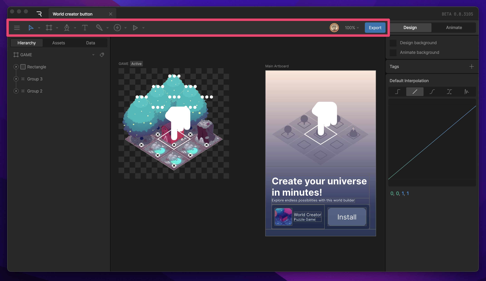
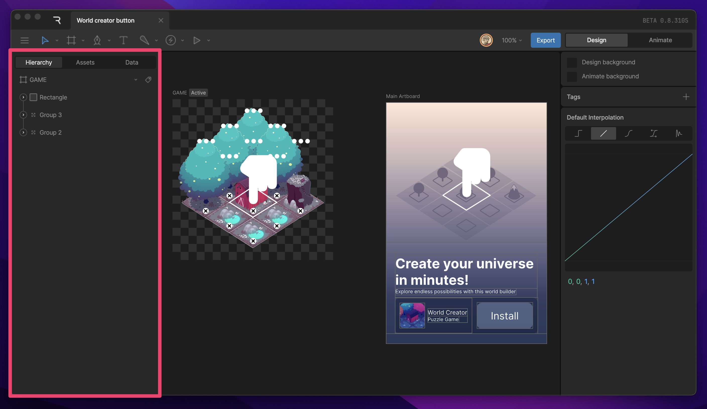
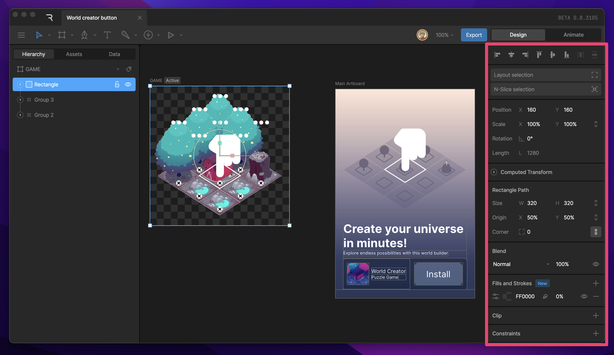
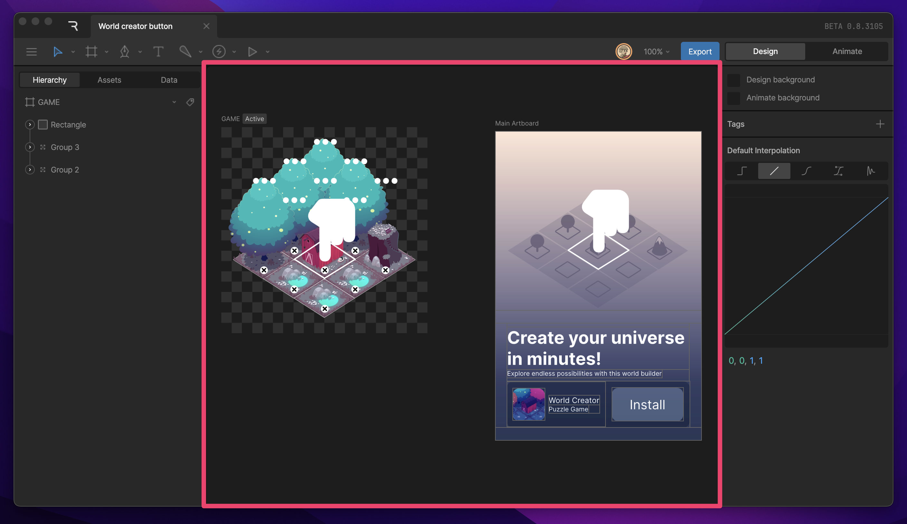
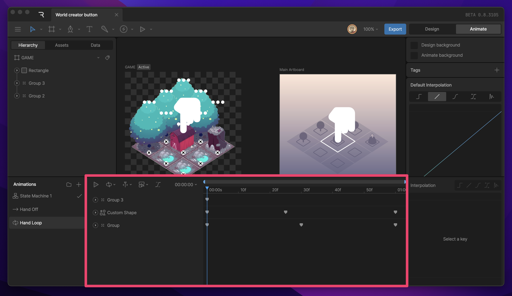

# 界面概览

Rive 的界面仅在需要时显示所需内容。它被划分为几个主要面板，下文将详细介绍。

## 工具栏

工具栏显示了您可用于在舞台上创建、绑定和操作项目的工具。除了这些工具外，工具栏还提供各种选项，允许您自定义文件的外观、设置主画板以及导出或共享文件。

了解更多：[工具栏页面](/docs/editor/interface-overview/toolbar)。

## 层级面板

组成文件的所有对象、资产、控件和动画都会出现在层级面板中。您还可以在这里找到资产面板和数据面板。

层级面板是一个树形视图，显示舞台上对象之间的父子关系以及它们的渲染顺序。

## 属性检查器

属性检查器允许您调整当前所选对象的属性，无论该对象是舞台上、时间轴上还是状态机中的对象。

了解更多：[属性检查器页面](/docs/editor/interface-overview/inspector)。

## 舞台

舞台是指工具栏、层级面板和属性检查器之间的中央区域。在这里，您可以创建画板，它们是 Rive 中设计和动画的基础。

了解更多：[舞台页面](/docs/editor/interface-overview/stage)。

## 时间轴

时间轴在进入动画模式时从屏幕底部浮现。在这里，您可以创建新状态、访问播放控制和设置，以及为对象参数设置关键帧。从左侧列表中选择一个时间轴即可在各个时间轴之间切换。

了解更多：时间轴页面。

## 状态机图表

当选择状态机时，时间轴将被图表替换。您将在此处编辑状态机。

了解更多：[状态机页面](/docs/editor/fundamentals/state-machines/introduction)。
