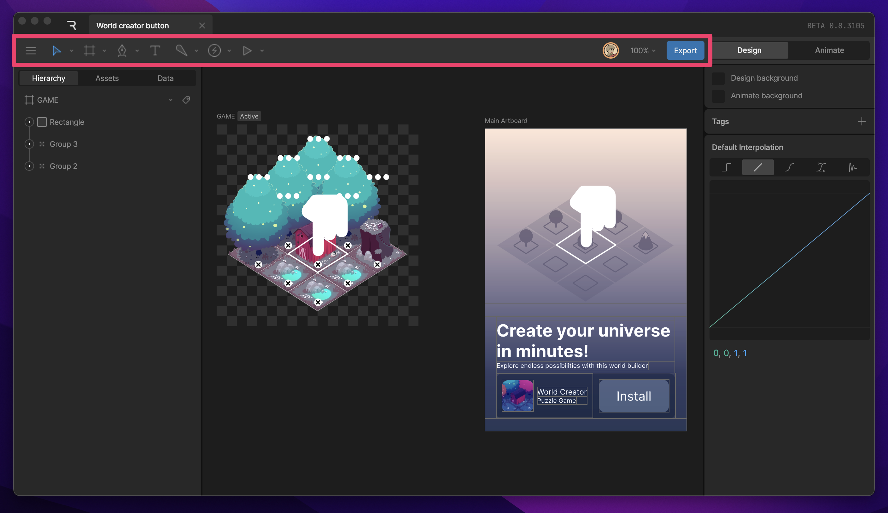
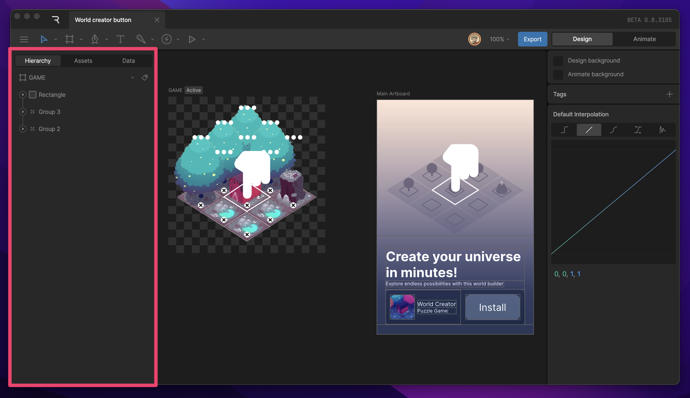
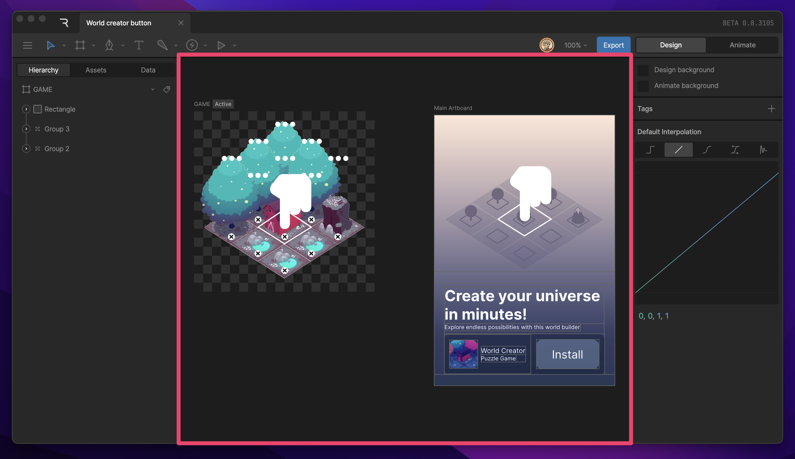
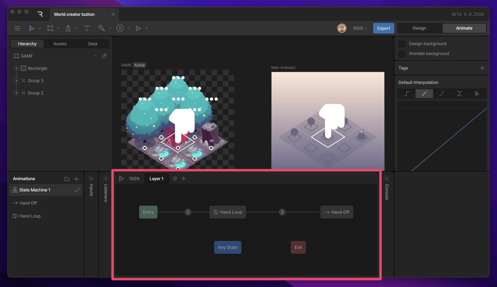

界面概览

# 界面概览 (Interface Overview)

Rive 的界面精简高效，只在需要时显示必要的内容。它分为几个主要面板，详见下文。

## [​](#toolbar) 工具栏 (Toolbar)

工具栏显示了你可以在舞台 (Stage) 上用于创建、绑定和操纵项目的工具。除了这些工具外，工具栏还包含各种选项，允许你自定义文件的外观、设置主画板以及导出或分享文件。

在工具栏页面了解更多信息。
[## 工具栏 (Toolbar)

从 Rive 编辑器工具栏访问设计和动画工具](/docs/editor/interface-overview/toolbar)

## [​](#hierarchy) 层级面板 (Hierarchy)

组成文件的所有对象、资产、控制和动画都显示在层级面板中。你还可以在这里找到资产面板 (Assets Panel) 和数据面板 (Data Panel)。

[## 层级面板 (Hierarchy)

层级面板是一个树状视图，它既显示了舞台上对象之间的父子关系，也显示了它们的渲染顺序。通过观看视频或阅读下文来了解层级面板。](/docs/editor/interface-overview/hierarchy)

## [​](#inspector) 检查器 (Inspector)

检查器允许你调整当前选中对象的属性，无论该对象是在舞台上、时间轴 (Timeline) 上还是状态机 (State Machine) 中。

在检查器页面了解更多信息。
[## 检查器 (Inspector)

对象的待编辑属性可以在检查器中找到。检查器会根据你选择的对象以及你在编辑器中所处的位置动态变化。](/docs/editor/interface-overview/inspector)

## [​](#stage) 舞台 (Stage)

舞台是指工具栏、层级面板和检查器之间的中央区域。在这里，你可以创建画板 (Artboards)，它是你在 Rive 中进行设计和制作动画的基础。

在舞台页面了解更多信息：
[## 舞台 (Stage)

舞台是一个无限的画布，你可以在其中放置包含所有图形的画板。](/docs/editor/interface-overview/stage)

## [​](#timeline) 时间轴 (Timeline)

进入动画模式 (Animate Mode) 后，时间轴会从屏幕底部升起。在这里，你可以创建新的动画状态、访问播放控制、设置以及为对象参数设置关键帧 (Keyframes)。从左侧列表中选择一个时间轴，可以在各个时间轴之间切换。
在时间轴页面了解更多信息：
[## 时间轴 (Timeline)

Rive 界面显示了一个带有播放控制的时间轴，以及用于在动画模式下进行当前动画配置的选项。时间轴左侧显示了所有动画的列表。请记住，这些都是当前活动画板的动画。](/docs/editor/animate-mode/timeline)

## [​](#state-machine-graph) 状态机图表 (State Machine Graph)

当选中状态机时，时间轴会被图表取代。这就是你进行状态机工作的地方。
在状态机页面了解更多信息。
[## 状态机 (State Machine)

状态机是一种直观地将动画连接在一起并定义驱动过渡逻辑的方式。](/docs/editor/state-machine/state-machine)