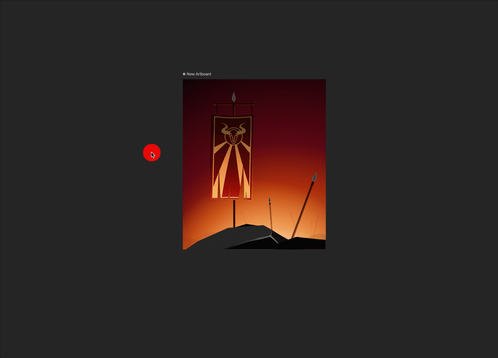
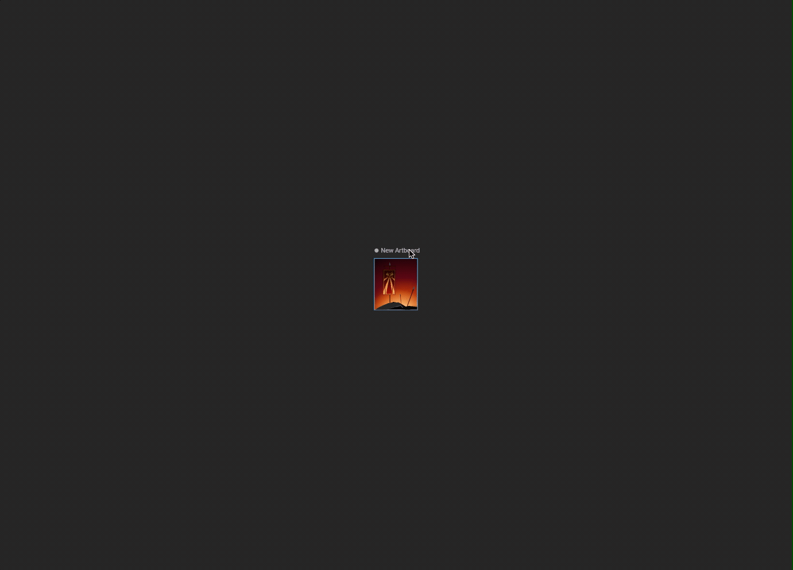

# 舞台 (Stage)

舞台（Stage）是 Rive 的无限画布，你可以在这里放置画板和图形。

## 选择 (Selection)

在舞台上选择图形有多种方式：

*   **点击 (Click)** 图形以选中它。
*   **拖拽框选 (Marquee select)** 以选中多个对象。
*   按住 **Shift** 键并点击可添加或移除选中项（多选）。

<iframe width="100%" height="400" src="https://www.youtube.com/embed/xQK498Y1J8M" frameborder="0" allow="accelerometer; autoplay; clipboard-write; encrypted-media; gyroscope; picture-in-picture" allowfullscreen></iframe>

### 双击 (Double-click)

默认情况下，当你点击一个对象组（Group）时，你会选中最顶层的组。你可以**双击**该组，向下钻取一级并选中其中的子对象。你可以重复此操作以深入层级结构。

双击舞台空白处可向上返回一级（或取消选择）。

### 深度选择 (Deep select)

如果你想忽略所有组层级，直接选中光标下的特定形状或路径，可以按住 **Cmd** (macOS) / **Ctrl** (Windows) 并点击该对象。

### 后方选择 (Select behind)

如果多个对象重叠，你可以按住 **Alt** 键并未移动鼠标，Rive 会循环高亮显示光标下方的所有对象。点击即可选中当前高亮的对象。

### 键盘导航 (Enter / Esc)

当你选中一个对象时，可以使用键盘在层级结构中快速移动：
*   **Enter**: 选中第一个子对象（向下钻取）。
*   **Esc**: 选中父对象（向上返回）。

## 导航 (Navigating)

你可以使用鼠标或触控板轻松在舞台上移动和查看内容。

<iframe width="100%" height="400" src="https://www.youtube.com/embed/osp_et6q7o8" frameborder="0" allow="accelerometer; autoplay; clipboard-write; encrypted-media; gyroscope; picture-in-picture" allowfullscreen></iframe>

### 平移 (Panning)

*   **右键**点击并拖拽以移动画布。
*   或者按住 **空格键**，然后**左键**点击并拖拽。

### 缩放 (Zooming)

*   按住 **Cmd** (macOS) / **Ctrl** (Windows) 并使用鼠标滚轮进行缩放。
*   使用键盘上的 **+** 和 **-** 键进行缩放。
*   按 **Cmd + 0** (macOS) / **Ctrl + 0** (Windows) 将缩放重置为 100%。

### 适配视图 (Fit)

当你迷失方向或想快速查看整体效果时，按 **F** 键可以：
*   如果有选中对象，缩放并移动视图以填满该对象。
*   如果没有选中对象，缩放并移动视图以填满当前的活动画板。
