# 工具栏 (Toolbar)

从 Rive 编辑器的工具栏中，您可以访问文件、设计、绑定、导出等工具和选项。

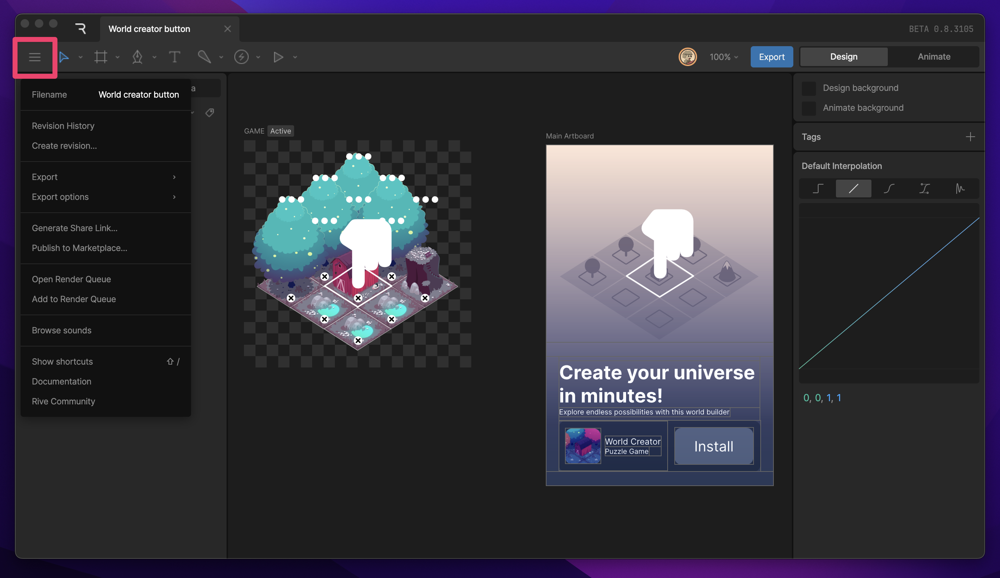

## 编辑器菜单 (Editor Menu)

编辑器菜单（Editor Menu）位于变换工具的左侧。此菜单为您提供多种**文件级选项**，包括修订历史、导出选项、文件分享方式、渲染选项、声音设置和快捷键列表。

### 1. 修改历史 (Revision History)

查看文件的完整修改历史。您可以浏览并恢复到之前保存的任何版本。

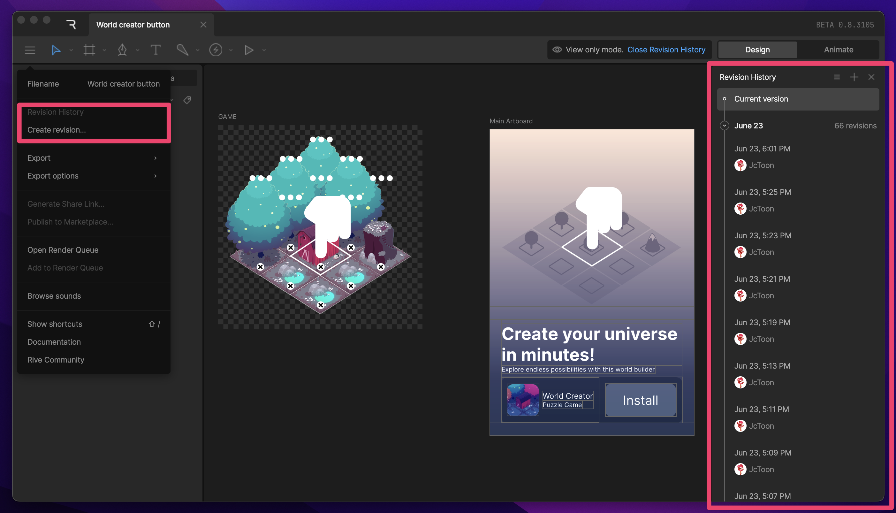

### 2. 导出 (Export)

打开导出菜单，下载当前文件的备份。导出类型包括：
*   **Rive 原生文件 (.riv)**: 用于运行时的优化二进制文件。
*   **备份 (.rev)**: 包含编辑器数据的完整源文件。

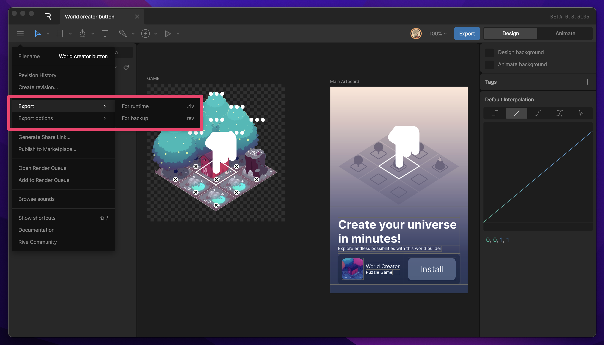

### 3. 分享链接 (Share Link)

生成一个唯一的 URL，以便与他人分享您的文件。任何拥有此链接的人都可以查看文件，甚至可以将其“混音 (Remix)”成一个新文件供自己使用。

### 4. 发布到社区 (Publish to Community)

将您的文件发布到 Rive 社区。您可以添加标题、描述和标签，让全世界都能看到您的作品。

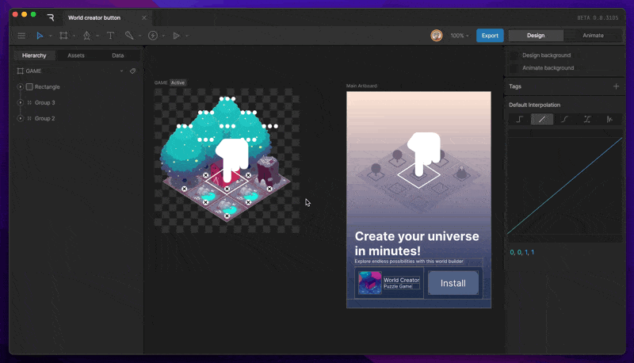

### 5. 渲染设置 (Render)

更改编辑器的渲染设置。目前主要用于启用或禁用抗锯齿 (Anti-aliasing)。

### 6. 声音 (Sounds)

查看并管理文件中的所有音频资产。您可以单独控制每个音频剪辑的音量。

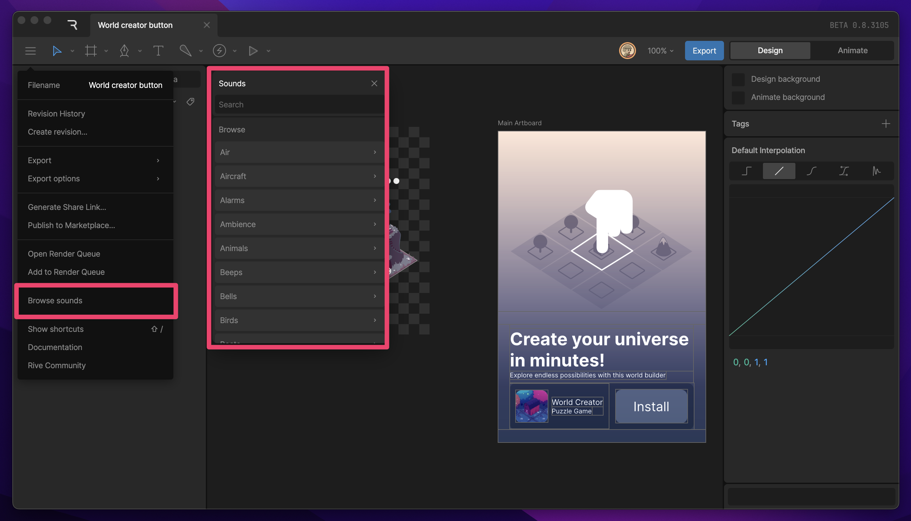

### 7. 快捷键 (Shortcuts)

查看 Rive 编辑器的完整键盘快捷键列表。

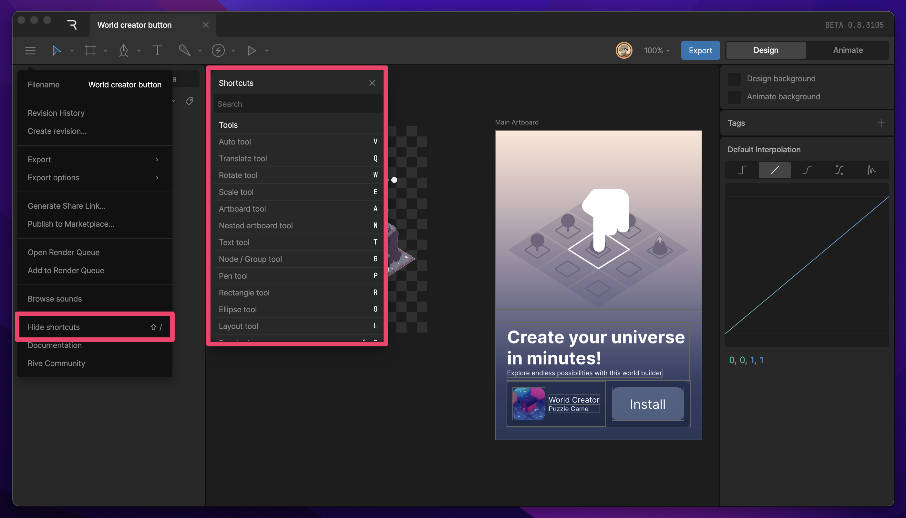

## 变换工具菜单 (Transform Tools menu)

您可以通过点击图标或使用键盘快捷键来快速切换变换工具。

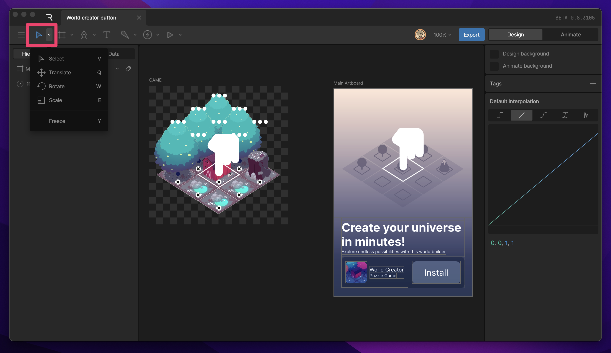

1.  **选择 (Select)** (快捷键: `V`): 选择对象。
2.  **平移 (Translate)** (快捷键: `T`): 移动对象。
3.  **旋转 (Rotate)** (快捷键: `R`): 旋转对象。
4.  **缩放 (Scale)** (快捷键: `S`): 缩放对象。
5.  **冻结模式 (Freeze Mode)** (快捷键: `Y`): 允许在不改变对象变换属性值的情况下，修改其轴心点或骨骼位置。

当选择平移、旋转或缩放工具时，**变换 Gizmo**（操作手柄）会出现在所选对象上。

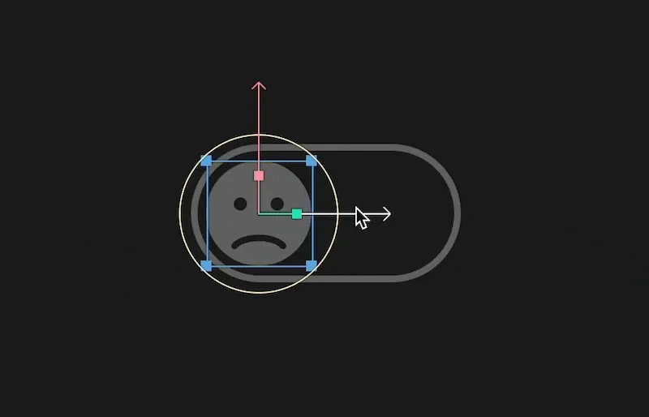

## 画板、布局和组菜单 (Artboard, Layout, and Groups menu)

用于创建容器类对象：画板、布局或组。

*   **画板 (Artboard)** (快捷键: `A`): 创建一个新的画板（设计区域）。
*   **组 (Group)** (快捷键: `Cmd + G` / `Ctrl + G`): 将选中的对象放入一个新组中。
*   **布局 (Layout)**: 创建 Flex 布局容器（行、列等）。

## 矢量工具菜单 (Vector Tools menu)

用于绘制形状和路径的核心设计工具。

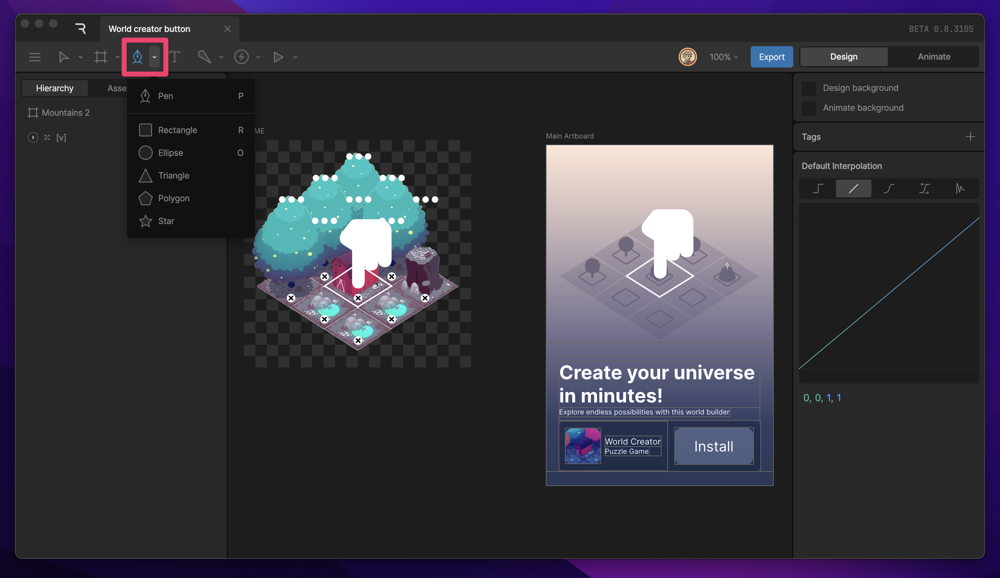

*   **钢笔 (Pen)** (快捷键: `P`): 绘制自定义路径。
*   **矩形 (Rectangle)** (快捷键: `R`)
*   **椭圆 (Ellipse)** (快捷键: `O`)
*   **三角形 (Triangle)**
*   **星形 (Star)**
*   **多边形 (Polygon)**

## 骨骼菜单 (Bones menu)

创建骨骼以构建角色或物体的骨骼绑定系统。

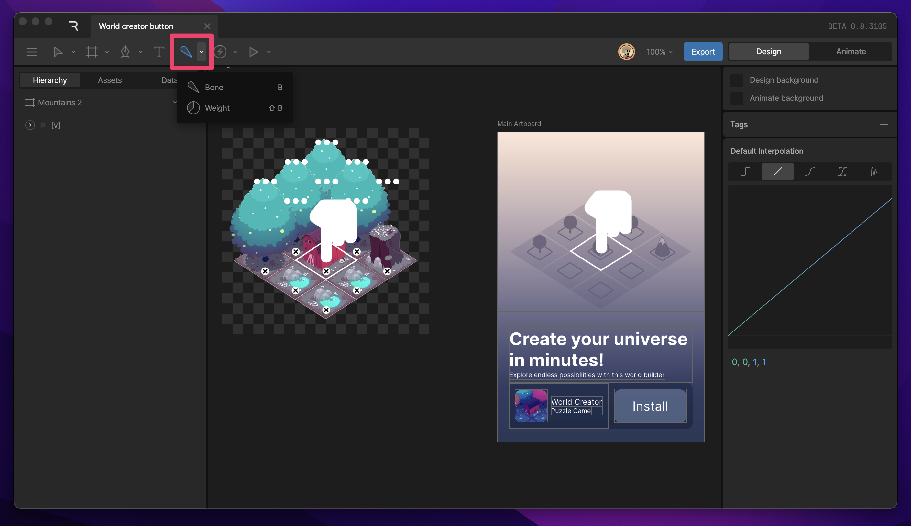

*   **骨骼 (Bone)** (快捷键: `B`): 创建一个新的骨骼关节。

## 事件与操纵杆菜单 (Events and Joystick Menu)

*   **事件 (Events)** (快捷键: `Shift + E`): 创建用于状态机交互的事件触发器。
*   **操纵杆 (Joystick)**: 创建用于控制混合状态 (Blend State) 的操纵杆控件。

## 视图选项菜单 (View Options menu)

控制舞台上的辅助显示选项。

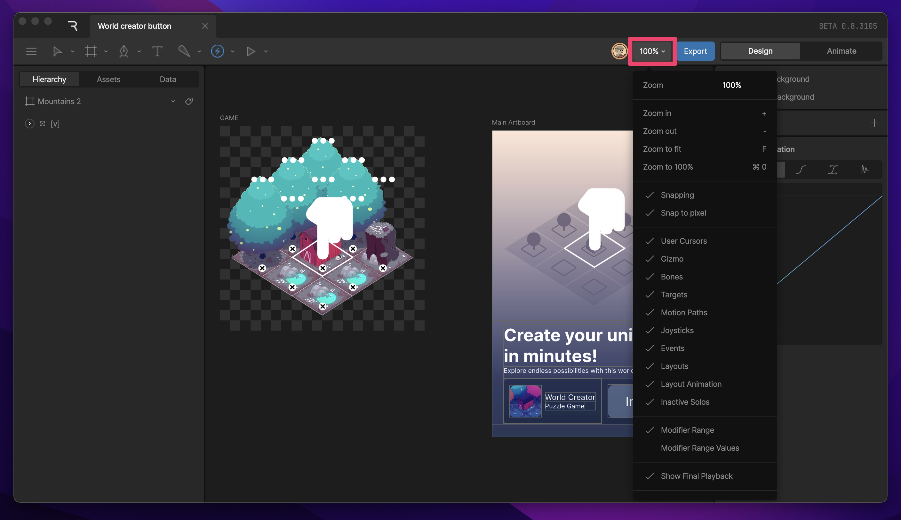

*   **显示骨骼 (Show Bones)**: 开启/关闭骨骼可见性。
*   **显示网格 (Show Mesh)**: 开启/关闭网格变形顶点的可见性。
*   **主要/次要网格 (Primary/Secondary Grid)**: 显示背景参考网格。
*   **吸附到网格 (Snap to Grid)**: 开启/关闭对齐网格。
*   **像素预览 (Pixel Preview)**: 预览导出后的光栅化像素效果。

## 导出按钮 (Export Button)

位于工具栏右上角的快捷导出按钮，功能与编辑器菜单中的导出选项完全相同。

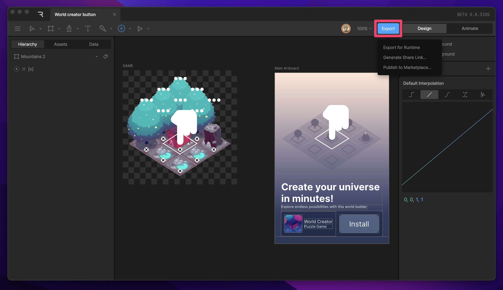

## 模式切换 (Mode Toggle)

使用此开关在 **设计 (Design)** 模式和 **动画 (Animate)** 模式之间切换。

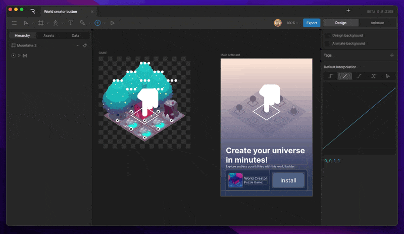

*   **设计模式**: 用于设置图形、骨骼、约束和初始状态 (Setup State)。
*   **动画模式**: 用于创建时间轴动画和编写状态机逻辑。

> [!TIP]
> 使用快捷键 `Tab` 可以快速在两个模式间切换。
