界面概览

# 工具栏 (Toolbar)

从 Rive 编辑器工具栏访问文件、设计、绑定 (Rigging) 和导出工具及选项。

## [​](#editor-menu) 编辑器菜单 (Editor menu)

编辑器菜单位于转换工具 (Transform Tools) 菜单的左侧。通过此菜单，你可以访问许多文件级选项，包括版本历史记录、导出选项、分享文件的方式、渲染选项、声音和快捷键。
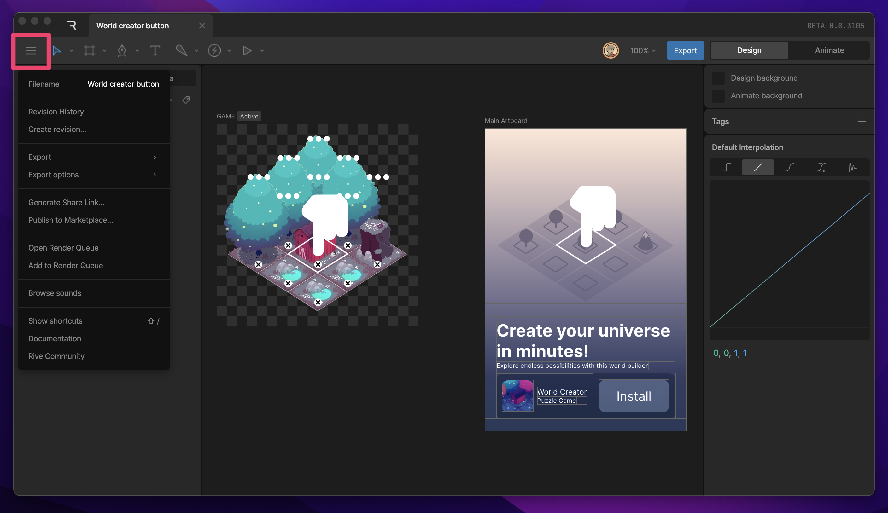
**版本历史记录 (Revision History)**
Rive 会自动保存你的版本历史记录。你可以通过版本历史记录选项查看或恢复文件版本历史中的任何实例。
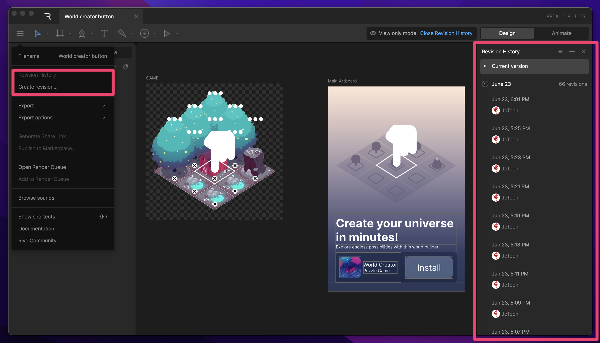
此外，你还可以使用“创建版本 (Create Revision)”选项创建一个新的自定义版本。
在此处阅读有关版本历史记录的更多信息：[此处](http://rive.app/docs/editor/fundamentals/revision-history)。

**导出 (Export)**
导出部分允许你导出 Rive 文件，以及为导出的文件导出或删除所有名称。
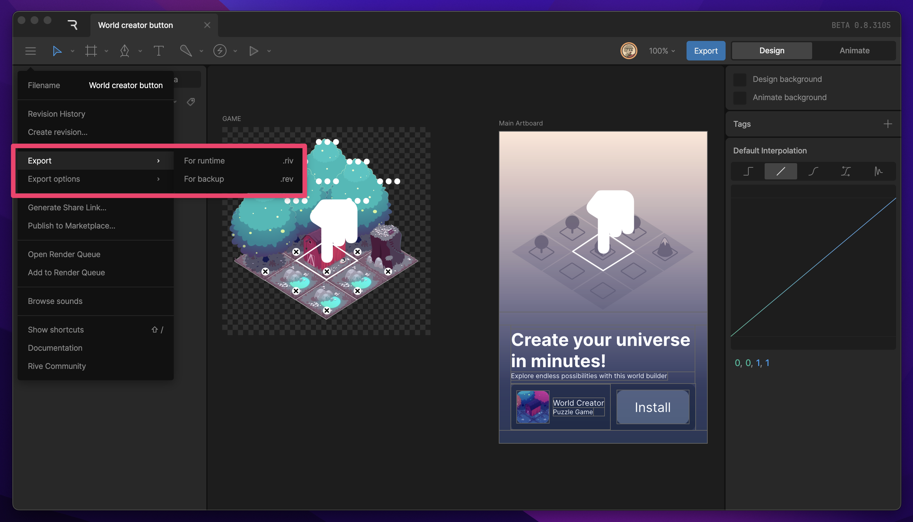
在此处阅读有关导出 Rive 文件及其内容的更多信息：[此处](https://rive.app/docs/editor/exporting/exporting-for-runtime)。

**生成分享链接 (Generate Share Link)**
生成分享链接功能适用于 Voyager 和 Enterprise 方案。[了解更多关于我们的方案和定价的信息](https://rive.app/pricing)。
分享链接是一种快速的无代码方式，可以让你的 Rive 文件在网站上运行，或者向客户展示你的图形作品。

通过分享链接分享你当前正在处理的文件版本。请注意，这并不等同于让某人访问包含所有版本历史记录的实时文件。此链接将是文件当前状态的冻结版本。如果你对文件进行了更改，则需要生成一个新的分享链接。
在此处了解更多关于分享链接的信息：[此处](https://rive.app/docs/editor/share-links/overview)。

**发布到市场 (Publish to Marketplace)**
市场 (Marketplace) 是你可以向整个 Rive 社区分享文件的地方。
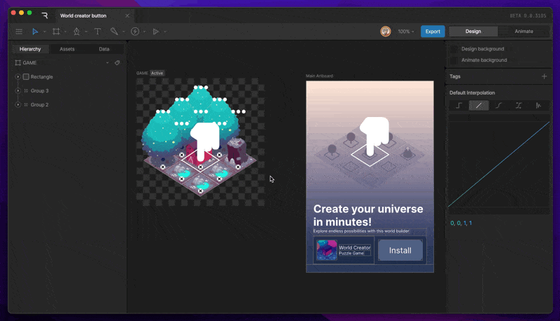
在此处了解更多关于将文件分享到市场的信息。

**云渲染器 (Cloud Renderer)**
文件菜单提供了一种查看动画并将新动画或预设添加到渲染队列的方法。
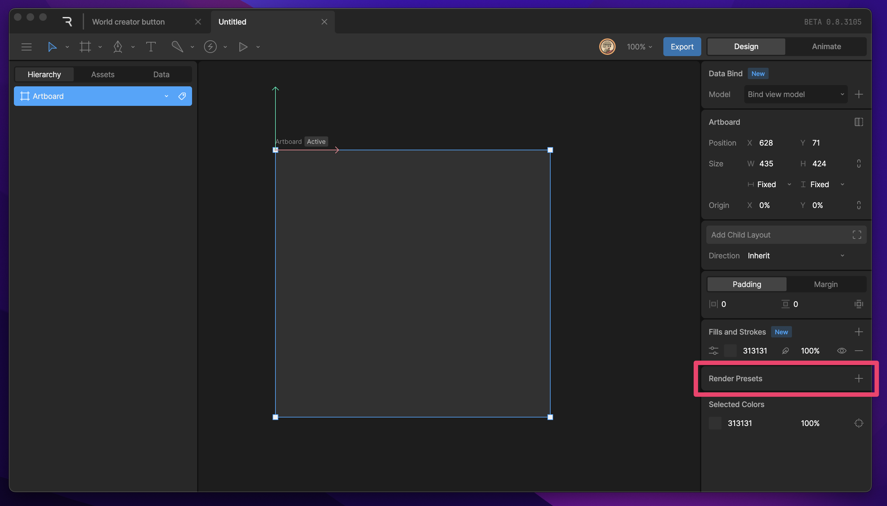
在此处了解更多关于使用我们的云渲染器的信息：[此处](https://rive.app/docs/editor/exporting/exporting-for-video-and-static-design)。

**浏览声音 (Browse Sounds)**
Rive 允许你通过事件 (Events) 在文件中添加和播放不同的音效。此选项允许你浏览我们的声音库。
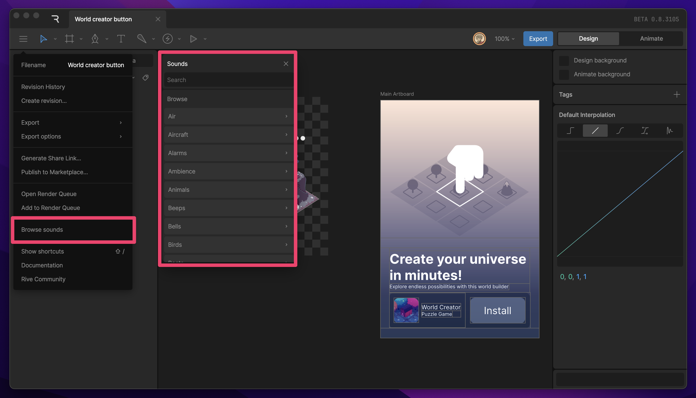
在此处阅读更多关于在 Rive 文件中添加声音的信息：[此处](https://rive.app/docs/editor/events/audio-events)。

**显示快捷键 (Show Shortcuts)**
“显示快捷键”选项允许你查看并搜索 Rive 编辑器中的所有快捷键。
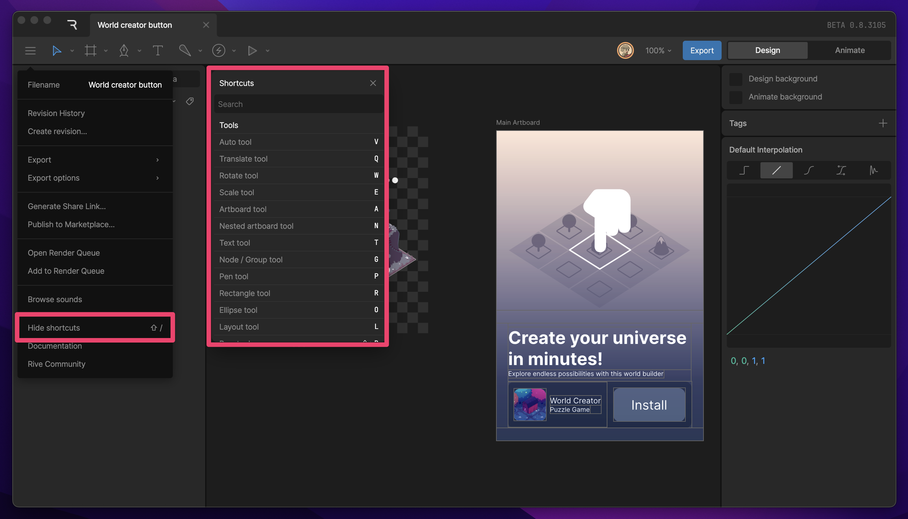

**文档 (Documentation)**
“文档”选项将带你直接进入 Rive 文档。

**发送反馈 (Send Feedback)**
如果你对我们改进 Rive 的方式有任何想法，“发送反馈”按钮将直接链接到我们社区的请求 (Requests) 页面。

## [​](#transform-tools-menu) 变换工具菜单 (Transform Tools menu)

变换工具菜单包含了允许你更改 [舞台 (Stage)](/docs/editor/interface-overview/stage) 上对象变换属性的工具。
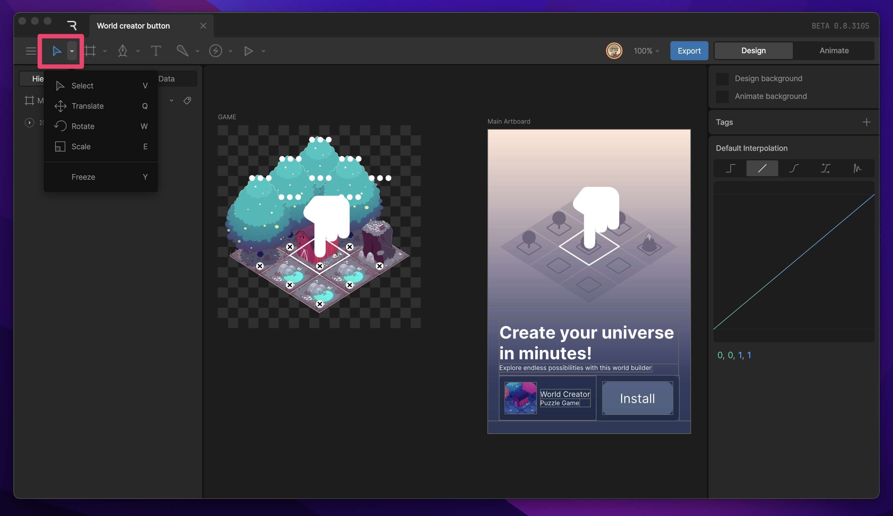
**选择工具 (Select Tool)**
选择工具允许你选择对象，并使用出现的 Gizmo 操纵它们的所有变换属性。你还可以在空白区域点击并拖动，通过框选来选择多个对象。
在大多数情况下，你可能都会使用选择工具，不过我们目前也提供专门的平移 (Translate)、缩放 (Scale) 和旋转 (Rotate) 工具。
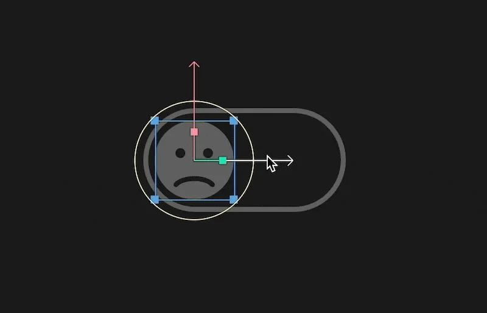
Gizmo 允许你操纵所选内容的平移、旋转和缩放属性。

**平移工具 (Translate Tool)**
平移工具允许你通过 Gizmo 或在空白区域点击来修改所选对象的位置，而不会丢失选择。

**旋转工具 (Rotate Tool)**
旋转工具允许你通过 Gizmo 或在空白区域点击来修改所选对象的旋转，而不会丢失选择。

**缩放工具 (Scale Tool)**
缩放工具允许你通过 Gizmo 或在空白区域点击来修改所选对象的缩放，而不会丢失选择。

**冻结模式 (Freeze Mode)**
冻结模式允许你修改原点 (Origins)、分组 (Groups) 和骨骼 (Bones) 的位置，而不影响与其关联的基础对象。
在此处了解更多关于原点和冻结模式的信息：[此处](https://rive.app/docs/editor/fundamentals/freeze-and-origin)。

## [​](#artboard,-layout,-and-groups-menu) 画板、布局和分组菜单 (Artboard, Layout, and Groups menu)

了解画板 (Artboards)、组件 (Components)、布局 (Layouts) 和分组 (Groups)。

[## 画板 (Artboards)

画板是你在设计模式和动画模式下进行创作的基础。](../fundamentals/artboards)[## 组件 (Components)

组件可以通过允许你复用动画和状态机来加快你的工作流程。](../fundamentals/components)[## 分组 (Groups)

使用分组来组织你的图形或添加额外的变换空间。](../fundamentals/groups)[## 布局 (Layouts)

布局让你能够创建响应式设计。](https://rive.app/docs/editor/layouts/layouts-overview)

## [​](#vector-tools-menu) 矢量工具菜单 (Vector Tools menu)

使用 [钢笔工具 (Pen Tool)](/docs/editor/fundamentals/pen-tool-overview) 和 [参数化图形 (procedural shapes)](/docs/editor/fundamentals/procedural-shapes) 在 Rive 中进行设计。矢量工具菜单包含了创建矢量作品所需的所有工具。
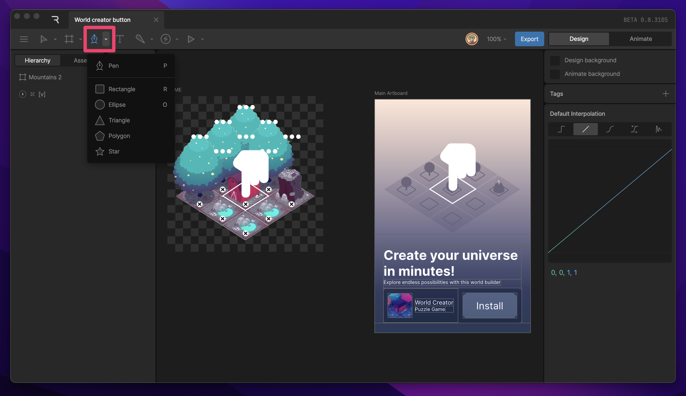

## [​](#bones-menu) 骨骼菜单 (Bones menu)

访问 [骨骼 (Bone)](/docs/editor/manipulating-shapes/bones) 和权重工具（绑定时）。

## [​](#events-and-joystick-menu) 事件和摇杆菜单 (Events and Joystick Menu)

事件和摇杆菜单允许你向文件中添加新的事件 (Events) 和摇杆 (Joysticks)。
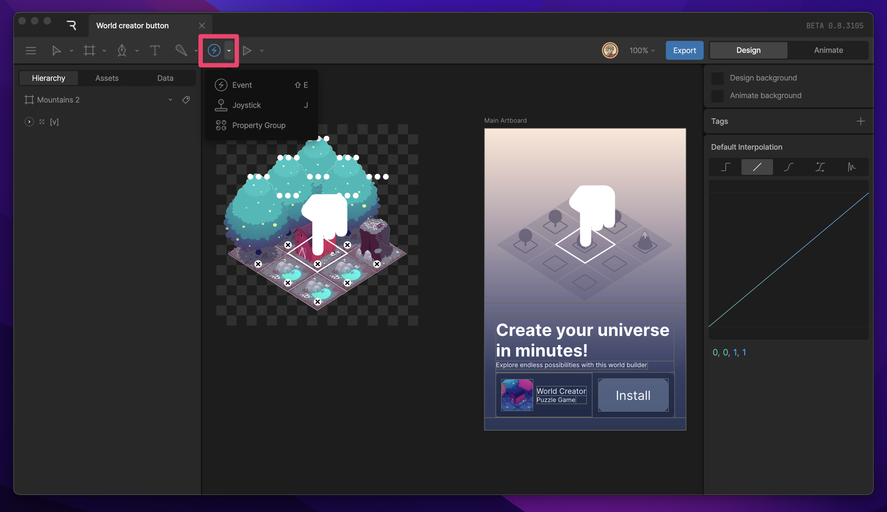

[## 事件 (Events)

事件允许你向运行时和编辑器提供额外信息。](https://rive.app/docs/editor/events/overview)[## 摇杆 (Joysticks)

摇杆是一个绑定工具，它能提供舞台控制项，让你能够平滑地切换已连接的时间轴。](https://rive.app/docs/editor/manipulating-shapes/joysticks)

## [​](#view-options-menu) 视图选项菜单 (View Options menu)

视图选项菜单允许控制 Rive 舞台上的许多不同视图选项。
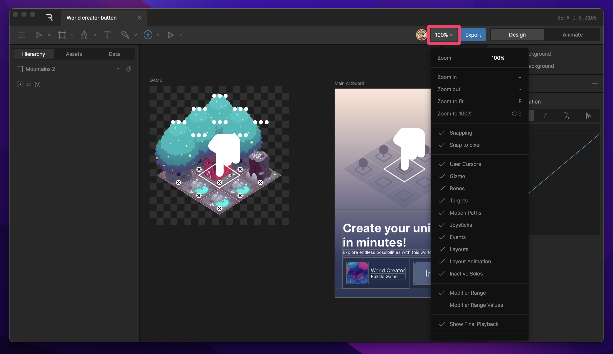
**缩放 (Zoom)**
此选项允许你查看并更改 Rive 编辑器的缩放级别。

**吸附 (Snapping)**
吸附选项允许 Rive 编辑器通过上下文帮助你将对象彼此吸附和对齐。可以通过关闭该选项或在拖动对象时按住 CMD (macOS) 或 CTRL (Windows) 来禁用此功能。

**像素吸附 (Snap to pixel)**
像素吸附强制 Rive 编辑器将对象位置吸附到最近的半像素。禁用时，对象可以放置在像素的任何分数值位置。

**用户光标 (User Cursors)**
当一个文件中有多个用户时，我们可以看到他们的鼠标光标。通过禁用此选项，我们可以隐藏文件中其他用户的光标。

**Gizmo**
Gizmo 是屏幕上的视觉对象，可以让我们更改对象的位置、缩放或旋转。禁用此选项后，选择对象时将不再出现 Gizmo。

**骨骼 (Bones)**
禁用骨骼后，编辑器将隐藏舞台上的所有骨骼。

**目标 (Targets)**
禁用目标将隐藏任何设为“目标 (Target)”模式的分组。

**运动路径 (Motion Paths)**
在时间轴上选中对象的 X 或 Y 属性时，对象随时间移动的视觉路径将作为运动路径出现。我们可以通过关闭此选项来禁用该视觉化显示。

**摇杆 (Joysticks)**
禁用摇杆将隐藏舞台上的所有摇杆。

**事件 (Events)**
禁用此选项将隐藏舞台上的所有事件。

**布局 (Layouts)**
布局在舞台上自带骨架视觉化，以显示布局容器的边界。禁用此选项将隐藏舞台上布局的所有视觉化说明。

**布局动画 (Layout Animations)**
当布局容器的各种属性发生变化时，布局可以自动制作动画。禁用此选项将禁用所有布局动画的播放。

**修改器范围 (Modifier Range)**
当文本修改器范围在文本对象视野内时，此选项会使其视觉化。禁用此选项将隐藏视觉化效果。

**修改器范围值 (Modifier Range Values)**
修改器范围值通过每个字母、单词或行下方的圆点来视觉化显示范围是如何应用的。禁用此选项将隐藏视觉化效果。

**显示最终回放效果 (Show Final Playback)**
“显示最终回放效果”会自动隐藏所有在运行时通常会被隐藏的元素和视觉化说明。例如，骨骼在运行时是不可见的，因此启用此选项后，当状态机或时间轴播放时，骨骼将自动隐藏。禁用此选项可使骨骼之类的内容在编辑器回放期间保持可见。请注意，这对运行时没有任何影响。

## [​](#export-button) 导出按钮 (Export Button)

导出按钮允许你创建 [分享链接 (Share Links)](/docs/editor/share-links/overview)、[发布文件到市场 (Marketplace)](/docs/community/marketplace-overview#marketplace-overview)、[下载 `.riv` 文件](/docs/editor/exporting/exporting-for-runtime) 以及 [发布库 (Library)](/docs/editor/libraries)。
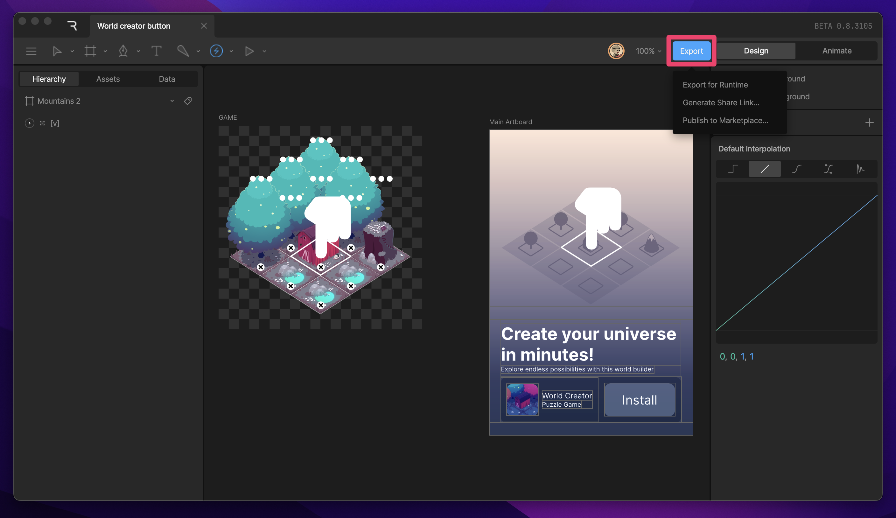

## [​](#mode-toggle) 模式切换 (Mode toggle)

模式切换允许你在设计模式 (Design Mode) 和动画模式 (Animate Mode) 之间切换。按下 `Tab` 键可快速切换模式。
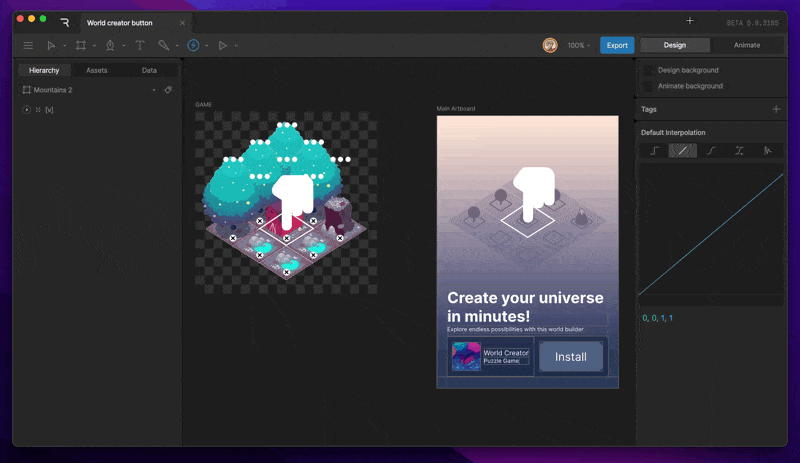