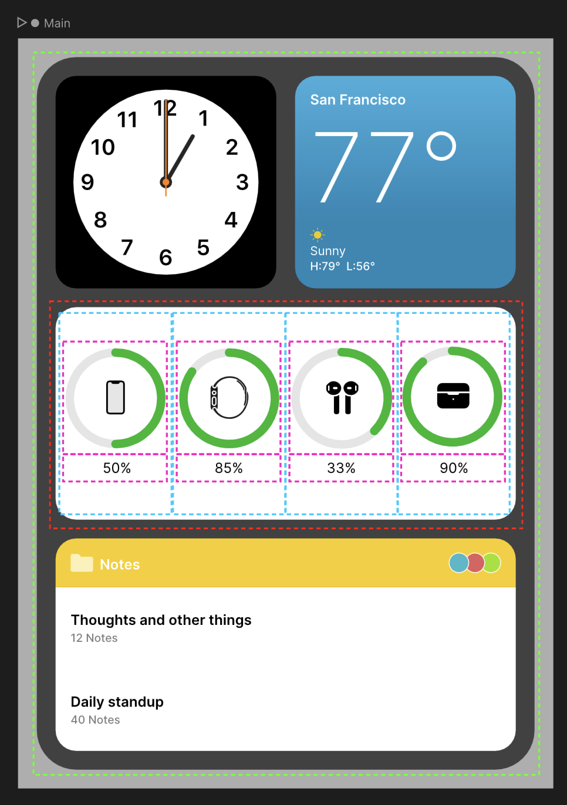
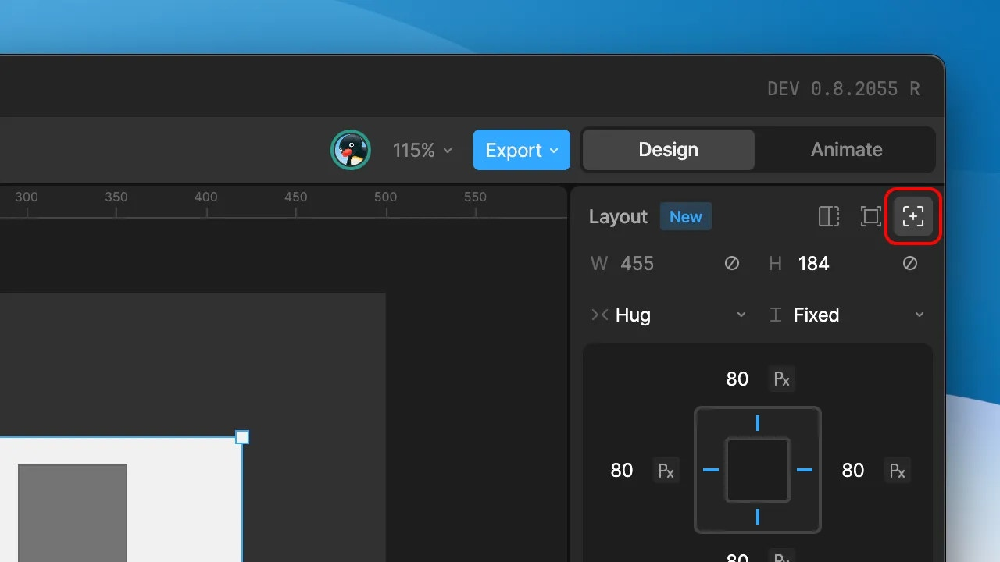

布局 (Layouts)

# 概览 (Overview)

布局允许你在 Rive 中构建响应式 UI 组件。让你的设计根据可用空间适应、填充或重新排列内容。

利用 Rive 的布局系统来满足各种用例：

- 将项目固定到父画板或容器的选定边缘。
- 创建适应文本大小的按钮和标签。
- 构建可以重排、动画化和滚动的内容列表和网格。
- 组合和嵌套布局以开发整个界面。

你可以使用这些技术来创建各种可直接用于生产环境的按钮、列表和菜单，它们可以流畅地调整大小以适应任何设备尺寸或方向。Rive 图形不是模型或原型，它们是可以改变状态并连接到真实数据的功能性图形——因为 Rive 可以在任何地方运行，你可以在移动应用、游戏引擎、网站、定制设备等上面重复使用相同的响应式图形。

在 Rive 的 YouTube 频道上查看 [Layouts 播放列表](https://www.youtube.com/playlist?list=PLujDTZWVDSsGvor80PkjHaZ3hNNo6s_ef) 以获取更多布局相关的教程。

---

## [​](#introduction) 介绍

在 Rive 添加布局功能之前，画板上的所有对象都以通过自由形式定位，几乎没有规则限制（[约束](/docs/editor/constraints/constraints-overview) 是一个例外）。布局提供了一种基于规则的方式，使用行 (Rows) 和列 (Columns) 来定位和调整内容大小。

布局是一个容器，其位置和大小受规则约束（相对于其父布局或子级）。当 Rive 对象（文本、形状、路径、分组、图像、组件，甚至摇杆或骨骼）被放置在布局中时，它们会继承布局的定位规则（**参与布局**），但如果需要，它们也可以在布局容器内独立行动。如果你需要在布局内制作对象动画，这提供了额外的自由度。

布局仅影响其他布局的位置。例如，如果你想拥有一个行布局，你需要将父布局的方向设置为行 (Row)，其所有布局子级将排列成一行（并将诸如父级的内边距 padding、间隙 gap、对齐 alignment 等应用到它们的位置上）。

---

## [​](#layout-parents-and-children) 布局父级和子级 (Layout Parents and Children)

为了创建能够响应屏幕或浏览器大小的更复杂 UI，重要的是要理解布局可以放置在其他布局内部。我们将外部布局称为父级 (Parent)，内部布局称为子级 (Child)。布局子级通常相对于其布局父级定位（类似于 [分组](/docs/editor/fundamentals/groups) 的工作方式）。此外，父级可以根据子级调整大小（[包裹 Hug](editor/layouts/layout-parameters#scale-types)），或者子级可以根据父级调整大小（[填充 Fill](editor/layouts/layout-parameters#scale-types)）。下面是一个例子，帮助直观地理解这些关系是如何工作的。

在下图中，我们将关注虚线包含的区域。外部的绿色虚线是最外层的布局，设置为将其子级在单列 (Column) 中布局。在该列的第二行，红色虚线是一个子布局，包含各种设备的电池指示器。此布局定义为行 (Row)。此布局有 4 个子布局（蓝色虚线），设置为均匀填充 (Fill) 其父级的宽度（因此当父级调整大小时，子布局也会调整大小，每个填充可用空间的 25%）。这 4 个布局中的每一个都被设置为列 (Column)，并有 2 个子布局（粉色虚线），包含剩余电池的可视化修剪路径和百分比标签。通过创建这些简单的父子布局，我们可以使用 Rive 创建无限响应的内容！

---

## [​](#absolute-vs-relative-layouts) 绝对布局 vs 相对布局 (Absolute vs Relative Layouts)

布局可以存在于 Rive 的自由变换空间中，这意味着你可以向画板绘制一个布局，并没有像其他 Rive 对象一样对其进行定位。这种类型的布局被称为 **绝对 (Absolute)**（绝对定位）。
另一方面，当你希望布局参与其父布局的流 (flow) 时，这被称为 **相对 (Relative)**（相对于其父级定位）。相对布局的位置由其父级通过许多参数（如行/列、对齐、内边距、间隙等）确定。
使用布局检查器右上角的图标在绝对布局和相对布局之间切换。

---

## [​](#layouts-and-other-rive-objects) 布局和其他 Rive 对象

布局容器将以以下两种方式之一影响其子级：

- 仅设置子级的位置
- 同时设置子级的位置和大小

此行为由子级的对象类型决定。位置和大小都由布局容器定义的对象包括：

- 文本 (Text)
- 图像 (Images)
- 参数化图形 (Parametric shapes)（矩形、椭圆、三角形、多边形和星形）
- 组件实例 (Component instances)（叶节点和布局模式）
- 其他布局 (Other Layouts)

所有其他对象仅由布局设置其位置。[N-切片 (N-Slicing)](/docs/editor/layouts/n-slicing) 功能提供了更高级的选项来控制更高级形状和分组的布局/缩放行为。
与其他一些工具不同，Rive 提供了一个额外的层级项来表示对象的布局容器。这有助于区分 Rive 的自由形式本质与结构化布局系统。例如，布局容器内的对象仍然可以应用额外的变换，如位置、缩放和旋转，以允许它脱离布局。当与约束结合使用时，这变得特别强大。此外，一个布局容器可以容纳多个可以相互重叠放置的对象。

---

## [​](#a-simple-use-case:-building-a-responsive-button) 简单用例：构建响应式按钮

本教程展示了如何从头开始构建响应式按钮。