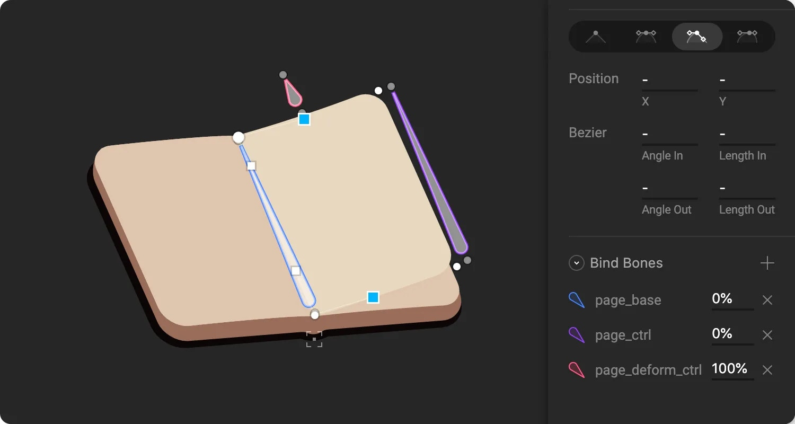

- [Case Studies](https://rive.app/blog/case-studies)
- [Community](https://community.rive.app)
- [Blog](https://rive.app/blog)
- [Early Access](https://rive.app/blog/early-access-to-unreleased-features)

##### Editor

- Interface Overview
- Fundamentals
- Manipulating Shapes

  - [Overview](/editor/manipulating-shapes/manipulating-shapes)
  - [Bones](/editor/manipulating-shapes/bones.md)
  - [Bone Tips](/editor/manipulating-shapes/bone-tips.md)
  - [Meshes](/editor/manipulating-shapes/meshes.md)
  - [Clipping](/editor/manipulating-shapes/clipping.md)
  - [Solos](/editor/manipulating-shapes/solos.md)
  - [Trim Path](/editor/manipulating-shapes/trim-path.md)
  - [Joysticks](/editor/manipulating-shapes/joysticks.md)
- Text
- Constraints
- Animate Mode
- State Machines
- Events
- Data Binding
- Layouts
- [Libraries](/editor/libraries.md)
- [Keyboard Shortcuts](/editor/keyboard-shortcuts.md)
- Exporting
- Share Links
- MCP
- [Tagging](/editor/tagging.md)

On this page

- [Use bones to animate multiple vertices together](#use-bones-to-animate-multiple-vertices-together)
- [The way you weight vertices or handles is important](#the-way-you-weight-vertices-or-handles-is-important)

Manipulating Shapes

# Bone Tips

How you rig your design is important. A smart rig allows you to create fewer keys, making your animation easy to work with and keeping your timeline tidy.

## [​](#use-bones-to-animate-multiple-vertices-together) Use bones to animate multiple vertices together

With Rive you can bind vertices and bezier handles to bones. You can connect different bones to different vertices to control parts of a shape.

In this page-turn example, we’ve connected the bezier handles at the top and bottom of the page to a single bone.

This allows you to easily deform the page with just a few bones acting as controls.

## [​](#the-way-you-weight-vertices-or-handles-is-important) The way you weight vertices or handles is important

Weighting a vertex and its handles differently allows you to create interesting deformations.

In this example, the top and bottom bezier handles (on the back shape of the orange) are weighted differently from their vertices. This causes the bezier handles to move at a different speed as the connected bone is scaled, creating a 3D effect.

Notice how the vertices and handles on the back shape of the orange move as the bone’s scale changes.

Was this page helpful?

YesNo

[Suggest edits](https://github.com/rive-app/rive-docs/edit/main/editor/manipulating-shapes/bone-tips.mdx)[Raise issue](https://github.com/rive-app/rive-docs/issues/new?title=Issue on docs&body=Path: /editor/manipulating-shapes/bone-tips)

[Bones](/editor/manipulating-shapes/bones.md)[Meshes](/editor/manipulating-shapes/meshes.md)

⌘I