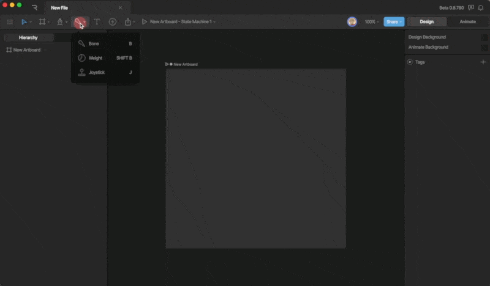
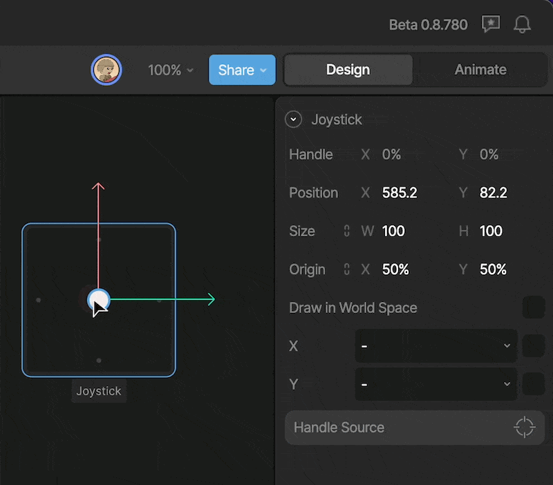
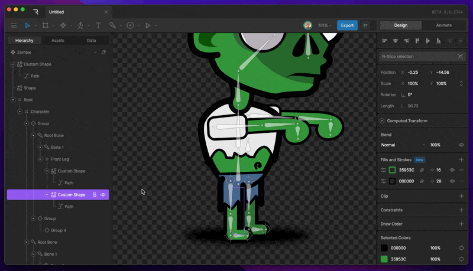
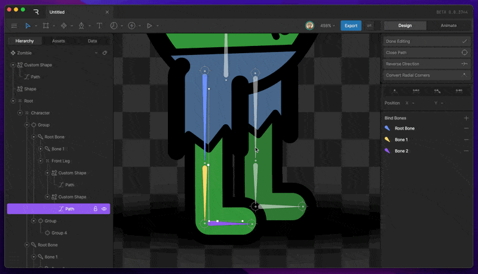
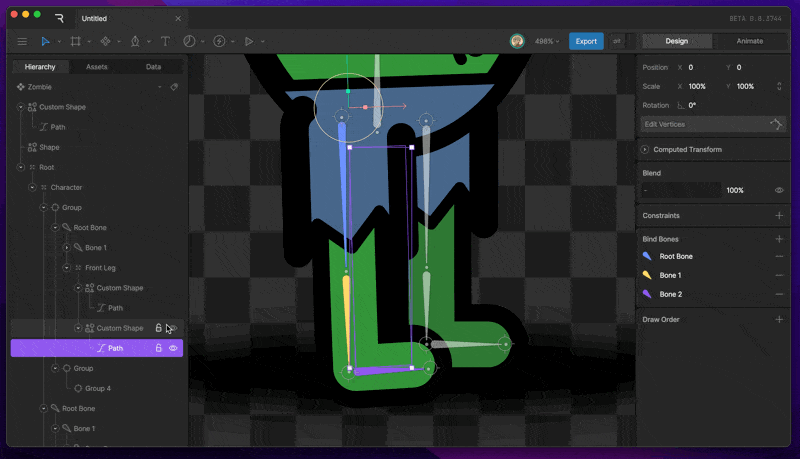

操纵形状

# 骨骼 (Bones)

骨骼允许你为图形创建骨架。这是一种直观且自然的方式，用于为多个连接部分（如手臂、旗帜或树枝）制作动画。通过观看视频或阅读下文来了解如何使用骨骼。

## [​](#how-to-create-bones) 如何创建骨骼

要创建骨骼链，请在 [变换工具菜单](/editor/interface-overview/toolbar.md) 中激活“骨骼工具”（或按 `B` 键），然后点击任何位置。
第一次点击是第一根骨骼的起点。在点击第二次之前，骨骼会显示为蓝色，因为它实际上还没有被创建。继续此过程来绘制后续骨骼。链中的每根新骨骼都是上一根骨骼的子级。完成后按 `Esc` 键或切换回选择工具 `V`。

要从另一根不同的骨骼继续创建链，请先选中该关节 (Joint)，然后继续使用骨骼工具。

## [​](#joints) 关节 (Joints)

关节在层级结构 (Hierarchy) 中并不存在。它们是用于在链中设置和定位骨骼的控制点。移动关节会更改附近骨骼的长度和旋转等属性。

## [​](#root-bones) 根骨骼 (Root bones)

链中的第一根骨骼称为根骨骼。它是链中唯一具有位置 X 和 Y 属性的骨骼。其他骨骼由其相对于父级的长度和旋转来定义。

## [​](#connecting-bones-to-artwork) 将骨骼连接到作品

### [​](#hierarchical-relationships) 层级关系 (Hierarchical relationships)

将形状和图像连接到骨骼最简单的方法是通过它们的层级关系。骨骼的任何子级都会随骨骼一起变换。你可以通过在层级面板中将形状图层拖放到目标骨骼上，使矢量形状成为骨骼的子级。

### [​](#binding) 绑定 (Binding)

绑定是一种将图形的特定部分连接到骨骼的方法。这允许你用一根骨骼操作形状的一部分，而用另一根骨骼操作同一形状的另一部分。要开始将形状绑定到骨骼，请选择一个路径图层 (Path Layer)。“绑定骨骼 (Bind Bones)”选项现在应该出现在检查器中。点击加号按钮，然后选择你想要绑定的骨骼。按住 Shift 键可以选择多根骨骼。
对于矩形和椭圆等参数化图形，需要先将其转换为自定义路径。方法是选中路径图层，然后按 Enter 键。

### [​](#weighting) 权重 (Weighting)

完成骨骼绑定后，你需要将骨骼的权重分配给路径的顶点或句柄。方法是选择一个顶点，然后更改百分比值，以反映你希望该骨骼对其产生的影响程度。
所有绑定骨骼的总权重始终等于 100%。

### [​](#weight-tool) 权重工具 (Weight Tool)

权重工具为你提供当前权重分布的视觉化表示。通过 Shift + B 激活此工具，或者进入骨骼工具菜单并选择“权重工具”。权重工具还允许你调整权重。要调整权重，请选择一根骨骼，然后在舞台上点击并拖动。
