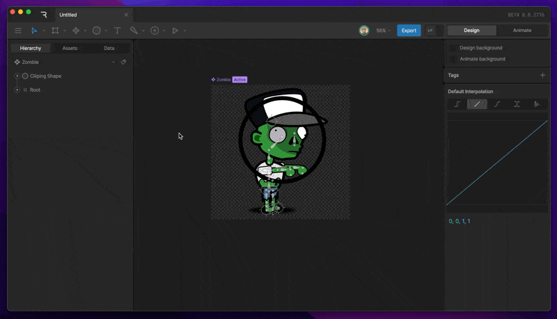
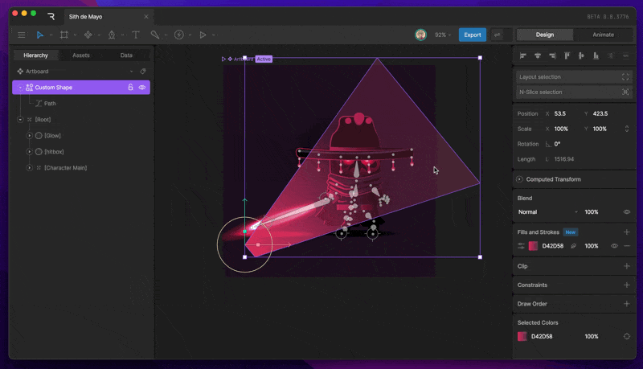
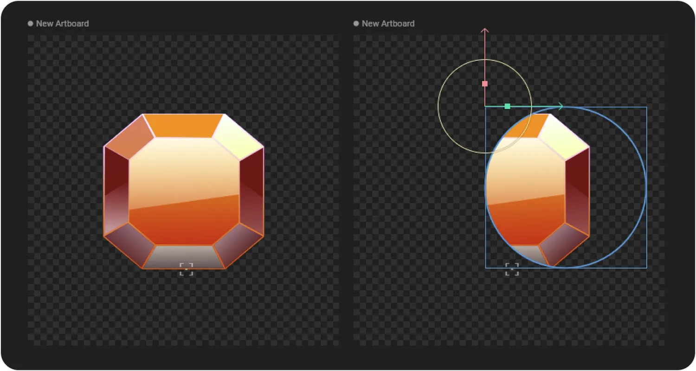
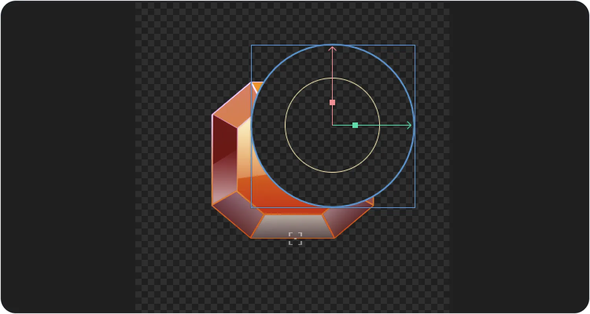
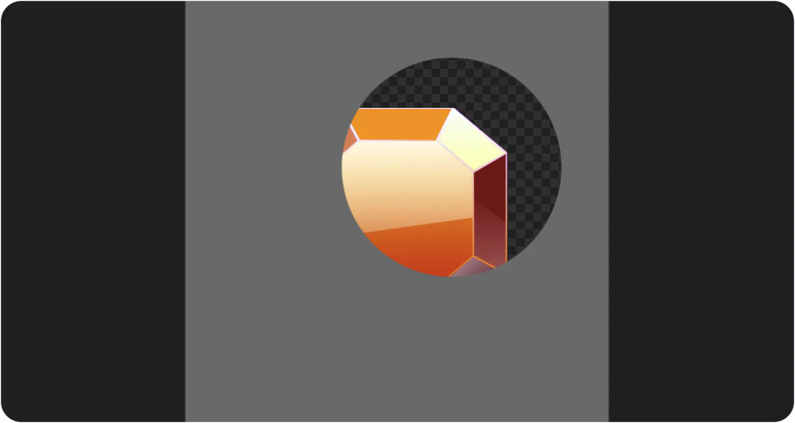
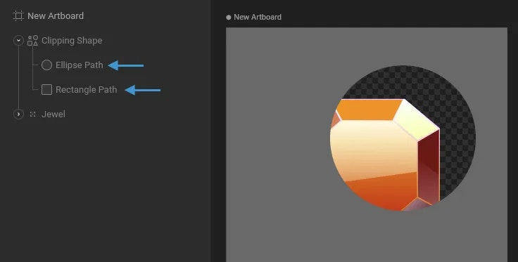
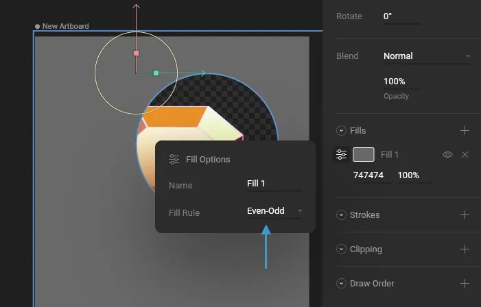
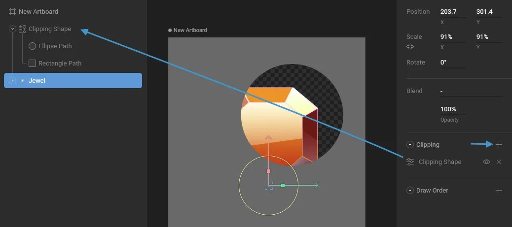
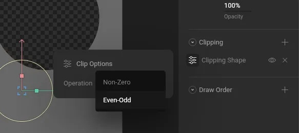

- [Case Studies](https://rive.app/blog/case-studies)
- [Community](https://community.rive.app)
- [Blog](https://rive.app/blog)
- [Early Access](https://rive.app/blog/early-access-to-unreleased-features)

##### Editor

- Interface Overview
- Fundamentals
- Manipulating Shapes

  - [Overview](/docs/editor/manipulating-shapes/manipulating-shapes)
  - [Bones](/docs/editor/manipulating-shapes/bones)
  - [Bone Tips](/docs/editor/manipulating-shapes/bone-tips)
  - [Meshes](/docs/editor/manipulating-shapes/meshes)
  - [Clipping](/docs/editor/manipulating-shapes/clipping)
  - [Solos](/docs/editor/manipulating-shapes/solos)
  - [Trim Path](/docs/editor/manipulating-shapes/trim-path)
  - [Joysticks](/docs/editor/manipulating-shapes/joysticks)
- Text
- Constraints
- Animate Mode
- State Machines
- Events
- Data Binding
- Layouts
- [Libraries](/docs/editor/libraries)
- [Keyboard Shortcuts](/docs/editor/keyboard-shortcuts)
- Exporting
- Share Links
- MCP
- [Tagging](/docs/editor/tagging)

On this page

- [How to use Clipping](#how-to-use-clipping)
- [Clipping and path direction](#clipping-and-path-direction)
- [Inverse Clipping](#inverse-clipping)

Manipulating Shapes

# Clipping

Clipping allows you to cut one shape out from another.

## [​](#how-to-use-clipping) How to use Clipping

Select the shape or group you want to clip and hit the plus button next to the Clipping options in the Inspector. After hitting the plus button, you’ll notice a blue border appear around the stage, indicating that you can pick a shape as the clipping source. Now, select the path you want to use as a clipping path. Remember, the clipping target must be a shape, not a group or any other object.

You can add as many clipping paths to a shape as you’d like.

## [​](#clipping-and-path-direction) Clipping and path direction

If you have shapes that aren’t clipping, or only partially clipping, be sure to check the winding of that shape. In most cases, reversing the direction of the path fixes this problem.

## [​](#inverse-clipping) Inverse Clipping

Clipping is typically used to hide a part of your graphics. In the example below, we’re using an ellipse to show only part of our jewel graphic.

You occasionally may want to invert the clipping, so that only the graphics outside of the clipping paths are drawn.

This is achieved using a clipping path that looks like the gray shape in the image below.

To create this shape, draw a rectangle the size of the artboard. Add both the rectangle path and ellipse path to the same shape layer in your Hierarchy.

Note that your shape might not show a hole as ours does. That’s because you need to set the Fill Rule of your shape to Even-Odd. This setting doesn’t affect your Clipping Path, but it helps explain how the Even-Odd operation works, which will be useful later!

Select the group containing the jewel and use the “plus” icon in the Clipping section of the Inspector. Next, select the Clipping Shape as the target.

Open the Clip Options and set the Operation to Even-Odd.

Be sure to hide the visibility of your clipping shape so it doesn’t cover your graphic.

Was this page helpful?

YesNo

[Suggest edits](https://github.com/rive-app/rive-docs/edit/main/editor/manipulating-shapes/clipping.mdx)[Raise issue](https://github.com/rive-app/rive-docs/issues/new?title=Issue on docs&body=Path: /editor/manipulating-shapes/clipping)

[Meshes](/docs/editor/manipulating-shapes/meshes)[Solos](/docs/editor/manipulating-shapes/solos)

⌘I