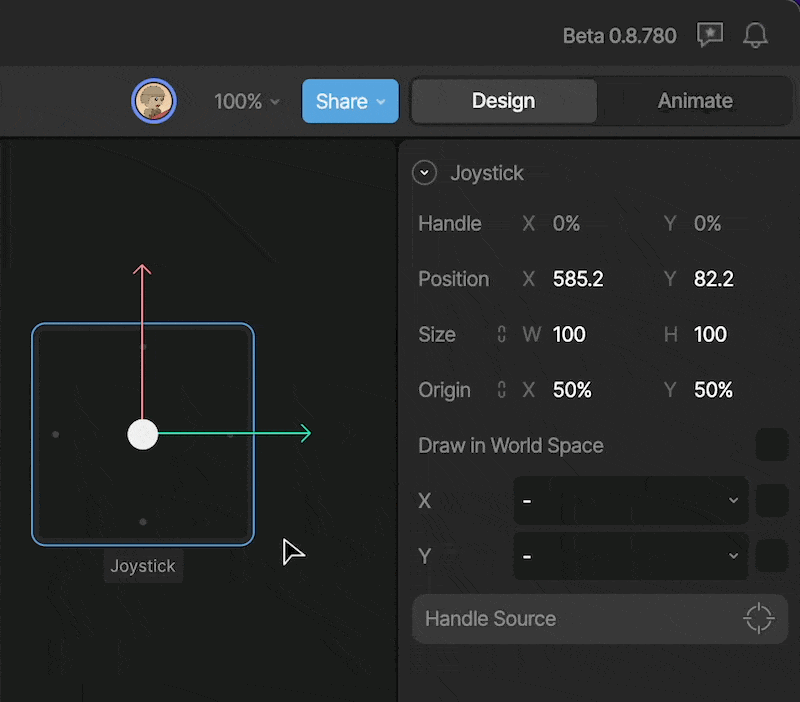
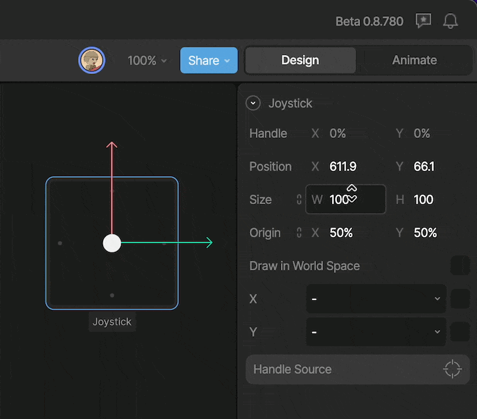
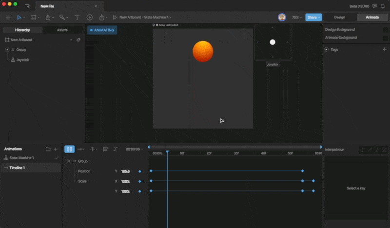
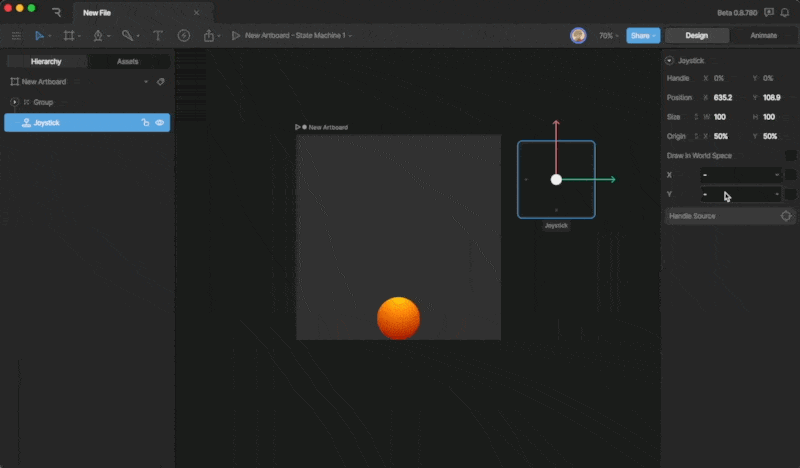
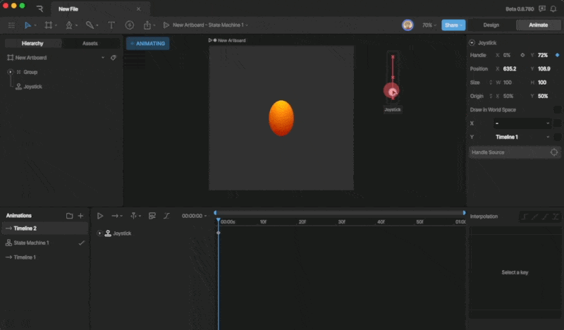

Manipulating Shapes

# Joysticks

Joysticks make it easy to set up sophisticated rigs with simple controls. You can quickly animate body poses, eyes, mouths, hands, and more. You can even control joysticks with other joysticks.

Joysticks work by allowing you to pan through different timelines that are assigned to either the X or Y axis of the joystick. Once you’ve assigned the timelines, you can use the joystick to set keys to create animations.
Either watch the video, or read more below.

## [​](#creating-a-new-joystick) Creating a new Joystick

To create a new joystick, either find the Joystick Tool in the Bones Menu, or by hitting the J key. Once the tool is activated, click anywhere on the stage to add a new Joystick.

## [​](#joystick-properties) Joystick Properties

With the Joystick selected, you’ll see a number of properties that you can use in the Inspector.

### [​](#handle) Handle

The Handle X and Y property describes the position that the handle is currently in. You’ll notice that these properties update as you move the handle around the Joystick.

### [​](#position) Position

The position property describes the position of the Joystick on the stage. For the most part, we won’t need to update this property at all while animating.

### [​](#size) Size

The size property describes the size of the joystick. We can modify this property to fit our needs by making the joystick longer/shorter or wider/skinnier.

### [​](#origin) Origin

The origin property exists because all objects in Rive that have a position must have an origin. You likely won’t ever change this property.

### [​](#draw-in-world-space) Draw in World Space

This toggle tells the joystick whether the joystick will scale with the zoom level or not. This can be a very helpful joystick when we use many different joysticks in a file attached to a character or object.

### [​](#x-&-y-dropdown) X & Y dropdown

The X & Y dropdowns allow us to assign timelines to the different axis of the Joystick.
For example, I’ve got a timeline that moves a ball on the Y axis. You can see that the timeline only has two keys which move the balls position and a few others that control the scale.

When the timeline is assigned to the Y axis of the Joystick, notice that the joystick becomes a slider that only allows you to move the handle in the Y direction.

As we move the joystick up and down, you’ll notice that the ball also moves up and down. Keep in mind that we are scrubbing through the assigned timeline. We can now use this joystick to set keys on a new timeline to create animations.
**Invert Toggle**
After you add a timeline to an axis, you’ll notice a toggle that appears next to it. This allows you to invert the direction that the joystick scrubs through the timeline.

Invert toggle

### [​](#handle-source) Handle Source

The handle source allows you to constrain the position of the handle to another objects position properties. This is useful when you want a control on the artboard to control the panning of a timeline.

## [​](#joystick-considerations) Joystick considerations

Joysticks are a powerful tool that allows you to create complex deformations, but like with many things in the Rive editor there are a few things to keep in mind as you set up these controls.

### [​](#conflicting-properties) Conflicting properties

The most important consideration is that when you have multiple animations assigned to the joystick, those timelines will blend together. If, for example, both timelines Y property of an object, these joysticks will conflict and prevent that object from moving in the Y direction.
Be sure to separate animated properties to prevent any conflicts.

### [​](#creating-complex-deformations) Creating Complex Deformations

You can add as many keys to a joystick timeline as you’d like. By doing this, we can create incredibly complex deformations, but remember, these deformations will often bloat the size of your file, so use them sparingly.

[Trim Path](/docs/editor/manipulating-shapes/trim-path)[Overview](/docs/editor/text/text-overview)