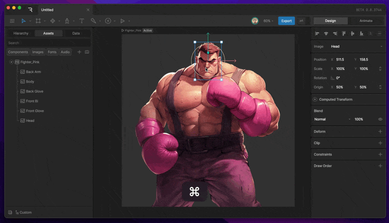
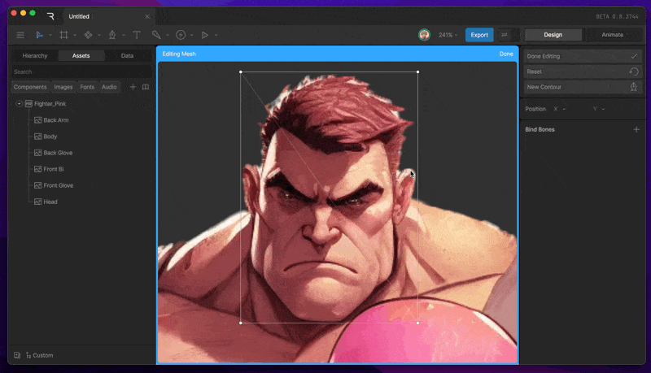
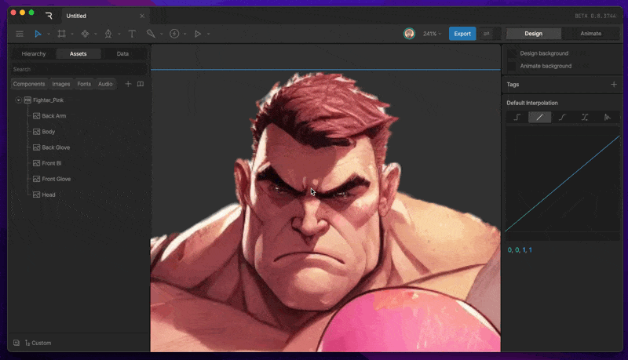
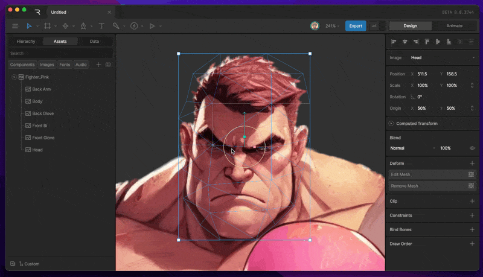

操纵形状

# 网格 (Meshes)

网格是为位图图形添加自然且有机变形的绝佳方式。让皮肤活动、织物起伏、头发飘动等等。

## [​](#add-mesh) 添加网格 (Add Mesh)

在创建任何变形之前，你需要先添加一个网格。
选中图像后，按 Enter 键或导航到检查器的“变形 (Deform)”部分，点击加号按钮，然后选择“网格 (Mesh)”。你会注意到系统会自动为你生成一个简单的网格。

使用检查器中的“新建轮廓 (New Contour)”按钮开始为对象创建自定义网格。使用钢笔工具放置网格的顶点。在钢笔工具激活的情况下持续点击以创建强制边（由连接两个顶点的蓝线表示），或者在点击之间按下 Esc 键以取消顶点之间的连接。

## [​](#edit-mesh) 编辑网格 (Edit Mesh)

你可以随时使用检查器中的“编辑网格 (Edit Mesh)”按钮，或在选中资产的情况下按 Enter 键来编辑网格。使用钢笔工具添加、删除或移动顶点。

## [​](#mesh-deform) 网格变形 (Mesh Deform)

在设计 (Design) 和编辑 (Edit) 模式下，你都可以通过进入编辑网格模式并使用选择工具移动顶点来让网格变形。为了获得更自然的体验，请考虑使用 [骨骼 (Bones)](https://rive.app/docs/editor/manipulating-shapes/bones)。
