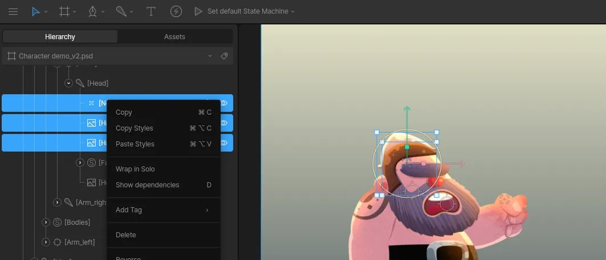
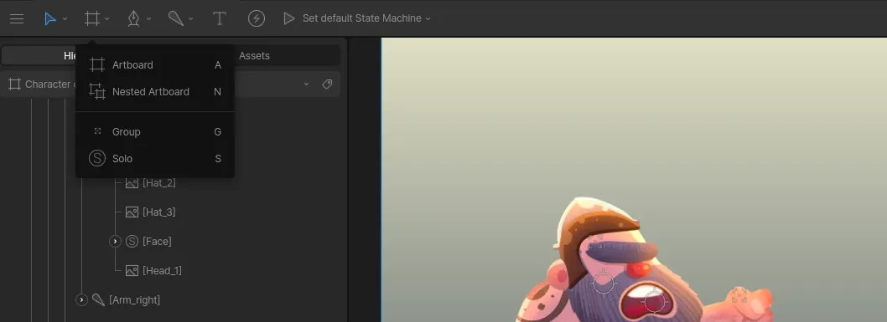
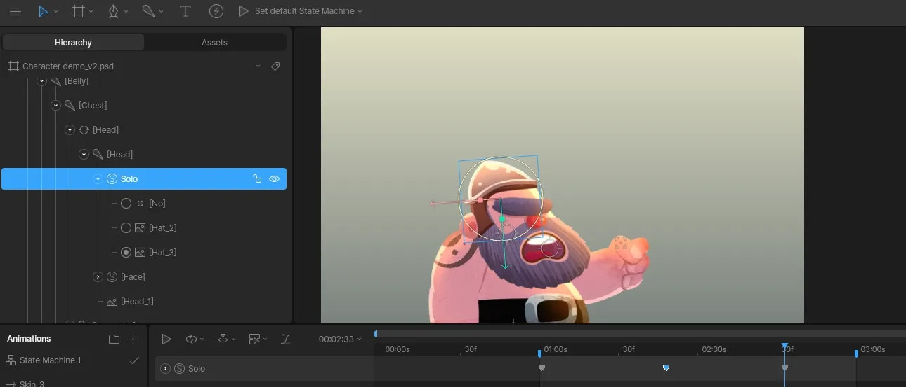

- [Case Studies](https://rive.app/blog/case-studies)
- [Community](https://community.rive.app)
- [Blog](https://rive.app/blog)
- [Early Access](https://rive.app/blog/early-access-to-unreleased-features)

##### Editor

- Interface Overview
- Fundamentals
- Manipulating Shapes

  - [Overview](/docs/editor/manipulating-shapes/manipulating-shapes)
  - [Bones](/docs/editor/manipulating-shapes/bones)
  - [Bone Tips](/docs/editor/manipulating-shapes/bone-tips)
  - [Meshes](/docs/editor/manipulating-shapes/meshes)
  - [Clipping](/docs/editor/manipulating-shapes/clipping)
  - [Solos](/docs/editor/manipulating-shapes/solos)
  - [Trim Path](/docs/editor/manipulating-shapes/trim-path)
  - [Joysticks](/docs/editor/manipulating-shapes/joysticks)
- Text
- Constraints
- Animate Mode
- State Machines
- Events
- Data Binding
- Layouts
- [Libraries](/docs/editor/libraries)
- [Keyboard Shortcuts](/docs/editor/keyboard-shortcuts)
- Exporting
- Share Links
- MCP
- [Tagging](/docs/editor/tagging)

On this page

- [Creating a Solo](#creating-a-solo)
- [Animating Solos](#animating-solos)
- [Creating New Skins](#creating-new-skins)
- [Change the underlying rig](#change-the-underlying-rig)
- [Frame-by-frame animation](#frame-by-frame-animation)

Manipulating Shapes

# Solos

A Solo is similar to a group, but only one of the elements inside the solo is rendered at a time. This is much faster than having to animate the opacity of each object individually.

## [​](#creating-a-solo) Creating a Solo

There are two ways to create a solo. The first is to select multiple items on your artboard, right click them in the Hierarchy, and click “Wrap in Solo”.

The second option is to select the **Solo** tool from the **Hierarchy Tools** dropdown (or click **S** on your keyboard) and click anywhere on your artboard. Now that you have a Solo in your Hierarchy, you can drag elements into it.

## [​](#animating-solos) Animating Solos

You can animate solos by opening a timeline and clicking the solo’s radio buttons in the Hierarchy.

## [​](#creating-new-skins) Creating New Skins

One of the most common use cases for Solos is creating new skins for a character.

## [​](#change-the-underlying-rig) Change the underlying rig

Sometimes when we animate an object or character, we need to create animations at different angles. Solos allow us to create multiple rigs and switch between them during our animation.

## [​](#frame-by-frame-animation) Frame-by-frame animation

The ability to toggle between many images gives you a quick way to create frame by frame effects.

Was this page helpful?

YesNo

[Suggest edits](https://github.com/rive-app/rive-docs/edit/main/editor/manipulating-shapes/solos.mdx)[Raise issue](https://github.com/rive-app/rive-docs/issues/new?title=Issue on docs&body=Path: /editor/manipulating-shapes/solos)

[Clipping](/docs/editor/manipulating-shapes/clipping)[Trim Path](/docs/editor/manipulating-shapes/trim-path)

⌘I