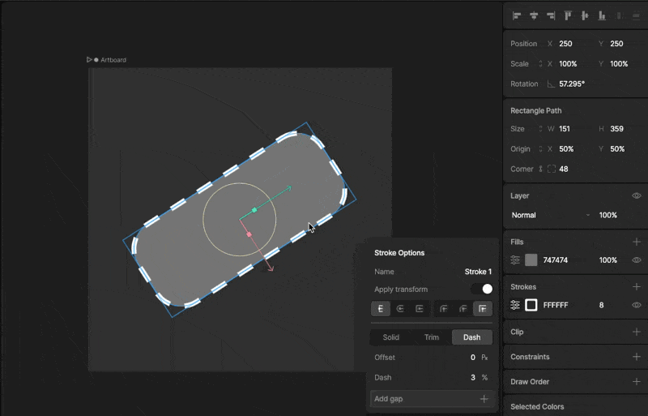

- [Case Studies](https://rive.app/blog/case-studies)
- [Community](https://community.rive.app)
- [Blog](https://rive.app/blog)
- [Early Access](https://rive.app/blog/early-access-to-unreleased-features)

##### Editor

- Interface Overview
- Fundamentals
- Manipulating Shapes

  - [Overview](/editor/manipulating-shapes/manipulating-shapes)
  - [Bones](/editor/manipulating-shapes/bones.md)
  - [Bone Tips](/editor/manipulating-shapes/bone-tips.md)
  - [Meshes](/editor/manipulating-shapes/meshes.md)
  - [Clipping](/editor/manipulating-shapes/clipping.md)
  - [Solos](/editor/manipulating-shapes/solos.md)
  - [Trim Path](/editor/manipulating-shapes/trim-path.md)
  - [Joysticks](/editor/manipulating-shapes/joysticks.md)
- Text
- Constraints
- Animate Mode
- State Machines
- Events
- Data Binding
- Layouts
- [Libraries](/editor/libraries.md)
- [Keyboard Shortcuts](/editor/keyboard-shortcuts.md)
- Exporting
- Share Links
- MCP
- [Tagging](/editor/tagging.md)

On this page

- [Enable trim path](#enable-trim-path)
- [Sequential](#sequential)
- [Synced](#synced)
- [Start and end](#start-and-end)
- [Offset](#offset)
- [Dashed Stroke](#dashed-stroke)
- [Dash](#dash)
- [Offset](#offset-2)

Manipulating Shapes

# Trim Path

The Trim Path feature allows you to draw only a portion of the stroke on a vector shape. This can be used to create a variety of animations where a line needs to follow a path. Every stroke you create for a shape can have its own independent Trim Path.

## [​](#enable-trim-path) Enable trim path

To activate Trim Path, select a shape that has a stroke and click the stroke options in the inspector. Now, use the Trim Path drop-down menu and select either Sequential or Synced mode. Both modes enable Trim Path, but behave differently when used on a shape with multiple paths.

### [​](#sequential) Sequential

When Trim Path is set to Sequential, paths are animated sequentially. The order in which they animate is dictated by their order under the shape.

### [​](#synced) Synced

Synced mode animates the trim path along all paths concurrently.

## [​](#start-and-end) Start and end

The trim of a stroke happens from a Start point to an End point. By default, all shapes have a Stroke that starts at 0% and ends at 100%. Change these values to modify the position of the Start and End points of the trim (which are represented by a percentage of the full length of the path).

## [​](#offset) Offset

Use Offset to easily move the trimmed portion of the path.

# [​](#dashed-stroke) Dashed Stroke

Much like Trim Path, the Dashed Stroke option allows you to dynamically change and animate parts of a path. Dash strokes allow you to customize the size of the dash and offset the dashes around the path. Note that you can add more than one dash size and gap to a path.

## [​](#dash) Dash

The dash property controls the size of the dashed segments. This option can be in pixels, or a percentage length of the path.

## [​](#offset-2) Offset

The offset property moves the dashes along the path. This option can be in pixels, or a percentage.

Was this page helpful?

YesNo

[Suggest edits](https://github.com/rive-app/rive-docs/edit/main/editor/manipulating-shapes/trim-path.mdx)[Raise issue](https://github.com/rive-app/rive-docs/issues/new?title=Issue on docs&body=Path: /editor/manipulating-shapes/trim-path)

[Solos](/editor/manipulating-shapes/solos.md)[Joysticks](/editor/manipulating-shapes/joysticks.md)

⌘I