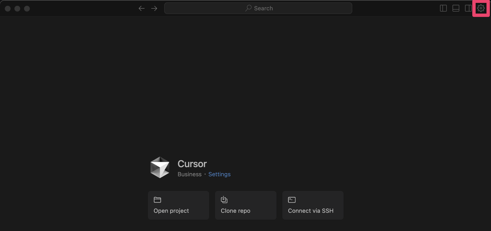
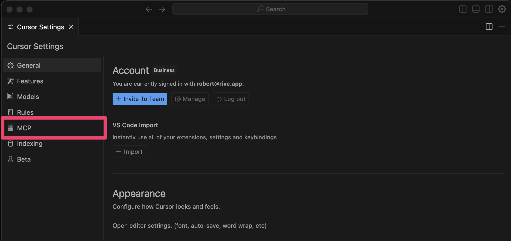
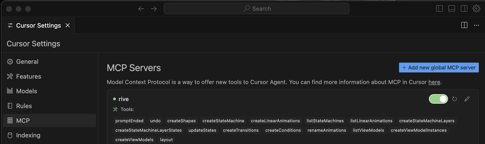

MCP

# Rive MCP Integration

MCP is in [Early Access](https://rive.app/blog/early-access-to-unreleased-features) and is not yet available for production.  
MCP Integration is initially available in the Early Access version of the Mac Desktop app. Windows support is coming.

## [​](#getting-started) Getting started

You can connect the Rive Editor to AI tools through MCP (Model Context Protocol). The first set of tools are designed to let AI handle repetitive tasks, like creating complex View Models, State Machines with hundreds of states/layers, Layouts, Shapes, and more.

This initial iteration works with a limited number of AI tools, specifically those supporting MCP. We recommend using Cursor for now, but the list will expand.

## [​](#installation) Installation

### [​](#mac) Mac

1

Install Rive Early Access

Install the latest version of the [Rive Early Access](https://rive.app/downloads) desktop app for Mac.

2

Set up Cursor

Create a [Cursor](https://www.cursor.com/) account and install the app.

3

Save the configuration

Save the following JSON snippet to your computer as `mcp.json`.

Copy

Ask AI

```
{
  "mcpServers": {
      "rive": {
          "url": "http://localhost:9791/sse"
      }
  }
}
```

4

Configure MCP

If you have hidden files and folders enabled in Finder, move `mcp.json` to the `.cursor` folder in your home directory.
Otherwise, you can use Terminal. Open Terminal.app and run the following command:

Copy

Ask AI

```
cp /path/to/mcp.json ~/.cursor
```

5

Enable in Cursor

1

Open settings

Open Cursor and navigate to the settings panel in the top right corner

2

Navigate to the MCP section



3

Verify connection

If everything was installed correctly, you should see Rive as an available MCP server

For the Rive server to be available, you must have the Rive Early Access app opened.

4

Enable connection

Turn the MCP connection `On`

Additional information on setting up MCP can be found [here](https://docs.cursor.com/context/model-context-protocol).

## [​](#what-can-it-do) What can it do?

Once Cursor is installed and everything is set up correctly, it’s time to start prompting the AI.

1

Open your Rive file

Have a Rive File open and an Artboard created.

2

Enter your prompt

Type your prompt into the chat UI and hit enter. The AI will take a moment to process the request.Example prompt:

Copy

Ask AI

```
Create a State Machine about birds with 20 states and 2 layers
```

3

Complete the interaction

Once the request has been processed, type **End Prompt** to allow the AI to make changes to the Rive file.

### [​](#supported-features) Supported Features

- Create State Machines, Layers, States, Transitions, and Conditions
- Create View Models, Properties, and Instances
- Create Layouts
- List View Models
- Create Shapes

This list of features will evolve over time as more tools are added.

[Framer And Rive](/docs/editor/share-links/framer-and-rive)[Tagging](/docs/editor/tagging)