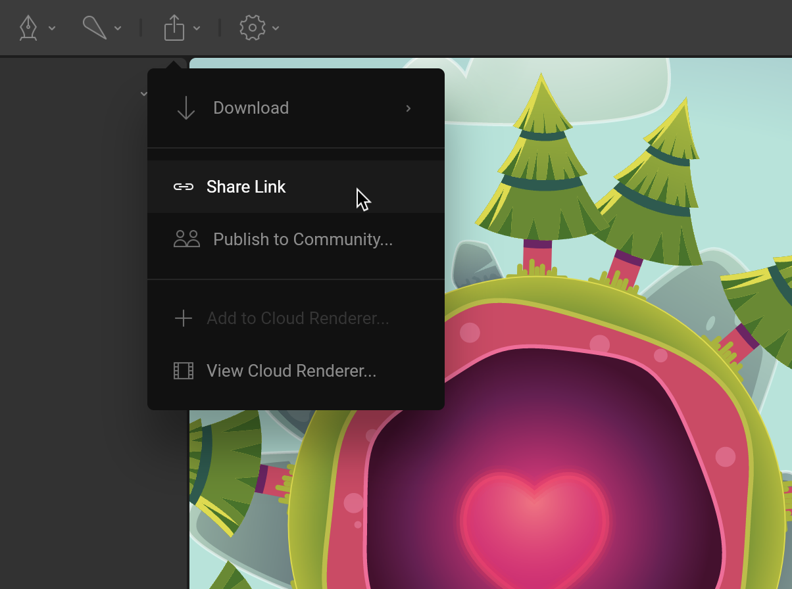
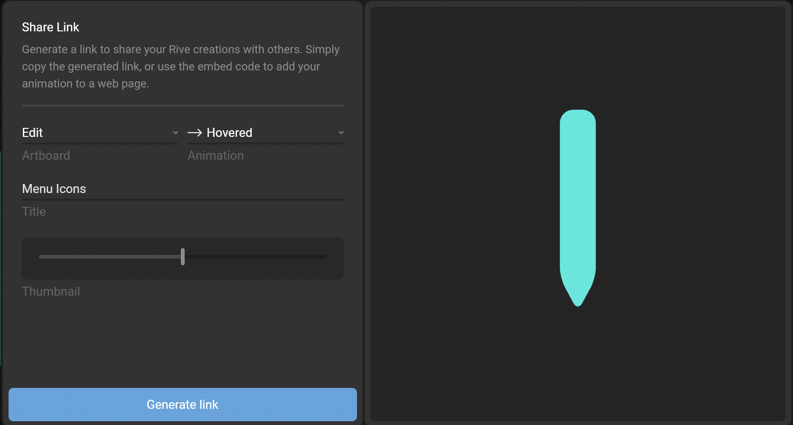
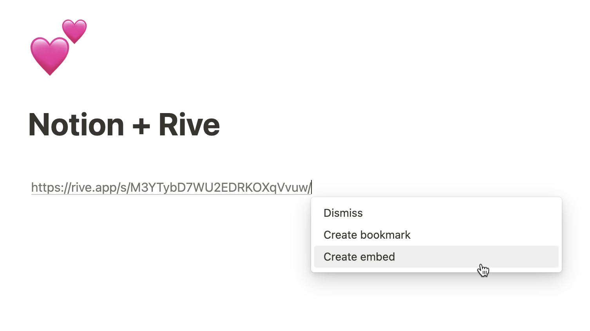
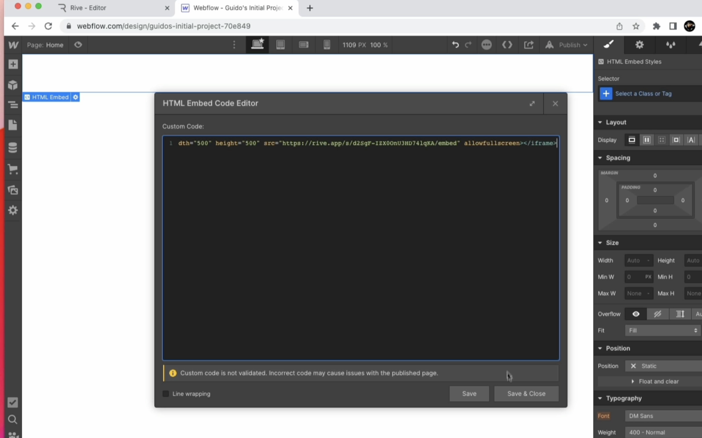
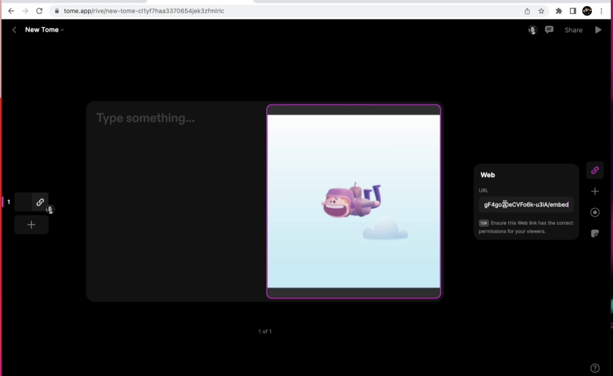

Share Links

# Share Links Overview

Share Links are a fast no-code way to get your Rive files running on a website or to present your graphics to a client.

Generating share links is available on Voyager and Enterprise plans. [Learn more about our plans and pricing](https://rive.app/pricing).

Share the current version of the file you’re working with share links. Note that this is not the same as giving someone access to the live file with all its revision history. This link will be a frozen version of the file in its current state. If you make changes to the file, you’ll need to generate a new share link.

Certain features, such as [Vector Feathering](https://rive.app/blog/introducing-vector-feathering), are only supported through the Rive Renderer. See our [Feature Support](/docs/feature-support) page for more information.

## [​](#creating-a-share-link) Creating a share link

Generate a share link from the Export menu. This link can be shared with anyone, not just your team members.

Choose which artboard, animation, or state machine you want to share in the Share Link modal.

### [​](#share-link-options) Share link options

Once you click on the “Generate link” button, several share link types appear:

- **Share link** - Displayed within a border frame on the Rive site at a unique URL. Use this for quickly showing off your Rive creation to clients without having to stage it within the context of a web application yourself
- **Embed link** - Standalone display of your Rive creation without the context of the border frame. Use this link when you want to embed your Rive creation into other 3rd party platforms that support unfurling and displaying your Rive creation still as a preview (i.e Notion, Tome, Telegram)
- **Embed code** - A code snippet that allows you to embed your Rive creation’s embed link in an iframe. This is useful for where you need to drop Rive into a platform where you can edit HTML (i.e Webflow, WordPress, etc.) and you don’t want to deal with setting up the creation with a web runtime
- **Framer code (Deprecated)** - See the new official [Rive Framer Plugin](https://www.framer.com/marketplace/plugins/rive/).

Other options include:

- **Enable**: Disable the link to prevent others from viewing it.
- **Rive Renderer**: Toggle between using the Rive Renderer (recommended) and the Canvas renderer.

Certain features, such as [Vector Feathering](https://rive.app/blog/introducing-vector-feathering), are only available using the Rive Renderer. See our [Feature Support](/docs/feature-support) page for more information.

## [​](#integrations) Integrations

Use share links to embed your Rive files with other well-known tools and platforms! This is not a full list. Most tools will support Rive share links using the methods described here.

### [​](#notion) Notion

1. Copy the *share* or *embed link*
2. Paste the link in Notion.
3. Select the Embed option that appears in the context menu.

Embed share link in Notion

### [​](#webflow) Webflow

1. Copy the *embed code* with the iframe HTML block
2. In Webflow, click the + sign to add a component and add an Embed to access the HTML Embed Code Editor
3. Paste the embed code you copied from the Rive editor

### [​](#tome) Tome

1. Copy the *embed link*
2. In Tome on a slide of your choosing, add a weblink
3. Paste the embed link you copied from the Rive editor

### [​](#social-media) Social Media

1. Copy the *share link*
2. Paste it into your favorite platform
3. See your Rive creation unfurl when you post

## [​](#managing-share-links) Managing share links

Visit the [Share Links](https://rive.app/profile/?section=share%20links) section of your settings to manage the links you’ve generated. You can disable a share link by setting its Active toggle to off.

[Exporting for Backup](/docs/editor/exporting/exporting-for-backup)[Framer And Rive](/docs/editor/share-links/framer-and-rive)