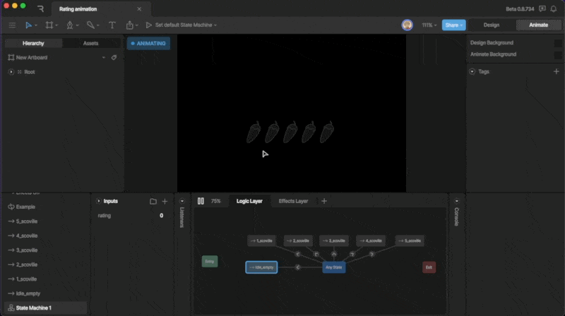

- [Case Studies](https://rive.app/blog/case-studies)
- [Community](https://community.rive.app)
- [Blog](https://rive.app/blog)
- [Early Access](https://rive.app/blog/early-access-to-unreleased-features)

##### Editor

- Interface Overview
- Fundamentals
- Manipulating Shapes
- Text
- Constraints
- Animate Mode
- State Machines

  - [Overview](/editor/state-machine/overview.md)
  - [States](/editor/state-machine/states.md)
  - [Inputs](/editor/state-machine/inputs.md)
  - [Transitions](/editor/state-machine/transitions.md)
  - [Listeners](/editor/state-machine/listeners.md)
  - [Layers](/editor/state-machine/layers)
- Events
- Data Binding
- Layouts
- [Libraries](/editor/libraries)
- [Keyboard Shortcuts](/editor/keyboard-shortcuts)
- Exporting
- Share Links
- MCP
- [Tagging](/editor/tagging)

On this page

- [Creating a new Input](#creating-a-new-input)
- [Input Types](#input-types)
- [Boolean](#boolean)
- [Trigger](#trigger)
- [Number](#number)

State Machines

# Inputs

⚠️ DEPRECATED: Use Data Binding instead of Inputs for controlling Rive graphics

**DEPRECATION NOTICE:** This entire page documents the legacy Inputs system.
**For new projects:** Use [Data Binding](/editor/data-binding) instead. **For
existing projects:** Plan to migrate from Inputs to Data Binding as soon as
possible. **This content is provided for legacy support only.**

Inputs are a legacy tool to control transitions in our state machine. While Inputs can still be used to control transitions, Data Binding is considered best practice since View Models are both more powerful and easier to control at runtime.
The best use for Inputs is quick, prototype interactions that you don’t plan to migrate to runtime.

### [​](#creating-a-new-input) Creating a new Input

To create a new Input, use the plus button in the input panel. After hitting the plus button, you’ll be prompted to select the type of input you want to create. There are three types of inputs; booleans, triggers, and numbers.

## [​](#input-types) Input Types

We can use three types of inputs depending on the situation and type of interactive content: booleans, triggers, and numbers. We’ll discuss each of these inputs below.

### [​](#boolean) Boolean

A boolean can hold either a true or false value.

### [​](#trigger) Trigger

Triggers are similar to booleans, but can only become true for a short time.

### [​](#number) Number

A number input give you a number box that can be any integer.

Was this page helpful?

YesNo

[Suggest edits](https://github.com/rive-app/rive-docs/edit/main/editor/state-machine/inputs.mdx)[Raise issue](https://github.com/rive-app/rive-docs/issues/new?title=Issue on docs&body=Path: /editor/state-machine/inputs)

[States](/editor/state-machine/states.md)[Transitions](/editor/state-machine/transitions.md)

⌘I