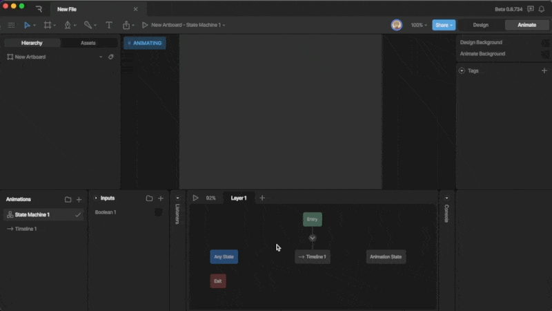

状态机

# 图层 (Layers)

图层 (Layers) 允许你在状态机中构建更复杂的逻辑和动画。

状态机上的一个图层一次只能播放一个动画。因此，如果你希望混合多个动画或向状态机添加额外的交互，可以创建多个图层。

例如，你可以使用图层来混合不同的背景动画，或者在单个画板上添加多个独立的交互逻辑。

### [​](#creating-a-new-layer) 创建新图层

要创建新图层，请使用“图层 (Layers)”选项卡上的加号按钮。
每个新创建的图层都会自带一组默认状态（Entry, Any, Exit）。

### [​](#layer-order) 图层顺序

图层的顺序非常重要：**右侧的图层优先级高于左侧的图层**。在大多数情况下这不影响使用，但如果你的多个图层中的状态控制了同一个对象的属性，那么最右侧图层中的动画将覆盖左侧图层的效果。

**更改图层顺序**
你可以通过在“图层”选项卡上拖放图层来更改它们的顺序。

**删除图层**
在图层名称上右键点击并选择“删除图层 (Delete Layer)”。

**重复图层**
在图层名称上右键点击并选择“重复图层 (Duplicate Layer)”。

**禁用与启用图层**
你可以通过右键菜单或点击图层旁的图标来禁用/启用特定图层，方便调试。

[监听器 (Listeners)](/editor/state-machine/listeners.md)[事件概览 (Events Overview)](/editor/events/overview.md)