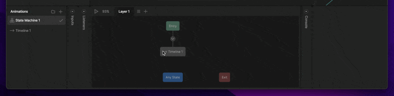
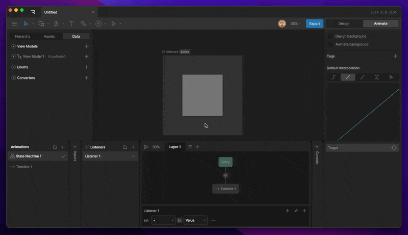
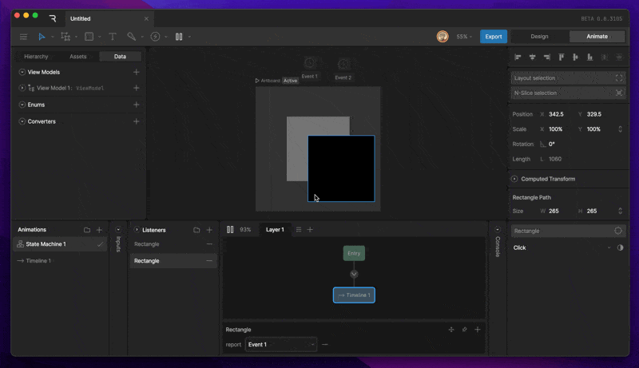
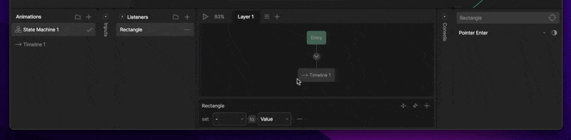
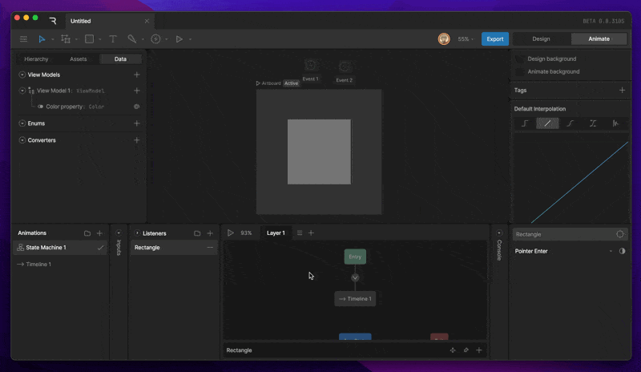
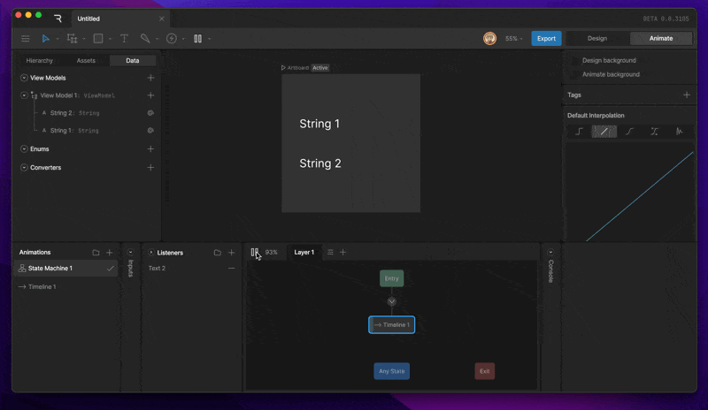
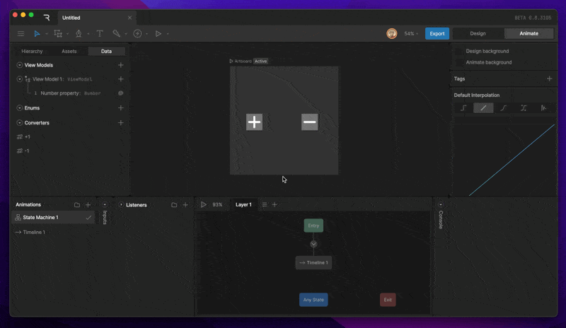

状态机 (State Machines)

# 监听器 (Listeners)

监听器让设计师无需编写代码即可创建交互行为。

监听器允许设计师直接在 Rive 内部创建交互行为——如点击、悬停和拖动——无需代码。例如，你可以为一个按钮添加 Pointer Enter、Pointer Exit 和 Click 监听器。当触发时，这些监听器可以更新数据绑定、设置输入、触发事件等，从而在运行时实现动态交互体验。

#### [​](#creating-a-new-listener) 创建新监听器

1. 在动画选项卡中，选择你的状态机。
2. 在监听器选项卡中，点击加号图标。

如果创建时已选中某个对象，它会自动被指定为目标。

# [​](#elements-of-a-listener) 监听器的组成

监听器由三部分组成：目标 (Target)、用户动作 (User Action) 和监听器动作 (Listener Action)。

### [​](#target) 目标 (Target)

目标决定在哪里监听用户动作。

**碰撞区域 (Hit Areas)**
目标通常定义响应用户动作的交互区域——类似于游戏开发中的"碰撞盒"。
最佳做法是使用形状作为目标（如透明度为 0 的椭圆或矩形）。如果使用分组，分组内的形状将作为交互区域。

**监听组件上的事件**
将画板或组件设为目标，可以监听从该画板触发的事件。

**不透明目标 (Opaque Target)**
决定指针事件是否会穿透碰撞区域，可能同时触发多个监听器。

# [​](#user-action) 用户动作 (User Action)

用户动作是监听器等待的交互类型。可用动作包括：
- **Pointer Down**：鼠标按下或手指按压。
- **Pointer Up**：释放鼠标或手指。
- **Pointer Enter**：鼠标/手指进入目标区域。
- **Pointer Exit**：鼠标/手指离开目标区域。
- **Pointer Move**：在目标区域内的任何移动。
- **Click**：在同一目标区域内的按下+抬起组合。
- **Listen for Event**：仅当目标是画板或组件时可用。

# [​](#listener-action) 监听器动作 (Listener Action)

监听器动作定义用户交互发生时要执行的操作。

## [​](#view-model-change) **视图模型更改**

更新视图模型实例中的值。这是从 Rive 文件向运行时代码通信的首选方式。

### 值 vs 属性
- **Value (值)**：设置为特定值。

- **Property (属性)**：设置为另一个视图模型属性的值。

**添加转换器**：可以在属性之间添加转换器（如"加一"转换器）。

### [​](#report-event) **报告事件 (Report Event)**
每次用户动作触发时发出一个事件。

### [​](#align-target) **对齐目标 (Align Target)**
让目标对象跟随指针位置。可启用"保持偏移"以维持原始距离。

### [​](#input-change) **输入更改 (Input Change)**
允许监听器更改定义的输入——如切换布尔值、触发触发器或设置数字值。

[过渡 (Transitions)](/editor/state-machine/transitions.md)[图层 (Layers)](/editor/state-machine/layers.md)