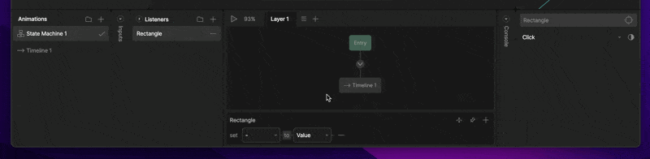

状态机 (State Machines)

# 监听器 (Listeners)

监听器让设计师无需编写代码即可创建交互行为。

监听器让设计师可以直接在 Rive 中创建交互行为——如点击、悬停和拖动——而无需代码。例如，你可以为按钮附加指针进入 (Pointer Enter)、指针移出 (Pointer Exit) 和点击 (Click) 监听器。触发时，这些监听器可以更新数据绑定、设置输入、触发事件等，从而在运行时实现动态的交互体验。

#### [​](#creating-a-new-listener) 创建新监听器

1. 在动画 (Animations) 选项卡中，选择你的状态机。
2. 在监听器 (Listeners) 选项卡中，点击加号图标。

如果在创建监听器时选择了一个对象，它将自动被指定为目标。

选中新监听器后，你会在状态机图表底部和图表右侧的新面板中看到显示的选项。

# [​](#elements-of-a-listener) 监听器的要素 (Elements of a Listener)

监听器由三部分组成：目标 (Target)、用户动作 (User Action) 和监听器动作 (Listener Action)。

### [​](#target) 目标 (Target)

目标决定了在哪里监听用户动作。

**点击区域 (Hit Areas)**
在大多数情况下，目标定义了响应用户动作的交互区域——类似于游戏开发中的碰撞箱 (hitbox)。当用户与此区域交互（例如点击或悬停）时，关联的监听器就会被触发。
通常最好使用形状作为目标——例如，不透明度为 0% 的椭圆或矩形。如果你使用分组 (Group) 作为目标，分组内的形状将充当交互区域。
要选择目标，请点击目标图标，然后从画板或层级面板中选择一个对象。

请注意，在创建监听器时选中对象会自动将选中的对象分配为监听器的目标。

**监听组件上的事件**
我们强烈建议使用数据绑定在画板之间进行通信，而不是依赖嵌套事件。

将画板或组件设置为目标允许你监听从该画板触发的事件。

**不透明目标 (Opaque Target)**
不透明目标选项决定了指针事件是否会穿过点击区域，从而可能一次触发多个监听器。

# [​](#user-action) 用户动作 (User Action)

用户动作是监听器正在监听的交互。目标按钮下方的下拉菜单允许你更改监听器检查的用户动作。

可用的动作包括：
**指针按下 (Pointer Down)** – 鼠标按下或手指按下。
**指针抬起 (Pointer Up)** – 释放鼠标点击或手指按下。
**指针进入 (Pointer Enter)** – 鼠标或手指进入目标区域。
**指针移出 (Pointer Exit)** – 鼠标或手指离开目标区域。
**指针移动 (Pointer Move)** – 鼠标或手指在目标区域内的任何移动。
**点击 (Click)** – 在同一目标区域内结合了指针按下和指针抬起。
**监听事件 (Listen for Event)** – 仅当目标是画板或组件时可见。如果存在多个事件，请使用下拉菜单选择特定事件。

# [​](#listener-action) 监听器动作 (Listener Action)

监听器动作定义了发生用户交互时会发生什么。
要添加监听器动作，请点击状态机图表下方控制面板中的加号图标。你可以向单个监听器添加多个动作。

## [​](#view-model-change) **视图模型更改 (View Model Change)**

更新视图模型实例中的值。这是从 Rive 文件与运行时代码通信的首选方式。默认情况下，监听器设置为“视图模型更改”，除非监听器的目标是画板或组件实例。

### [​](#view-model-drop-down) **视图模型下拉菜单**

视图模型下拉菜单允许你选择希望监听器更改哪个视图模型属性。

请注意，监听器可以更改文件中任何视图模型的属性，即使该模型未分配给画板。

### [​](#value-vs-property) **值 vs 属性 (Value vs Property)**

选择要让监听器修改的属性后，你可以将其设置为特定值 (Value) 或使其等于另一个视图模型属性 (View Model Property)。

**值 (Value)**
如果选择“值”，你可以使用输入字段更改你希望属性设置的具体值。值的类型根据属性而变化。

**视图模型属性 (View Model Property)**
选择属性会将监听器中的视图模型属性设置为等于另一个属性。

请注意，我们可以设置视图模型属性等于其自身。

**添加转换器 (Adding a Converter)**
如果我们选择将一个视图模型属性设置为等于另一个视图模型属性，视图模型属性右侧会出现转换器图标。这允许我们对属性应用转换器。

例如，我们可以将 Number 设置为 Number，但附加一个“加一”转换器。每当此监听器触发时，我们可以将 Number 属性增加 1。

### [​](#report-event) **报告事件 (Report Event)**

每次触发用户动作时触发一个事件。当画板或组件实例是监听器的目标时，这是默认选项。

### [​](#align-target) **对齐目标 (Align Target)**

对齐目标动作在监听器区域内发生指定的用户动作时，将目标对象定位为跟随指针。
使用目标拾取器选择要对齐的对象。
启用“保持偏移 (Preserve Offset)”以维持触发动作时对象与指针之间的原始距离。如果取消选中，对象将直接对齐到指针中心。

### [​](#input-change) **输入更改 (Input Change)**

允许监听器更改已定义的输入——例如切换布尔值、触发触发器 (trigger) 或将数字输入设置为特定值。
这对于直接在画板上创建交互行为（如悬停状态或点击效果）非常有用。