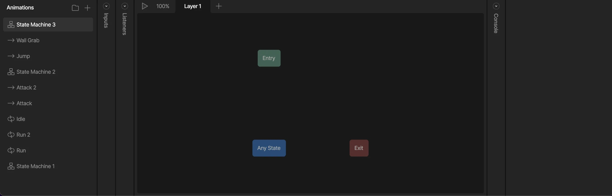
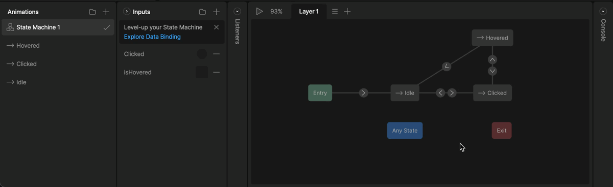

状态机 (State Machines)

# 状态机概览 (State Machine Overview)

为你的动画添加智能。

## [​](#overview) 概览

状态机是一种视觉化方式，用于连接动画并定义驱动过渡 (Transitions) 的逻辑。它们允许你构建可直接在产品、应用、游戏或网站中实施的交互式动态图形。

状态机开创了设计师与开发者之间的新协作层面，允许双方团队在开发过程中深入迭代，而无需复杂的交接。使用状态机要求设计师和动画师像开发者一样思考，但通过直观、视觉化的方式进行。

默认情况下，每个画板至少有一个状态机，但你可以根据需要创建任意数量的状态机。要创建新状态机，请点击动画列表中的加号按钮，并选择“状态机”选项。

### [​](#anatomy-of-a-state-machine) 状态机剖析

一个基本的状态机由图表 (Graph)、[状态 (States)](/editor/state-machine/states.md)、[过渡 (Transitions)](/editor/state-machine/transitions.md)、[输入 (Inputs)](/editor/state-machine/inputs.md) 和 [图层 (Layers)](/editor/state-machine/layers) 组成。我们将在本节中探索每一部分以及更多内容。

**图表** 是你添加状态和连接过渡的空间。当在动画列表中选中状态机时，它会代替时间轴显示。

**状态** 实际上就是可以在状态机中播放的时间轴动画。通常，它们代表你的动画内容所处某种状态。例如，一个按钮通常会有一个从初始状态 (Idle)（按钮静止），一个悬停状态 (Hovered)（当按钮被悬停时的样子），以及一个点击状态 (Clicked)（按钮被点击时的样子）。

定义好内容的“状态”后，我们可以通过“过渡”将它们连接起来，创建状态机在这些不同时间轴之间行进的逻辑路径。我们正在创建一张地图，状态机可以使用它从一个动画跳转到下一个动画。

**弃用通知：** 本节关于旧版输入系统。
**对于新项目：** 请改用 [数据绑定 (Data Binding)](/editor/data-binding/overview.md)。
**对于现有项目：** 计划尽快从 Inputs 迁移到 Data Binding。
**此内容仅用于支持遗留项目。**

**输入** 是控制状态机过渡的旧版工具。虽然仍可使用输入来控制过渡，但数据绑定被认为是最佳实践，因为视图模型 (View Models) 在运行时更强大且更易于控制。
输入的最佳用途是你并未计划迁移到运行时的快速原型交互。
输入是设计师与开发者之间的契约。作为设计师，我们将其用作过渡发生的规则。例如，我们可以有一个名为 `isHovered` 的布尔值。该布尔值控制初始状态和悬停状态之间的过渡。当布尔值为 true 时，状态机处于悬停状态；当它为 false 时，状态机处于初始状态。开发者在运行时接入这些输入，并定义控制状态机输入的动作，例如定义可以改变 `isHovered` 布尔值的点击区域。

最后，所有状态机都将至少拥有一个 **图层**。因为在给定图层上只能播放一个动画，如果我们想要混合不同的动画或添加额外的交互，我们可以添加多个图层。例如，这个状态机有多个图层，每一层都有控制此菜单中其中一个按钮的逻辑。
