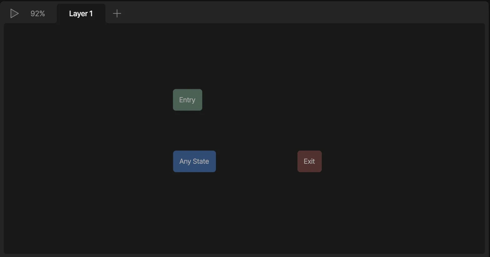
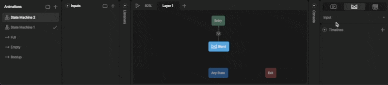
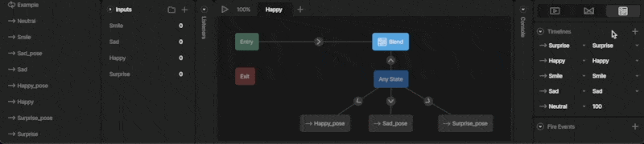
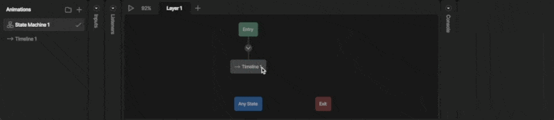
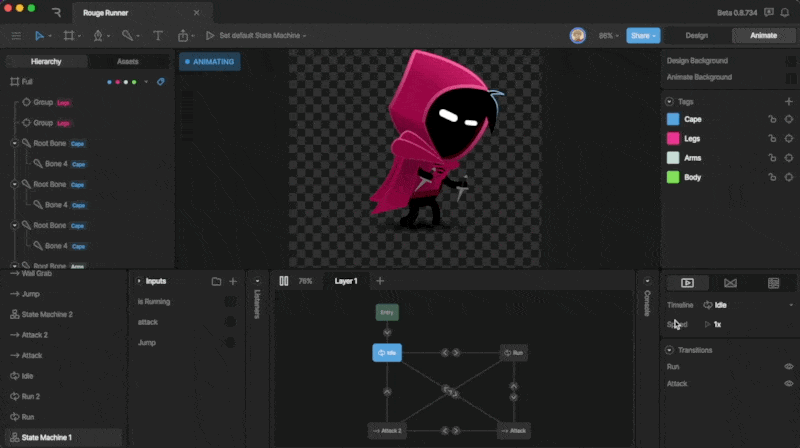
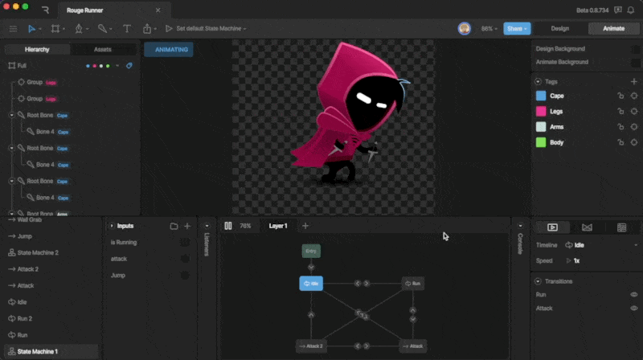

状态机 (State Machines)

# 状态 (States)

状态实际上就是可以在状态机中任意时刻播放的时间轴动画。一个状态可以简单到仅仅改变对象的颜色和位置，也可以复杂到混合多个时间轴。
在使用状态机时，你最终会用到几种类型的状态，包括默认状态 (Default States)、单一动画状态 (Single animations) 和混合状态 (Blend States)。我们在下面逐一探讨。

## [​](#default-states) 默认状态 (Default States)

默认状态是默认添加到每个状态机的状态。

### [​](#entry-state) 入口状态 (Entry State)

入口状态是状态机启动时的起始状态。你会注意到，默认情况下，你的状态机已经在入口状态上连接了一个动画，但你可以随时更改此动画。请注意，如果需要，你可以将多个动画连接到入口状态，例如你想构建一个既可以在“开”也可以在“关”状态下启动的开关。

### [​](#exit-state) 出口状态 (Exit State)

出口状态告诉状态机图层停止播放。这种特殊状态在使用多图层时会有用武之地。

### [​](#any-state) 任意状态 (Any State)

与普通状态不同，连接到任意状态的状态可以随时播放，无论你的状态机当前处于哪个状态。当你想要创建一组可以随时激活的状态（例如更改角色的皮肤）时，任意状态非常有用。

## [​](#animation-states) 动画状态 (Animation States)

动画状态包括添加到状态机的所有非默认状态。这些状态将控制你交互式内容的外观和动作。动画状态有三种类型：单一动画、1D 混合和直接混合状态。
要向图表添加状态，你可以将动画列表中的动画直接拖放到图表上。注意这将创建一个单一动画状态。你可以使用检查器更改状态类型。

此外，你可以在图表上右键单击并创建任何类型的空白状态，不关联任何时间轴。

要将时间轴分配给状态，请使用检查器中的时间轴下拉菜单。

### [​](#single-animation-state) 单一动画状态 (Single animation state)

我们创建的任何时间轴都可以用作单一动画状态。根据我们使用的动画类型，单一动画状态可以是一次性播放、循环播放或往复播放 (ping-pong) 状态。在大多数情况下，你将使用单一动画状态来创建大部分状态机。

### [​](#blend-states) 混合状态 (Blend states)

混合状态是将两个或更多时间轴动画混合在一起的任何状态。我们将这些状态用于加载条、生命值系统、滚动交互和动态面部绑定等内容。
混合状态有两种类型：1D 混合和直接混合状态。

#### [​](#1d-blend-state:) 1D 混合状态 (1D Blend state):

1D 混合状态允许我们通过单个数值输入将多个时间轴混合在一起。这种状态的工作原理是在你增加或减少数字输入时，增强一个动画并减弱另一个动画。请注意，这种混合不是线性的，而是叠加的，可能会产生意想不到的结果。

**配置 1D 混合状态：**
首先为你的混合状态创建几个时间轴。请记住，最好使用仅对几个属性设置关键帧的时间轴。在这个生命值条示例中，只有 X 轴缩放设置了关键帧。

将 1D 混合状态添加到图表后，使用检查器配置该状态。

首先，使用下拉菜单添加你想要用来驱动混合的数字输入。如果你还没有创建，你会注意到这里什么也显示不出来。

数字输入下方出现的加号按钮允许你向混合状态添加时间轴。使用下拉菜单分配特定时间轴。请注意，你可以添加任意数量的时间轴。

接下来，你需要定义混合状态工作的数值范围。此特定混合在 0 到 100 之间工作。

注意，一旦定义了范围，输入下拉菜单上方会出现一个图表，直观地表示你的动画将如何混合。当状态机处于活动状态时，随着你在定义范围内增加或减少输入，你会看到一个视觉指示器在图表上移动，向你展示时间轴的混合情况。

#### [​](#additive-blend-state:) 叠加混合状态 (Additive Blend state):

叠加混合状态允许你使用多个数字输入将多个时间轴混合在一起。这允许我们通过混合多个动画来创建独特的姿势和面部位置。使用叠加混合时，你要么按值混合动画，要么按输入混合。请阅读下文了解更多。

**数值混合 vs 输入混合**
向叠加混合状态添加动画时，系统会提示你添加“按值混合 (Blend by Value)”动画或“按输入混合 (Blend by Input)”动画。

按值混合的时间轴可以被视为基线动画或默认姿势。此值不与输入绑定，因此无法用于控制状态机。相反，此值描述了其混合权重。
输入混合是通过数字输入与默认姿势或运动混合的动画。每个不同的输入混合都应该有自己的数字输入。

## [​](#additional-state-options) 其他状态选项 (Additional State Options)

当你在状态机图表上选择一个状态时，你可以更改许多选项。

**更改状态类型**
顶部的三个图标允许你更改状态的类型。你可以选择单一动画、1D 混合和叠加混合。

**更改动画**
你可以使用下拉菜单更改当前状态分配的动画。

**速度 (Speed)**
你可以通过更改此值来改变状态的播放速度。请注意，正值表示向前播放动画，负值表示向后播放。

**过渡 (Transitions)**
你可以看到从选定状态出发的所有过渡。你也通过关闭眼睛图标来忽略特定过渡。