- [Case Studies](https://rive.app/blog/case-studies)
- [Community](https://community.rive.app)
- [Blog](https://rive.app/blog)
- [Early Access](https://rive.app/blog/early-access-to-unreleased-features)

##### Editor

- Interface Overview
- Fundamentals
- Manipulating Shapes
- Text
- Constraints
- Animate Mode
- State Machines

  - [Overview](/docs/editor/state-machine/state-machine)
  - [States](/docs/editor/state-machine/states)
  - [Inputs](/docs/editor/state-machine/inputs)
  - [Transitions](/docs/editor/state-machine/transitions)
  - [Listeners](/docs/editor/state-machine/listeners)
  - [Layers](/docs/editor/state-machine/layers)
- Events
- Data Binding
- Layouts
- [Libraries](/docs/editor/libraries)
- [Keyboard Shortcuts](/docs/editor/keyboard-shortcuts)
- Exporting
- Share Links
- MCP
- [Tagging](/docs/editor/tagging)

On this page

- [Creating a new Transition](#creating-a-new-transition)
- [Configuring a Transition](#configuring-a-transition)
- [Transition properties](#transition-properties)
- [Duration](#duration)
- [Exit Time](#exit-time)
- [Pause when exiting](#pause-when-exiting)
- [Conditions](#conditions)
- [Adding a new condition](#adding-a-new-condition)
- [Interpolation](#interpolation)

State Machines

# Transitions

Transitions supply the logical map for the state machine to follow. There are a number of considerations and configurable properties for transitions that we will cover below. Note that we’ll briefly discuss Inputs as well, so be sure to read more about those as well here.

## [​](#creating-a-new-transition) Creating a new Transition

To create a transition, place your mouse near the state you want to leave until you notice the ellipse appear. Click and drag the ellipse to the state you want to transition to. Once you’ve connected two states, you’ll notice an ellipse with an arrow icon indicating the transition’s direction.

Note that you can create multiple transitions from one state to another. Each of these transitions can require a different condition to be met, which will fire the transition, thus giving you the ability to make “or” conditions.
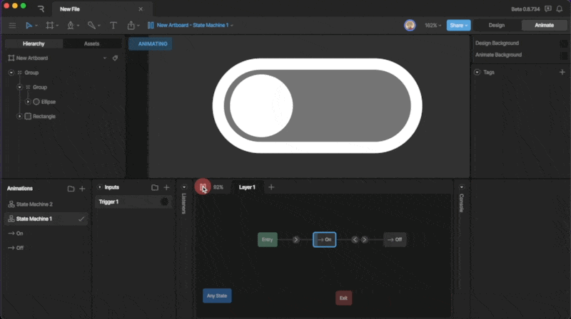

## [​](#configuring-a-transition) Configuring a Transition

Once you’ve added a transition, selecting the direction indicator will allow you to configure the transition. There are three different sections to the transition panel, the transition properties, conditions, and interpolation.

### [​](#transition-properties) Transition properties

The transition properties allow you to customize how a transition occurs.
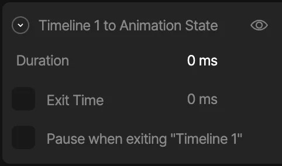

### [​](#duration) Duration

The duration property describes how long it takes for a transition to occur.
The duration is set to zero by default, meaning the transition happens immediately. So, when we transition between these two animations, it appears as though the object snaps from one side of the artboard to the other.
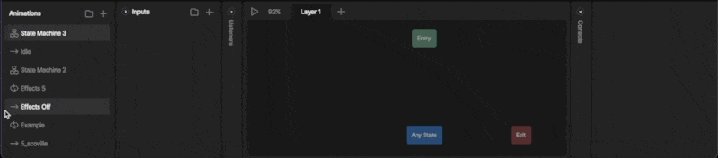
If we increase the duration, you’ll notice that the higher the number, the longer the transition takes.
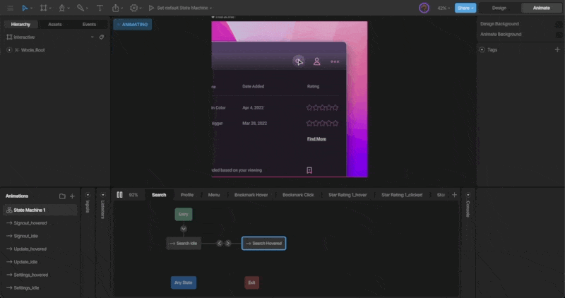
In a way, transitions act as their own animation. The starting properties (coming from the state your state machine is leaving from) will be interpolated to the ending properties (the starting properties of the state your state machine is going to). If the starting properties are the first key on a timeline, and the ending properties are the second key, the duration is the timing between those two keys. Transitions are much more complex than this, but thinking about transitions this way will help you diagnose issues with your state machine.
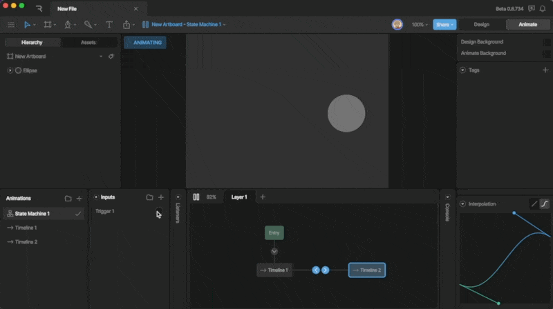
Much like keys on our timeline, we can change the interpolation, which we’ll discuss more below.

### [​](#exit-time) Exit Time

Exit Time tells the state machine how much of the state must play before transitioning.
By default, Exit Time is unchecked. If you want to enable the Exit Time, use the check box. Once the setting is enabled, you can use either a time value or percent.
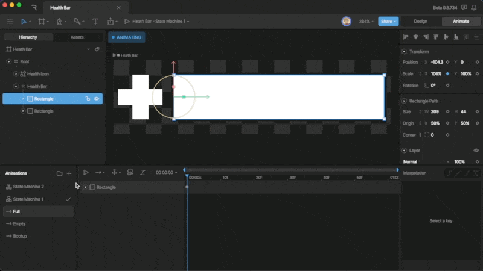
For example, if you want the state machine to play the entire animation before transitioning, you can either enter the duration of the animation, or use 100%.

### [​](#pause-when-exiting) Pause when exiting

The Pause When Exiting option pauses the animation you are leaving from during the transition.
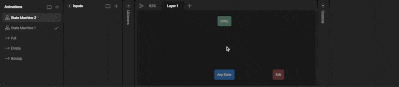
As we discussed in the duration section, when a transition happens, properties from the first state are mixed with the first key of the next state. In reality, the animation your state machine leaves from continues to play as the transition happens.

### [​](#conditions) Conditions

Conditions are the rules for our transitions. Without conditions, our transitions would continuously fire and our state machine would likely look either glitchy, or only play a single animation. Conditions require us to define some inputs, which you can read more about [here](/docs/editor/state-machine/inputs).
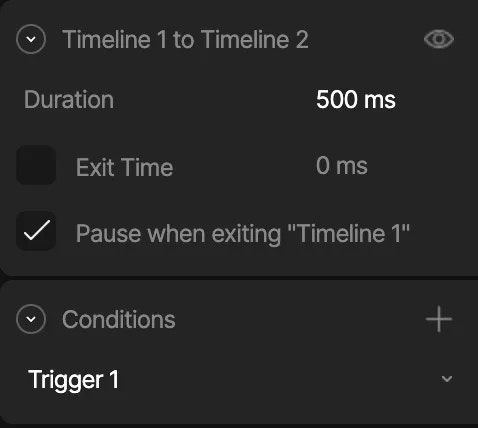

#### [​](#adding-a-new-condition) Adding a new condition

To add a new condition to a transition, hit the plus button next to the Conditions section.
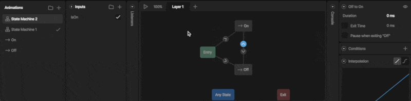
Adding a new Condition
Each new condition provides a dropdown showing all of the inputs you’ve added to the State Machine. The configuration options will be different depending on the input type you select.
Note that you can add multiple conditions to a single transition to create an “and” transition.
**Configuring a Boolean**
When you configure a boolean, you can decide if the transition happens when said boolean is either true or false.
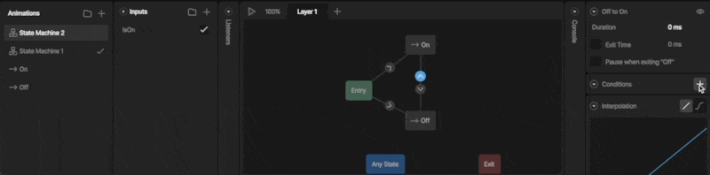
**Configuring a Number**
When you configure a number input, you can tell the transition to happen when a numerical condition happens such as equalling a specific number, being greater than or less than a specific number.
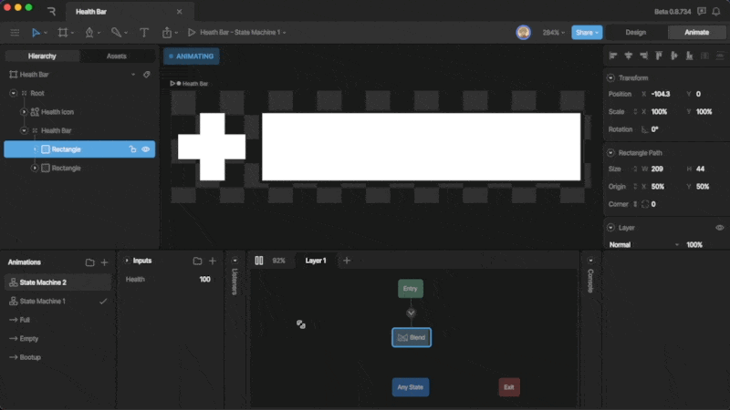
**Configuring a Trigger**
When you add a trigger input to a transition, you are telling the transition to fire when that trigger occurs.
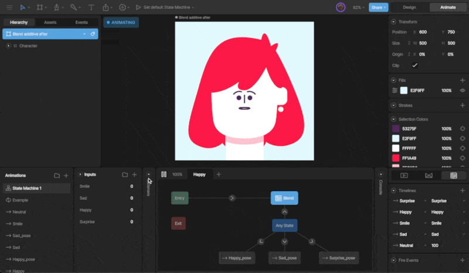

### [​](#interpolation) Interpolation

You can add interpolation to your transition at the bottom of the Transitions Panel. By default, the interpolation is set to linear, but you can use the cubic and hold interpolations.
Note that the interpolation between states is most effective when your transition duration is longer.
If you are unfamiliar with the basics of Interpolation, read more [Interpolation (Easing)](/docs/editor/animate-mode/interpolation-easing).

Was this page helpful?

YesNo

[Suggest edits](https://github.com/rive-app/rive-docs/edit/main/editor/state-machine/transitions.mdx)[Raise issue](https://github.com/rive-app/rive-docs/issues/new?title=Issue on docs&body=Path: /editor/state-machine/transitions)

[Inputs](/docs/editor/state-machine/inputs)[Listeners](/docs/editor/state-machine/listeners)

⌘I