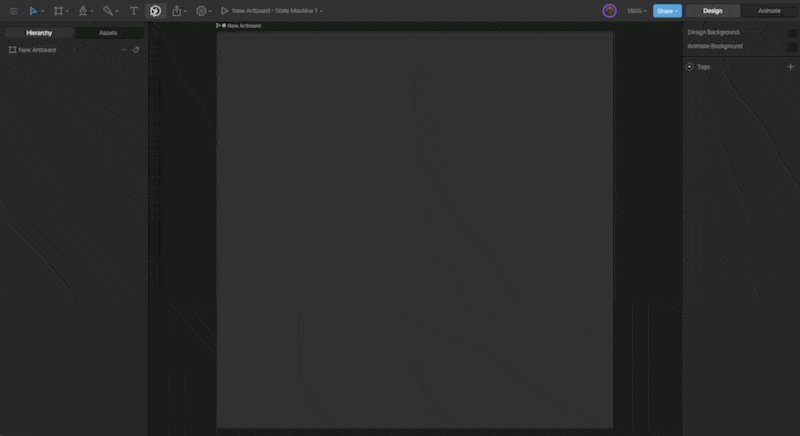
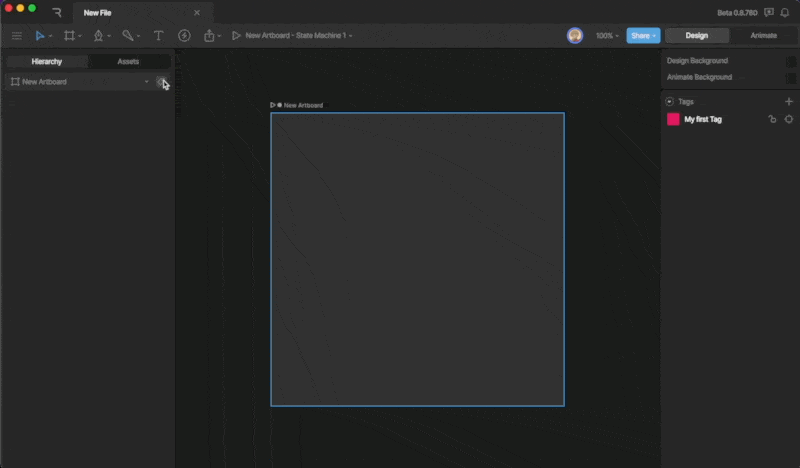
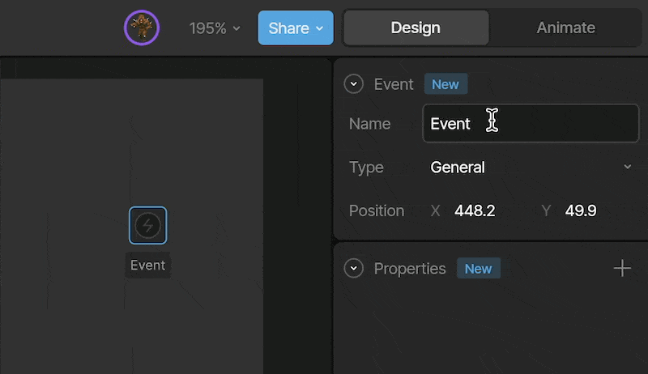
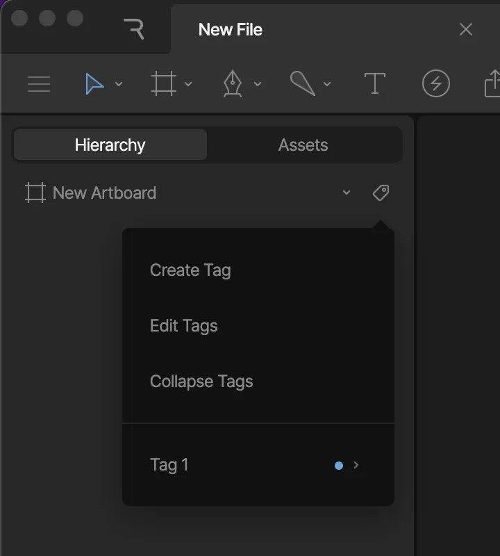
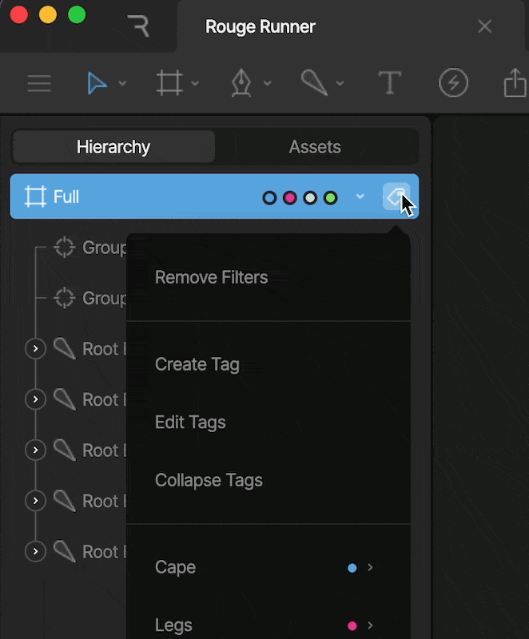
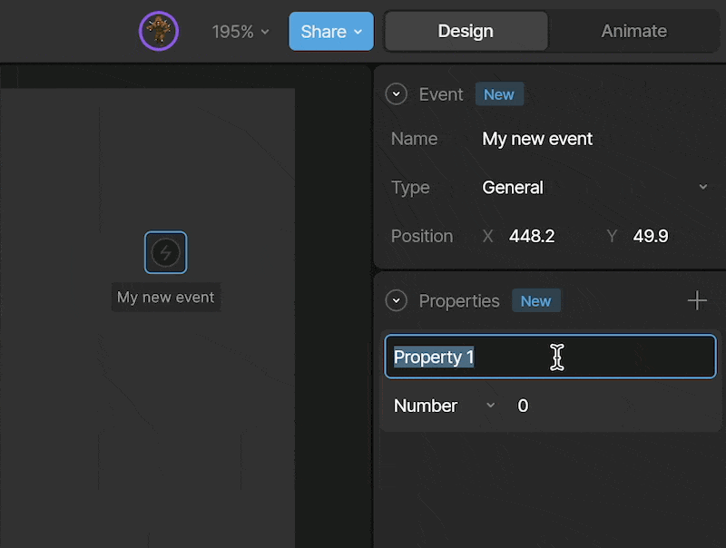
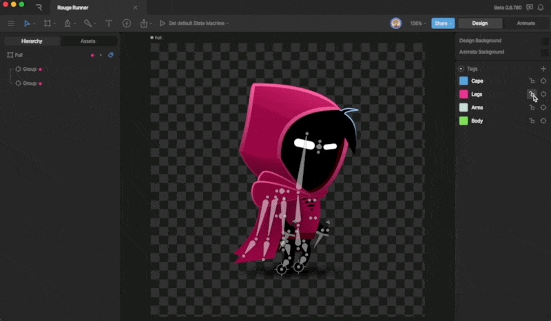

Editor

# Tagging

Tagging is a way to organize your hierarchy further. Create tags, then apply them to objects in the Hierarchy like Bones or Groups, then filter the view to see exactly what you need, when you need it.

## [​](#creating-tags) Creating Tags

There are two ways to create a Tag: either through the Hierarchy or by using the Inspector. Remember that any Tag created can be used on any artboard in the file.

### [​](#in-the-inspector) In the Inspector

To create a new tag, ensure that you have nothing selected on the artboard, then use the plus button next to the Tags option.

Once the Tag has been added, you can change the name and color to your liking.

### [​](#in-the-hierarchy) In the Hierarchy

There are two ways to create tags through the Hierarchy. The first is by using the tag menu at the top of the Hierarchy. From here you can create new Tags, edit Tags, collapse Tags, filter, lock, or select assigned Tags.

The second way is to select one or more objects to create a tag directly in the hierarchy, then right-click and use the add tag option. From there, you can either create a new tag or assign a tag that you’ve already created.

To edit the Tag’s properties, use the steps above.

## [​](#the-tags-menu) The Tags Menu

The Tags Menu is where you will find most of the Tag Options. Some of these options are self-explanatory, such as creating or editing a tag. Let’s explore some of the other available options.

### [​](#collapse-tag) Collapse Tag

When you add a tag to an object, you’ll notice that the Tag’s name and the color pip are displayed to the right.

We can use the Collapse Tag option to hide the name. Conversely, we can use the Reveal Tag option to display the names again.

### [​](#filter-tags) Filter Tags

When you mouse over a tag in the menu, you’re given the option to Filter. This option will filter your Hierarchy and only show you the objects with the filtered tag. The current filtered tabs are shown next to the Tag Menu.

Note that you can add as many tags to the filter as you want. This is a great way to show only the controls you need to create an animation.

### [​](#locked) Locked

The Locked option will allow you to lock the objects with the selected Tag. When locked, you can no longer select that object on the stage.

This is a great tool to use when you want to hand off a file to another animator so that they don’t inadvertently use a control that shouldn’t be.
This option is also available via the Inspector via the lock icon.

### [​](#select) Select

The Select option will select every object with the assigned tag.
Note that this option is also available in the Inspector via the target icon.

[MCP Integration](/editor/mcp/integration)