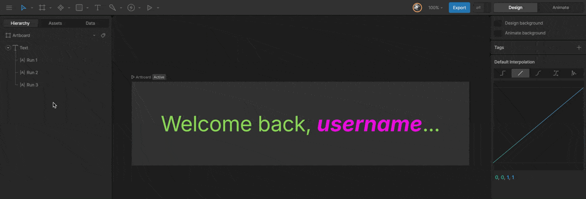
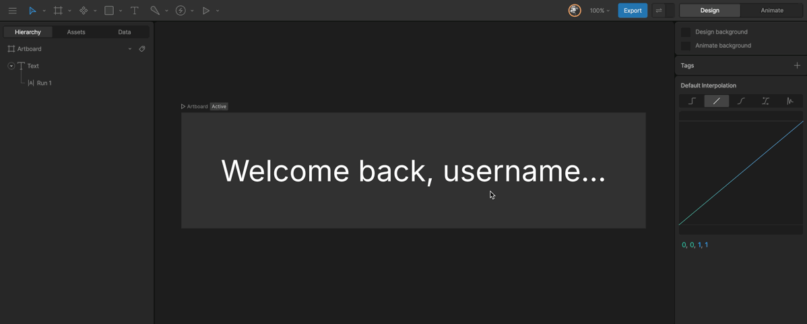
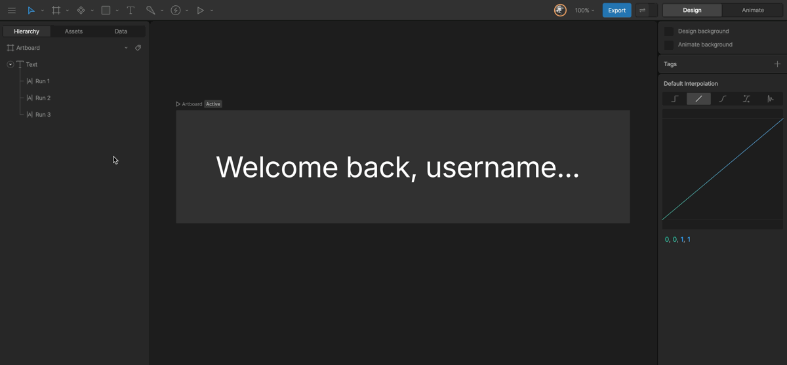

文本

# 文本运行 (Text Runs)

“运行 (Runs)”允许你将文本分割成不同的部分 —— 通常，它们被用于给单个文本块应用多种不同的样式。虽然大多数工具是在后台管理文本运行的，但 Rive 将它们暴露出来，以便在运行时动态更改文本时提供更大的控制力。
你可能希望将文本分割成多个“运行”，以便为文本的特定部分应用不同的样式（如字体、字号、颜色等），然后你可以 [在运行时更新你的文本运行](/docs/runtimes/text#read-update-text-runs-at-runtime)。

一个“文本运行”一次只能应用一种“文本样式”。

例如，一个欢迎用户访问应用或网站的动画可能会以用户的名字来打招呼。在 Rive 编辑器中，你可能设计并制作一段文字动画，内容为“欢迎回来，用户名”。将“用户名”定义为其专有的“运行”，意味着你可以通过 Rive 运行时定位它，并将其替换为用户的真实姓名。

---

## [​](#creating-a-text-run) 创建文本运行 (Creating a Text Run)

要创建一个“运行”，请选择目标文本部分，然后点击检查器中的“从选区创建运行 (Run from Selection)”按钮。你可以在层级面板中的文本对象下方看到列出的“文本运行”。
在选中文本框的情况下双击或按 `Enter` 键即可开始编辑文本。
勾选检查器中的“高亮文本运行 (Highlight Text Runs)”选项，可以获得当前文本运行的视觉指南。在层级面板中悬停在某个运行上也会在文字中高亮其位置。

---

## [​](#managing-text-runs) 管理文本运行 (Managing Text Runs)

在层级面板中选择一个“文本运行”以查看检查器选项：

- **文本值 (Text Value):** 更新该运行的文本内容。在动画模式下可以为此值设置关键帧。
- **编辑文本运行 (Edit Text Run):** 启动文本编辑器并预先选中该运行。
- **与后一个合并 (Merge with Next):** 将选中的运行与下一个运行合并。
- **与前一个合并 (Merge with Previous):** 将选中的运行与上一个运行合并。
- **删除文本运行 (Delete text Run):** 删除该运行及其内容。
- **样式 (Style):** 分配文本对象上定义的文本样式之一。在动画模式下可以为此属性设置关键帧。

