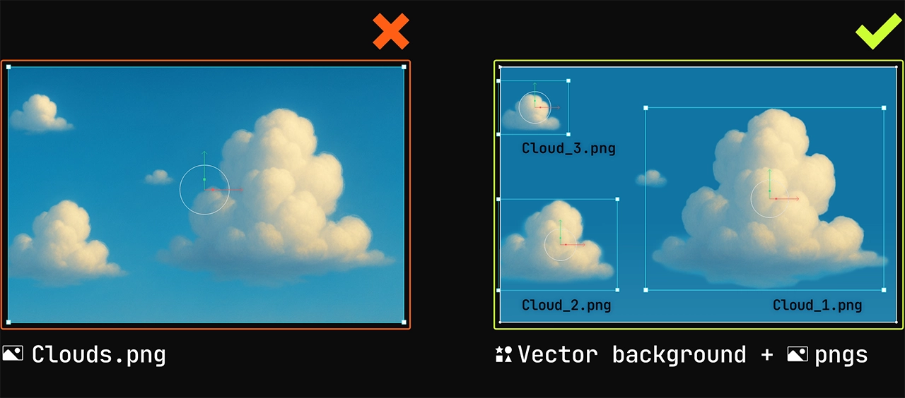

# 最佳实践

编辑器与运行时的性能及使用规范。

Rive 的设计初衷是在编辑器中以及在应用程序和游戏运行时都能高效地播放交互式图形。然而，未经优化的动画可能会消耗大量资源并导致性能低下，特别是在低端设备上。在接下来的章节中，我们将概述在 Rive 编辑器中进行设计/动画制作期间，以及在应用程序运行期间，保持最佳性能和最小资源占用的重要注意事项和技巧。

> **注意：** 我们建议在您的目标设备/平台上持续测试您的动画。

## 设计时建议

请看下面一些在 Rive 编辑器中使用的技术，以保持 Rive 的高性能：

### 资源优化

图像、音频和字体资源通常是 .riv 文件体积过大的主要原因。未经优化的资源会增加下载大小，并且必须加载到内存中，这可能导致运行缓慢——尤其是在低端设备上。

> **注意：** 只有在画板（Artboard）中使用的资源才会被编译到运行时。资源面板中未在画板中使用的项目不会增加 .riv 文件的体积。

#### 字体

字体文件通常包含数千个您可能不需要的字符，如希腊字母、数学符号和图标。为了减小导出的字体或 .riv 文件的体积，请[选择包含哪些字符](editor/text/fonts#glyph-%2F-script-selection)。

#### 位图图像的大小与尺寸

确保图像资源的大小与其用途相匹配至关重要。例如，如果图像将显示在画板的一个很小的区域（如 100 x 100），请避免使用尺寸巨大的图像（如 8192 x 7022）。

使用大尺寸图像会迅速消耗设备内存。在内存受限的移动设备上尤其如此。即使这些图像经过压缩，它们的尺寸仍会影响应用程序所占用的内存量。

如果您有一张非常大的图像，且在任何给定时间只有一部分可见（例如：滚动背景），请考虑将图像拆分为较小的块，或者混合使用位图并将其部分内容重新创建为矢量图形。

#### 位图图像压缩

压缩涉及通过采用各种算法丢弃一些图像数据来减小文件大小。您可以直接在 Rive 编辑器中压缩图像，这意味着您可以保留原始图像，但针对运行时使用进行压缩。如果资源嵌入在动画中，这将减小导出的 .riv 文件的体积。

为了获得最小的图像文件大小和最佳性能，我们建议使用 WebP 格式导出资源。

#### 矢量图像

请高效地控制矢量图像中的顶点数量。虽然增加几个顶点不会产生太大影响，但数千个顶点就会。在导入由 AI 生成、从位图图像转换或在绘图应用中创建的矢量图时要特别小心。

### 导入 Lottie 文件

虽然 Rive 提供 Lottie 转换器以方便导出 .riv 文件，但直接在 Rive 中重新创建图形和动画通常会产生明显更小的文件体积。如果您正在导入 Lottie 文件，可以通过将图像从 PNG 转换为 WebP，并为字体文件仅选择必要的字符来进一步减小 .riv 文件的体积。此外，您可以[通过带外加载资源（Out-of-band assets）](#out-of-band-assets)在多个 .riv 文件之间重复使用字体和图像，从而优化存储。

直接在 Rive 中创作通常是首选，因为它可以根据您的动画需求进行文件优化。例如，与直接从 Lottie 转换相比，使用骨骼（Bones）和约束（Constraints）创建骨架（Rig）会产生更少的动画关键帧。

### Web 端的层混合模式

混合模式在 Web 端非常耗费资源，因为 WebGL 没有公开访问帧缓冲区的机制。为了应用混合模式，Rive 必须在合成之前将渲染的像素复制到单独的纹理中，这会带来显着的性能和内存开销。

虽然目前正在通过新的 WebGL 功能来改进这一点的努力正在进行中，但这些指南仍有待更广泛的支持。在此之前，最好在 Web 项目中谨慎使用混合模式，以确保最佳性能。

### 画板建议

#### 裁剪画板（Clipped Artboards）

剪裁画板通常没问题，但如果您遇到性能问题，则值得尽量减少它们的使用。剪裁在计算上可能非常昂贵，因为渲染器必须评估每个对象（包括组件实例）以确定像素可见性。相反，考虑将剪裁应用于画板内的特定对象或组。

在大多数情况下，您可以安全地删除主画板本身的剪裁，因为在运行时，Rive 实例之外的任何内容都不会被渲染。

#### 未使用的画板

未使用的画板仍会包含在编译后的 .riv 文件中，并在首次加载文件时进行解析。这可能会导致不必要的内存使用和性能开销，特别是如果未使用的画板包含复杂的动画或大型资源。为了保持文件的精简和高效，最佳做法是删除任何未在使用中的画板。

### 空闲动画（Idle Animations）

如果在状态机中，图形在给定状态下保持静态，请考虑使用“触发式（one-shot）”动画，并确保时间轴动画不会过长。在状态机的运行过程中，如果没有循环播放的动画或处于激活状态的混合状态，运行时将先发制人地“暂停”自身，直到状态机输入或 Rive 监听器触发状态机中的下一次转换。这非常有用，因为资源消耗（即 CPU 使用率）可能会降低到 Rive 对应用程序资源影响微不足道的程度。

应用场景：图标、按钮、仅根据用户交互进行动画处理的图形等。

### 使用 Solo

[Solo](editor/manipulating-shapes/solos) 与组类似，但增加了切换嵌套对象渲染的能力。它的功能类似于单选按钮，会停用同一层级上的其他对象。

Solo 的一个常见用例是为角色创建可以轻松切换的不同皮肤。使用 Solo 比单独为每个对象设置不透明度动画要快得多。此外，它允许编辑器和运行时通过不计算/渲染已停用的 Solo 来优化您的动画。

### 混合状态（Blend States）

与“空闲动画”中的指南类似，确保混合状态能够转换到其他状态，或者在完成时移动到退出状态（如果可能）。当混合状态在运行时激活时，Rive 将持续播放状态机，即使它已不再需要。在完成时提供一些离开混合状态的转换，可以确保 Rive 在考虑是否在播放状态机的任何点自我暂停时，减少一个“激活”的动画路径。

## 运行时建议

以下是一些在应用程序中使用 Rive 运行时以保持 Rive 高性能的技术：

### 带外资源（Out-of-band Assets）

请参阅我们关于[加载资源](runtimes/loading-assets)的文档。此功能允许您通过代码在运行时动态加载和替换资源（如字体、图像和音频），并为您的 Rive 图形提供资源。这具有以下好处：

* 减小导出的 .riv 二进制文件体积。
* 资源可以在多个 Rive 文件或应用程序的其他区域重复使用。
* 资源可以预加载并缓存，以便在显示 Rive 图形之前随时可用。
* 资源可以根据用户的屏幕尺寸和分辨率进行交换，例如在这个 [Web JS 示例](https://codesandbox.io/p/sandbox/cool-dewdney-hlk5xl?file=%2Fsrc%2Findex.ts)中。

### 缓存您的 .riv

如果您在页面或应用程序的多处使用相同的 Rive 文件，可以[缓存 .riv 文件](runtimes/caching-a-rive-file)以提高性能。缓存的关键好处是文件只需解析和解码一次。从缓存的、已解码的文件中创建新的画板实例，比每次在实例化画板之前解码文件要快得多。

### 通过程序暂停

在几种情况下，您可能希望通过程序暂停使用 Rive 配置的状态机。通过在运行时暂停 Rive 图形，您可能会注意到 Rive 对应用程序的影响（即 CPU）资源消耗微乎其微。

1. **Rive 图形在屏幕外**
   a. 如果 Rive 图形滚动到屏幕外且不需要继续播放，请在您使用的相应运行时上调用 `pause` API，以防止 Rive 在不需要时继续进行动画并消耗资源。
   b. 当图形回到屏幕内且需要继续动画时，调用 `play` API。

2. **辅助功能 (Accessibility)**
   * 如果用户在设备设置中设置了偏好“减少动态效果”，您可能希望在运行时读取此属性，并以程序方式调用 `pause` 或在 Rive 运行时设置 `autoplay: false`，以确保这些用户在导航应用程序时减少动态。或者，可以在运行时创建并加载功能不同的不同画板或状态机。

3. **状态机在静态图形下处于空闲状态**
   a. 当 Rive 图形因等待用户交互、数据处理等导致状态机转换而处于空闲状态时，调用 `Pause`。

### 低端设备

Rive 将努力在所有浏览器/设备上高性能运行，但在可能的情况下，请测试您的应用程序在资源受限设备上运行特定 Rive 图形时的表现。您可能会发现，对于给定的屏幕，包含重度动画图形的 Rive 文件可能超出了实际需求，并决定显示静态 Rive 图形（即 autoplay: false）或减少任何给定点正在进行动画处理的 Rive 实体数量。

针对低端设备的一个策略是创建一个减少了资源使用/动态效果的备用画板或状态机，以便在旧设备上运行时动态加载。
