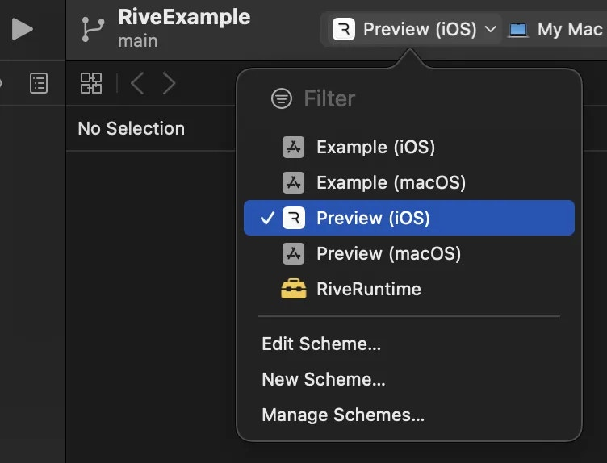

Apple

# Apple

Apple runtime for Rive.

Note that certain Rive features may not be supported yet for a particular runtime, or may require using the Rive Renderer.For more details, refer to the [feature support](/docs/feature-support) and [choosing a renderer](/docs/runtimes/choose-a-renderer) pages.

## [​](#overview) Overview

This guide documents how to get started using the Apple runtime library. Rive runtime libraries are open-source. The source is available in its [GitHub repository](https://github.com/rive-app/rive-ios).
This library contains an API for Apple apps to easily integrate their Rive assets for both UIKit/AppKit and SwiftUI. The runtime can also be installed via Cocoapods or Swift Package Manager.
The minimum iOS target is **14.0,** and the target for macOS is `13.1`

**Note:** macOS runtime support is included in `v4.0.1+`

You can run our Apple example app from the Rive GitHub repository.

Copy

Ask AI

```
git clone https://github.com/rive-app/rive-ios
```

Open the `Example-iOS` app in XCode and be sure to select the `Preview (iOS)` or `Preview (macOS)` [scheme](https://developer.apple.com/documentation/xcode/customizing-the-build-schemes-for-a-project). The other schemes are for development purposes and require additional configuration, see[CONTRIBUTING.MD](https://github.com/rive-app/rive-ios/blob/main/CONTRIBUTING.md).


## [​](#getting-started) Getting Started

Follow the steps below for a quick start on integrating Rive into your Apple app.

1

Install the dependency

#### [​](#via-cocoapods) Via Cocoapods

Add the following to your Podspec file:

Copy

Ask AI

```
pod 'RiveRuntime'
```

#### [​](#via-swift-package-manager) Via Swift Package Manager

To install via Swift Package Manager, in the package finder in Xcode, search for `rive-ios` or the full Github path: `https://github.com/rive-app/rive-ios`

2

Importing Rive

Add the following to the top of your file where you utilize the Rive runtime:

Copy

Ask AI

```
import RiveRuntime
```

3

v2 Runtime Usage

In Rive Apple runtimes of versions 2.x.x or later, the primary object you’ll use is a `RiveViewModel`. It is responsible for creating and interacting with Rive assets.

#### [​](#swiftui) SwiftUI

**Set up RiveViewModel w/ View**

Copy

Ask AI

```
struct AnimationView: View {
    var body: some View {
        RiveViewModel(fileName: "cool_rive_animation").view()
    }
}
```

In the above example, you reference the name of a `.riv` asset bundled into your application, but you can also load in a `.riv` file hosted on a remote URL like so:

Copy

Ask AI

```
struct AnimationView: View {
    var body: some View {
        RiveViewModel(
            webURL: "https://cdn.rive.app/animations/off_road_car_v7.riv"
        ).view()
    }
}
```

#### [​](#uikit-storyboard) UIKit - Storyboard

#### [​](#set-up-riveviewmodel-w/-controller-formatted-on-a-storyboard) Set up RiveViewModel w/ Controller formatted on a Storyboard

The simplest way of adding Rive to a controller using Storyboards is to make a `RiveViewModel`, and set its view to be the `RiveView` you made in the Storyboard.

Copy

Ask AI

```
class AnimationViewController: UIViewController {
    @IBOutlet weak var riveView: RiveView!
    var simpleVM = RiveViewModel(fileName: "cool_rive_animation")

    override public func viewDidLoad() {
        simpleVM.setView(riveView)
    }
}
```

#### [​](#uikit-programmatic) UIKit - Programmatic

#### [​](#set-up-riveviewmodel-w/-controller-from-scratch-in-code) Set up RiveViewModel w/ Controller from scratch in code

You can also add Rive to a controller purely with code by making the `RiveViewModel`, telling it to create a fresh `RiveView` and then adding it to the view hierarchy.

Copy

Ask AI

```
class AnimationViewController: UIViewController {
    var simpleVM = RiveViewModel(fileName: "cool_rive_animation")

    override func viewWillAppear(_ animated: Bool) {
        let riveView = simpleVM.createRiveView()
        view.addSubview(riveView)
        riveView.frame = view.bounds
    }
}
```

See subsequent runtime pages to learn how to control animation playback, state machines, and more.

## [​](#resources) Resources

Github: <https://github.com/rive-app/rive-ios> Examples:

- <https://github.com/rive-app/rive-ios/tree/main/Example-iOS>
- <https://github.com/rive-app/rive-ios/tree/main/Demo-App>
- Free course from Meng To: <https://designcode.io/swiftui-rive>

[Migration Guide](/docs/runtimes/flutter/migration-guide)[Migrating from 1.x.x to 2.x.x](/docs/runtimes/apple/migrating-from-1.x.x-to-2.x.x)