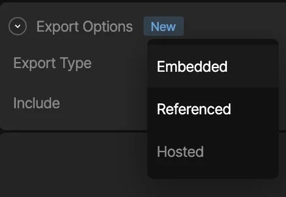

Runtime Fundamentals

# 加载资产 (Loading Assets)

在运行时动态加载和替换资产

如果你想动态替换图像，请使用 [图像数据绑定 (image data binding)](/runtimes/data-binding#images)。

一些 Rive 文件可能包含可以嵌入到实际文件二进制文件中的资产，例如字体、图像或音频文件。Rive 运行时可以在加载 Rive 文件时加载这些资产。虽然这使得 Rive 文件/运行时的使用变得容易，但也可能有机会在运行时加载甚至替换这些资产，而不是将它们嵌入到文件二进制文件中。
这种方法有几个好处：

-   保持 `.riv` 文件微小，没有大资产的潜在膨胀
-   出于任何原因动态加载资产，例如如果 `.riv` 在移动设备上运行，则加载较小分辨率的图像，而在桌面设备上加载较大分辨率的图像
-   预加载资产以便在显示 `.riv` 时立即可用
-   使用已经与你的应用程序捆绑在一起的资产，例如字体文件
-   在多个 `.riv` 之间共享同一资产

## [​](#methods-for-loading-assets) 加载资产的方法

目前有三种不同的方法为你的 Rive 文件加载资产。
在 Rive 编辑器中，从 **Assets** 选项卡中选择所需的资产，并在检查器中选择所需的导出选项：

有关更多详细信息，请参阅编辑器文档中的 **Export Options** 部分。

### [​](#embedded-assets) 嵌入式资产 (Embedded Assets)

在 Rive 编辑器中，可以通过选择 *“Embedded”* 导出类型将静态资产包含在 `.riv` 文件中。如本页开头所述，当加载 Rive 文件时，运行时也将隐式尝试加载嵌入在 `.riv` 中的资产，你无需担心手动加载任何资产。
**警告：** 嵌入式资产可能会增加文件大小，尤其是在使用 Rive 文本 ([文本概览](/editor/text/overview.md)) 时的字体。

**Embedded 是默认选项。**

### [​](#loading-via-rive’s-cdn) 通过 Rive 的 CDN 加载

在 Rive 编辑器中，你可以将导入的资产标记为 *“Hosted”* 导出类型，这意味着当你导出 `.riv` 文件时，资产将不会嵌入到文件二进制文件中，而是托管在 Rive 的 CDN 上。这意味着在运行时加载文件时，运行时将看到资产被标记为“Hosted”并从 Rive CDN 加载资产，因此你无需担心自己加载任何内容，并且文件仍然可以保持微小。
**警告：** 应用程序将对 Rive CDN 进行额外调用以检索你的资产。

Hosted 资产在 Voyager 和 Enterprise 计划中可用。[了解更多关于我们的计划和定价](https://rive.app/pricing)。

### [​](#image-cdns) 图像 CDN

一些图像 CDN 允许进行动态图像转换，包括调整大小、裁剪和基于浏览器和设备功能的自动格式转换。这些 CDN 可以托管你的 Rive 图像资产。请注意，对于这些 CDN，你可能需要指定接受的格式，例如，作为 HTTP 标头请求的一部分：

```javascript
... headers: { Accept: 'image/png,image/webp,image/jpeg,*/*', } ...
```

请参阅你的 CDN 提供商的文档以获取更多信息。

Rive 支持以下图像格式：**jpeg**、**png** 和 **webp**。

### [​](#referenced-assets) 引用资产 (Referenced Assets)

在 Rive 编辑器中，你可以将导入的资产标记为 *“Referenced”* 导出类型，这意味着当你导出 `.riv` 文件时，资产将不会嵌入到文件二进制文件中，加载资产的责任将由你的应用程序在运行时处理。此选项使你能够在运行时开始加载 `.riv` 文件时通过处理程序 API 动态加载资产。如果你需要根据任何类型的应用/游戏逻辑动态加载特定资产，特别是如果你想保持文件大小较小，此选项是首选。
所有引用的资产（包括 `.riv`）在导出动画时将被捆绑为一个 zip 文件。
**警告：** 你需要在加载 Rive 时提供一个资产处理程序 API，该 API 应执行你自己加载资产的工作。请参阅下面的“处理资产”。

## [​](#handling-assets) 处理资产

请参阅下文，了解如何使用各种运行时在运行时为你的 Rive 文件加载资产。

-   Web (JS)
-   React
-   Flutter
-   Apple
-   Android
-   React Native

### [​](#examples) 示例 (Web/JS)

-   [指定要加载的字体资产](https://codesandbox.io/p/devbox/rive-out-of-band-fonts-js-forked-kml2wd?file=%2Fsrc%2Findex.ts)
-   [指定要加载的图像资产](https://codesandbox.io/p/sandbox/rive-out-of-band-images-js-forked-23jx8m?file=%2Fsrc%2Findex.ts)
-   [带外资产 (字体) - webgl2 高级](https://codesandbox.io/p/sandbox/rive-canvas-advanced-out-of-band-assets-fonts-3q4zzy?file=%2Fsrc%2Findex.ts)

### [​](#using-the-asset-handler-api) 使用资产处理程序 API (Web/JS)

当实例化一个新的 Rive 实例时，将 `assetLoader` 回调属性添加到参数列表中。此回调将针对运行时在加载时从 `.riv` 文件中检测到的每个资产进行调用，并负责在运行时处理资产的加载，或者将责任传递给运行时并让其尝试加载。你可能想要处理加载资产的一个实例是，如果文件中的资产标记为 **Referenced**，并且你需要提供实际资产来渲染图形，因为 Rive 不会将其嵌入 `.riv` 中，因此无法加载它。你可能想要给运行时一个机会加载资产的另一个实例是，如果文件中的资产标记为 **Hosted**，并希望将加载它的责任传递给运行时（运行时将调用 Rive CDN 来执行此操作）。

```javascript
assetLoader: (asset: rc.FileAsset, bytes: Uint8Array) => boolean;
```

你提供的回调将被传递一个 `asset` 和 `bytes`。

-   `asset` - 来自 WASM 的 `FileAsset` 对象的引用。你可以从该对象获取许多属性，例如名称、资产类型等。你还将使用它来为你想要设置的动态加载资产设置新的 Rive 特定资产（即图像的 `RenderImage`，字体的 `Font`，或音频的 `Audio`）。
-   `bytes` - 资产的字节数组（如果可能，例如它是嵌入式资产）

**重要**：请注意，返回值是一个 `boolean`，如果你打算处理并自己加载资产，则需要返回 `true`；如果你不想自己处理给定资产的加载，并尝试让运行时尝试加载该资产，则返回 `false`。解码资产时，确保在不再需要时调用 `unref` - 以避免内存泄漏。这允许引擎在没有任何动画使用它时清理它。
示例用法

```javascript
import {
Rive,
Fit,
Alignment,
Layout,
decodeFont,
ImageAsset, // Optionally include for type checking
FontAsset, // Optionally include for type checking
FileAsset, // Optionally include for type checking
} from "@rive-app/canvas";

// Load a random asset by using a decodeFont API to feed to a
// setFont API on the asset provided in assetLoader
const randomFontAsset = (asset) => {
const urls = [
    "https://cdn.rive.app/runtime/flutter/IndieFlower-Regular.ttf",
    "https://cdn.rive.app/runtime/flutter/comic-neue.ttf",
    "https://cdn.rive.app/runtime/flutter/inter.ttf",
    "https://cdn.rive.app/runtime/flutter/inter-tight.ttf",
    "https://cdn.rive.app/runtime/flutter/josefin-sans.ttf",
    "https://cdn.rive.app/runtime/flutter/send-flowers.ttf",
];
let randomIndex = Math.floor(Math.random() * urls.length);
fetch(urls[randomIndex]).then(
    async (res) => {
    // decodeFont creates a Rive-specific Font object that `setFont()` takes
    // on the asset from assetLoader
    // decodeFont 创建一个 Rive 特定的 Font 对象，供 assetLoader 中的 asset 上的 `setFont()` 使用
    const font = await decodeFont(new Uint8Array(await res.arrayBuffer()));
    asset.setFont(font);

    // Be sure to call unref on the font once it is no longer needed. This
    // allows the engine to clean it up when it is not used by any more animations.
    // 确保在不再需要字体时对其调用 unref。这允许引擎在没有任何动画使用它时清理它。
    font.unref();
    }
);
};

const riveInstance = new Rive({
src: "acqua_text.riv",
stateMachines: "State Machine 1", // Name of the State Machine to play
canvas: document.getElementById("rive-canvas"),
layout: new Layout({
    fit: Fit.Cover,
    alignment: Alignment.Center,
}),
autoplay: true,
// Callback handler to pass in that dictates what to do with an asset found in
// the Rive file that's being loaded in
// 传入的回调处理程序，指示如何处理正在加载的 Rive 文件中找到的资产
assetLoader: (asset, bytes) => {
    console.log("Asset properties to query", {
    name: asset.name,
    fileExtension: asset.fileExtension,
    cdnUuid: asset.cdnUuid,
    isFont: asset.isFont,
    isImage: asset.isImage,
    isAudio: asset.isAudio,
    bytes,
    });

    // If the asset has a `cdnUuid`, return false to let the runtime handle
    // loading it in from a CDN. Or if there are bytes found for the asset
    // (aka, it was embedded), return false as there's no work needed here
    // 如果资产有 `cdnUuid`，返回 false 让运行时处理从 CDN 加载它。
    // 或者如果找到了资产的字节（即它是嵌入的），返回 false，因为这里不需要工作
    if (asset.cdnUuid.length > 0 || bytes.length > 0) {
    return false;
    }

    // Here, we load a font asset with a random font on load of the Rive file
    // and return true, because this callback handler is responsible for loading
    // the asset, as opposed to the runtime
    // 在这里，我们在加载 Rive 文件时加载一个随机字体的字体资产并返回 true，
    // 因为此回调处理程序负责加载资产，而不是运行时
    if (asset.isFont) {
        randomFontAsset(asset);
        return true;
    }
},
onLoad: () => {
    // Prevent a blurry canvas by using the device pixel ratio
    // 使用设备像素比防止画布模糊
    riveInstance.resizeDrawingSurfaceToCanvas();
}
});
```

### [​](#examples-2) 示例 (React)

-   [指定要加载的字体资产](https://codesandbox.io/p/sandbox/peaceful-water-2chg77?file=%2Fsrc%2FApp.tsx%3A20%2C38)
-   [本地化 - 根据语言交换字体 (TypeScript & i18n)](https://codesandbox.io/p/sandbox/rive-react-i18n-localization-and-font-swapping-kfsqsl?file=%2Fsrc%2FRiveDemo.tsx)
-   [指定要加载的图像资产](https://codesandbox.io/p/sandbox/rive-out-of-band-images-react-forked-gstq2w?file=%2Fsrc%2FApp.tsx%3A14%2C30)

### [​](#using-the-asset-handler-api-2) 使用资产处理程序 API (React)

当使用 `useRive` hook 实例化一个新的 Rive 实例时，将 `assetLoader` 回调属性添加到参数列表中。此回调将针对运行时在加载时从 `.riv` 文件中检测到的每个资产进行调用，并负责在运行时处理资产的加载，或者将责任传递给运行时并让其尝试加载。

请注意，你只能将 `assetLoader` 回调与 `useRive` hook 一起使用，而不能与 React 运行时默认导出的 `<Rive />` 组件一起使用。

```javascript
assetLoader: (asset: rc.FileAsset, bytes: Uint8Array) => boolean;
```

有关更多 API 详细信息，请参阅此表中的 Web (JS) 选项卡。

### [​](#examples-3) 示例 (Flutter)

-   [动态交换字体](https://zapp.run/edit/rive-out-of-band-assets-fonts-zva0062lva10)
-   [动态交换图像](https://zapp.run/edit/rive-out-of-band-assets-image-z09q06hl09r0?entry=lib/main.dart&file=pubspec.yaml:2865-2888)

### [​](#using-the-asset-handler-api-3) 使用资产处理程序 API (Flutter)

当实例化 `File` 时，将 `assetLoader` 回调添加到参数列表中。此回调将针对运行时在加载时从 `.riv` 文件中检测到的每个资产进行调用，并负责在运行时处理资产的加载，或者将责任传递给运行时并让其尝试加载。

字体资产示例

```dart
final fontFile = await File.asset(
    'assets/acqua_text_out_of_band.riv',
    riveFactory: Factory.rive,
    assetLoader: (asset, bytes) {
        // Replace font assets that are not embedded in the rive file
        if (asset is FontAsset && bytes == null) {
            final urls = [
                'https://cdn.rive.app/runtime/flutter/IndieFlower-Regular.ttf',
                'https://cdn.rive.app/runtime/flutter/comic-neue.ttf',
                'https://cdn.rive.app/runtime/flutter/inter.ttf',
                'https://cdn.rive.app/runtime/flutter/inter-tight.ttf',
                'https://cdn.rive.app/runtime/flutter/josefin-sans.ttf',
                'https://cdn.rive.app/runtime/flutter/send-flowers.ttf',
            ];

            // pick a random url from the list of fonts
            http.get(Uri.parse(urls[Random().nextInt(urls.length)])).then((res) {
                if (mounted) {
                    asset.decode(
                        Uint8List.view(res.bodyBytes.buffer),
                    );
                    setState(() {
                        // force rebuild in case the Rive graphic is no longer advancing
                    });
                }
            });
            return true; // Tell the runtime not to load the asset automatically
        } else {
            // Tell the runtime to proceed with loading the asset if it exists
            return false;
        }
    },
);
```

你提供的回调将被传递一个 `asset` 和 `bytes`。

-   `asset` - `FileAsset` 对象的引用。你可以从该对象获取许多属性，例如名称、资产类型等。你还将使用它来为动态加载的内容设置新的 Rive 特定资产。类型：`FontAsset`、`ImageAsset` 和 `AudioAsset`。
-   `bytes` - 资产的字节数组（如果它作为嵌入式资产可用）

**示例用法**

-   请参阅 Rive Flutter 示例应用程序，该应用程序展示了如何预先缓存字体和图像，并在运行时动态交换它们。

**重要**：请注意，返回值是一个 `boolean`，你需要返回：

-   `true` 如果你打算自己处理和加载资产
-   或 `false` 如果你不想自己处理该特定资产的加载，并尝试让运行时尝试加载该资产

一旦 `File` 被释放，`FileAsset` 将不再有效，使用它将是危险的。

### [​](#examples-4) 示例 (Apple)

-   [(SwiftUI) 交换图像和字体](https://github.com/rive-app/rive-ios/blob/main/Example-iOS/Source/Examples/SwiftUI/SwiftSimpleAssets.swift)
-   [(UIKit) 交换和缓存图像和字体](https://github.com/rive-app/rive-ios/blob/main/Example-iOS/Source/Examples/Storyboard/CachedAssets.swift)

### [​](#using-the-asset-handler-api-4) 使用资产处理程序 API (Apple)

当实例化 `RiveViewModel`（或直接实例化 `RiveFile`）时，将 `customLoader` 回调属性添加到参数列表中。此回调将针对运行时在加载时从 `.riv` 文件中检测到的每个资产进行调用，回调将负责在运行时处理资产的加载，或者将责任传递给运行时并让其尝试加载。你可能想要处理加载资产的一个实例是，如果文件中的资产标记为 **Referenced**，并且你需要提供实际资产来渲染图形，因为 Rive 不会将其嵌入 `.riv` 中，因此无法加载它。你可能想要给运行时一个机会加载资产的另一个实例是，如果文件中的资产标记为 **Hosted**，并希望将加载它的责任传递给运行时（运行时将调用 Rive CDN 来执行此操作）。

```swift
RiveViewModel(fileName: "simple_assets", loadCdn: false, customLoader: { (asset: RiveFileAsset, data: Data, factory: RiveFactory) -> Bool in
    // A simple check for a Rive file with one asset
    if (asset is RiveImageAsset){
        // picture-47982.jpeg can be exported with the .riv file from the Rive editor.
        // It is then included in the main bundle resources of the project
        guard let url = (.main as Bundle).url(forResource: "picture-47982", withExtension: "jpeg") else {
            fatalError("Failed to locate 'picture-47982' in bundle.")
        }
        guard let data = try? Data(contentsOf: url) else {
            fatalError("Failed to load \(url) from bundle.")
        }
        (asset as! RiveImageAsset).renderImage(
            factory.decodeImage(data)
        )
        return true;
    }
    return false;
}).view()
```

你提供的回调将被传递一个 `asset`、`data` 和一个 `factory`。

-   `asset` - `RiveFileAsset` 对象的引用。你将使用此引用为动态加载的内容设置新的 Rive 特定资产。如果你希望在视图的生命周期内动态交换给定的图像/字体，你可能希望缓存此对象。你可以从该对象获取许多属性，例如：
    -   `name()` - 不附加唯一文件标识符的资产名称（即 `picture.webp` 而不是 `picture-47982.webp`）
    -   `uniqueFilename()` - 带有唯一文件标识符的资产名称（即 `picture-47982.webp` 而不是 `picture.webp`）
    -   `fileExtension()` - 文件扩展名的名称（即 `"png"`）
    -   `cdnBaseUrl()` - CDN 的基本 URL 名称
    -   `cdnUuid()` - Rive CDN 中的资源标识符。用于查看其是否有长度，以便你可以查看资产是否标记为从 Rive CDN 获取（在这种情况下，你可以让 Rive 运行时检索资产，而不是你的应用逻辑）
-   `data` - 资产的字节数组。这对于确定资产是否已嵌入在 Rive 文件中（即，未在编辑器中标记为“referenced”）很有用。
-   `factory` - 包含将资产字节转换为 `RiveRenderImage`、`RiveFont` 或 `RiveAudio` 的方法的实用程序，`asset` 对象使用这些方法通过 `.renderImage(your-rive-render-image)`、`.font(your-rive-font)` 或 `.audio(your-rive-audio)` 进行渲染。这些资产是通过调用 `factory.decodeImage(data)`、`factory.decodeFont(data)` 或 `factory.decodeAudio(data)` 创建的。

**重要**：请注意，回调的返回值是一个 `boolean`，你需要返回：

-   `true` 如果你打算自己处理和加载资产
-   `false` 如果你不想自己处理该特定资产的加载，并尝试让运行时尝试加载该资产。

**示例用法**

```swift
import SwiftUI
import RiveRuntime

struct SimpleAssetReplacement: View {
    @StateObject private var riveInstance = RiveViewModel(fileName: "simple_assets", autoPlay: false, loadCdn: false, customLoader: { (asset: RiveFileAsset, data: Data, factory: RiveFactory) -> Bool in
        if (asset is RiveImageAsset) {
            guard let url = (.main as Bundle).url(forResource: "picture-47982", withExtension: "jpeg") else {
                fatalError("Failed to locate 'picture-47982' in bundle.")
            }
            guard let data = try? Data(contentsOf: url) else {
                fatalError("Failed to load \(url) from bundle.")
            }
            (asset as! RiveImageAsset).renderImage(
                factory.decodeImage(data)
            )
            return true;
        } else if (asset is RiveFontAsset) {
            guard let url = (.main as Bundle).url(forResource: "Inter-45562", withExtension: "ttf") else {
                fatalError("Failed to locate 'Inter-45562' in bundle.")
            }
            guard let data = try? Data(contentsOf: url) else {
                fatalError("Failed to load \(url) from bundle.")
            }
            (asset as! RiveFontAsset).font(
                factory.decodeFont(data)
            )
            return true;
        }
        return false;
    })

    var body: some View {
        riveInstance.view()
    }
}
```

### [​](#fonts) 字体 (Fonts)

当使用自定义加载器时，可以通过两种方式之一加载引用的字体：使用原始数据（来自文件，如上所示），或使用 `UIFont` / `NSFont`。
当使用 `UIFont` / `NSFont` 时，提供的字体的大小、粗细和宽度将被忽略。字体将按照文本运行中的定义使用，而不是被提供的字体的样式覆盖。

```swift
import SwiftUI
import RiveRuntime

struct SimpleFontReplacement: View {
    @StateObject private var riveInstance = RiveViewModel(fileName: "simple_assets", autoPlay: false, loadCdn: false, customLoader: { (asset: RiveFileAsset, data: Data, factory: RiveFactory) -> Bool in
        if (asset is RiveFontAsset) {
            (asset as! RiveFontAsset).font(
                factory.decodeFont(UIFont.systemFont(ofSize: 12))
            )
            return true;
        }
        return false;
    })

    var body: some View {
        riveInstance.view()
    }
}
```

### [​](#images) 图像 (Images)

当为引用图像加载资产时，你可能需要将本地资产缩放到 Rive 文件中定义的图像资产的大小。当使用自定义加载器时，你可以通过 `RiveImageAsset` 的 `size` 属性访问引用图像的大小。

```swift
import SwiftUI
import RiveRuntime

struct SimpleImageSizeReplacement: View {
    @StateObject private var riveInstance = RiveViewModel(fileName: "simple_assets", autoPlay: false, loadCdn: false, customLoader: { (asset: RiveFileAsset, data: Data, factory: RiveFactory) -> Bool in
        guard let imageAsset = asset as? RiveImageAsset else { return false }
            let requestedSize = imageAsset.size
            let image = UIImage(...)
            let resizedImage = resize(image, to: requestedSize)
            guard let pngData = resizedImage.pngData() else { return false }
            imageAsset.renderImage(
                factory.decodeImage(pngData)
            )
            return true
        }
        return false;
    }

    var body: some View {
        riveInstance.view()
    }
```

### [​](#examples-5) 示例 (Android)

-   <https://github.com/rive-app/rive-android/blob/master/app/src/main/java/app/rive/runtime/example/AssetLoaderFragment.kt>

### [​](#using-the-asset-handler-api-5) 使用资产处理程序 API (Android)

当实例化一个新的 `RiveAnimationView` 时，设置一个名为 `riveAssetLoaderClass` 的新属性，其值是负责在运行时处理资产加载或将责任传递给运行时的类的完整路径字符串。
**通过 XML**

```xml
<app.rive.runtime.kotlin.RiveAnimationView
    android:id="@+id/rive_font_load_simple"
    android:layout_width="match_parent"
    android:layout_height="wrap_content"
    app:riveStateMachine="State Machine 1"
    app:riveAssetLoaderClass="app.rive.runtime.example.HandleRiveFontAsset"
    app:riveResource="@raw/acqua_text" />
```

在你的 accompanying activity 中，创建一个具有提供给 `riveAssetLoaderClass` 名称的新类，该类应实现 Rive 运行时的 `ContextAssetLoader` 抽象类。在这里，你可以覆盖 `loadContents` 函数，该函数将执行确定要加载什么资产（如果有）的工作：

-   `asset` - `FileAsset` 对象的引用。你可以从该对象获取许多属性，例如名称、资产类型等。你还将使用它来为你想要设置的动态加载资产设置新的 Rive 特定资产
-   `bytes` - 资产的字节数组（如果可能，例如它是嵌入式资产）

```kotlin
override fun loadContents(asset: FileAsset, inBandBytes: ByteArray): Boolean
```

**重要**：请注意，返回值是一个 `boolean`，如果你打算处理并自己加载资产，则需要返回 `true`；如果你不想自己处理给定资产的加载，并尝试让运行时尝试加载该资产，则返回 `false`。

**示例用法**
为了配合上面的 XML 片段，以下是 accompanying activity 的示例：

```kotlin
package app.rive.runtime.example

import android.content.Context
import android.os.Bundle
import android.widget.FrameLayout
import androidx.appcompat.app.AppCompatActivity
import app.rive.runtime.kotlin.core.ExperimentalAssetLoader
import app.rive.runtime.kotlin.core.FileAsset

import app.rive.runtime.kotlin.core.ContextAssetLoader
import kotlin.random.Random

class FontLoadActivity : AppCompatActivity() {
    override fun onCreate(savedInstanceState: Bundle?) {
        super.onCreate(savedInstanceState)
        setContentView(R.layout.rive_font_load_simple)
    }
}

open class HandleSimpleRiveAsset(context: Context) : ContextAssetLoader(context) {
    private val fontPool = arrayOf(
        R.raw.montserrat,
        R.raw.opensans,
    )
    /**
    * Override this method to customize the asset loading process.
    */
    override fun loadContents(asset: FileAsset, inBandBytes: ByteArray): Boolean {
        val randFontIndex = Random.nextInt(fontPool.size)
        val fontToLoad = fontPool[randFontIndex]
        context.resources.openRawResource(fontToLoad).use {
            // Load in the font bytes to the asset
            return asset.decode(it.readBytes())
        }
    }
}
```

-   New Runtime (推荐)
-   Legacy Runtime

### [​](#using-the-asset-handler-api-6) 使用资产处理程序 API (React Native)

要加载带外资产，请在加载 Rive 文件时提供一个键值对象，该对象将预期资产映射到其源。
**键 (key)** 是从 Rive 编辑器导出的名称 + 唯一标识符组合。

```javascript
const { riveFile, isLoading, error } = useRiveFile(
    require('path/to/file.riv'),
    {
        referencedAssets: {
            'Inter-594377': {
                source: require('../../assets/fonts/Inter-594377.ttf'),
            },
            'referenced-image-2929282': {
                source: { uri: 'https://picsum.photos/id/372/500/500' },
            },
            'referenced_audio-2929340': {
                source: require('../../assets/audio/referenced_audio-2929340.wav'),
            },
        },
    }
);
```

你可以选择排除唯一标识符。例如，你可以使用 `Inter` 代替 `Inter-594377`。但是，建议使用完整标识符以避免潜在冲突。仅使用资产名称允许你无需知道唯一标识符，并为你提供更多命名控制权。

### [​](#using-suspense) 使用 Suspense

你可以自己管理资产解码，并在多个 Rive 视图之间共享此资源。

我们目前只支持图像，但其他资产类型的工作正在进行中。

```javascript
function getImagePromise(url: string): Promise<RiveImage> {
    return RiveImages.loadFromURLAsync(url);
}
```

```javascript
<ErrorBoundary key={errorBoundaryKey} fallback={renderErrorFallback}>
    <React.Suspense
        fallback={
        <View style={styles.loadingContainer}>
            <ActivityIndicator size="large" />
            <Text style={styles.loadingText}>Loading image...</Text>
        </View>
        }
    >
        <RiveContent imageUrl={uri} />
    </React.Suspense>
</ErrorBoundary>
```

```javascript
function RiveContent({ imageUrl }: { imageUrl: string }) {
    const imagePromise = React.useMemo(
        () => getImagePromise(imageUrl),
        [imageUrl]
    );
    const riveImage = React.use(imagePromise);

    const { riveFile, isLoading, error } = useRiveFile(
        require('../../assets/rive/out_of_band.riv'),
        {
            referencedAssets: {
                'Inter-594377': {
                source: require('../../assets/fonts/Inter-594377.ttf'),
                },
                'referenced-image-2929282': riveImage,
                'referenced_audio-2929340': {
                source: require('../../assets/audio/referenced_audio-2929340.wav'),
                },
            },
        }
    );

    if (isLoading) {
        return <ActivityIndicator />;
    } else if (error != null) {
        return (
            <View style={styles.safeAreaViewContainer}>
                <Text>Error loading Rive file: {error}</Text>
            </View>
        );
    }

    return (
        <RiveView
            file={riveFile}
            fit={Fit.Contain}
            style={styles.rive}
            stateMachineName="State Machine 1"
            artboardName="Artboard"
        />
    );
}
```

请参阅 [此示例](https://github.com/rive-app/rive-nitro-react-native/blob/main/example/src/pages/OutOfBandAssetsWithSuspense.tsx) 以获取更多信息。

### [​](#examples-6) 示例 (React Native)

-   [带外资产示例](https://github.com/rive-app/rive-react-native/blob/main/example/app/(examples)/OutOfBandAssets.tsx)

### [​](#using-the-referenced-assets-api) 使用引用资产 API (Referenced Assets API - Legacy)

与我们的其他运行时相比，React Native 有一个不同的 API 来处理带外资产。

`referencedAssets` 属性接受一个键值对象。`key` 是资产的唯一标识符（在编辑器中导出），结合了资产名称及其唯一标识符。`value` 指定如何加载资产：

-   直接从 JavaScript 加载的源。
-   指向从 Web 下载的资产的 URI。
-   本机平台（iOS 和 Android）上的捆绑资产，分别通过 Xcode 和 Android Studio 包含。

你可以选择排除唯一标识符。例如，你可以使用 `Inter` 代替 `Inter-594377`。但是，建议使用完整标识符以避免潜在冲突。仅使用资产名称允许你无需知道唯一标识符，并为你提供更多命名控制权。

以下代码示例说明了加载资产的三种不同方式：

```javascript
<Rive
    autoplay={true}
    stateMachineName="State Machine 1"
    referencedAssets={{
        'Inter-594377': {
            source: require('./assets/Inter-594377.ttf'), // loaded directly from JavaScript
        },
        'referenced-image-2929282': {
            source: {
                uri: 'https://picsum.photos/id/270/500/500' // Loaded from a URI
            },
        },
        'referenced_audio-2929340': {
            source: {
                fileName: 'referenced_audio-2929340.wav', // Loaded from a bundled asset
                path: 'audio', // only needed for Android assets
            },
        },
    }}
    artboardName="Artboard"
    resourceName={'out_of_band'}
    onError={(riveError: RNRiveError) => {
        console.log(riveError);
    }}
/>
```

## [​](#additional-resources) 其他资源

[数据绑定 (Data Binding)](/runtimes/data-binding)[字体 (Fonts)](/runtimes/fonts)